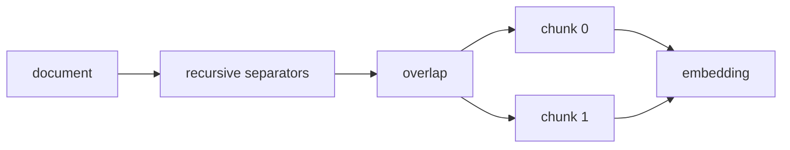

# Chunking

**Status:** implemented

## Definition
Chunking divides a document into retrieval units. Chunk size controls specificity/context; overlap reduces boundary loss but duplicates text and can distort rankings.

## Archon implementation
`backend/app/services/chunker.py::RecursiveChunker` prefers paragraph, newline, sentence, word, then character boundaries. `chunk` strips empty input, recursively splits, prepends configurable overlap, assigns UUIDs/sequential indexes, and carries title/source metadata. `canonical_content_hash` returns truncated SHA-256 for persisted integrity checks.

## Invariants and trade-offs
Empty documents yield no chunks; indexes are sequential; IDs unique. Character length is not token length. Overlap may make near-duplicates, and this chunker does not preserve rich PDF/table structure or empirically optimize boundaries per corpus.

## Evidence
`backend/tests/unit/test_rag.py::TestRecursiveChunker`; durable limits are enforced by `SqlJsonVectorStore.max_chunks_per_document` and document services.

## Interview prompt
“Chunking defines the retrieval unit; tune it with retrieval evals rather than assuming 500 characters is universally correct.”
