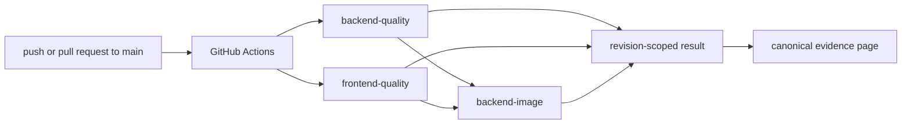
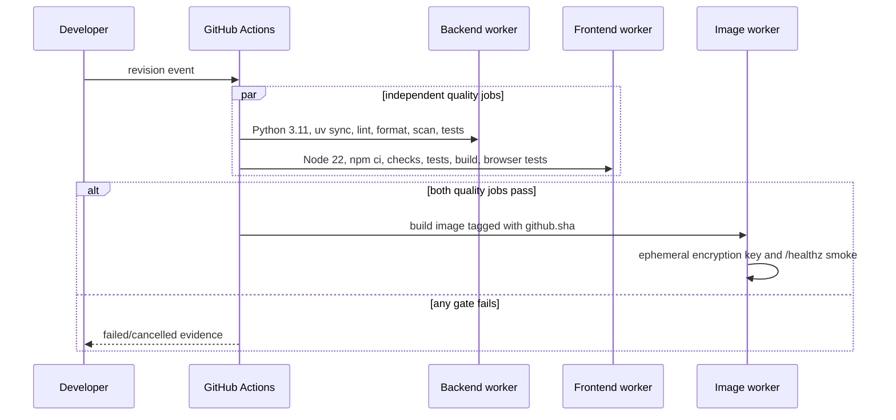

# Continuous integration

> **Documentation status:** Draft
> **Concept status:** `implemented`
> **Status boundary:** Repository quality gates execute in GitHub Actions; green CI is revision-scoped evidence, not deployment or a permanent property of the branch.
> **Used by:** [Module 14](../modules/14-local-operations/README.md)

## Beginner explanation

Continuous integration, or CI, runs repeatable checks when code changes.
A clean worker checks out one revision, installs declared dependencies, and executes named gates.
The result answers “did these checks pass for this revision in this worker environment?”
It does not answer “is production healthy?” or “will every later commit pass?”
It also does not prove behavior that the workflow never checks.
Archon’s CI is repository orchestration, not an authenticated Core API operation.
Workflow jobs and scripts do not create agent runs, `Core.jobs` objects, product approvals, or runtime metrics.

## Vocabulary and proof boundary

| Term | Plain-English meaning |
|---|---|
| workflow | YAML recipe GitHub Actions interprets |
| job | group of steps executed on one worker |
| gate | check whose failure makes its job fail |
| clean worker | newly provisioned environment rather than a developer’s modified machine |
| revision | exact commit checked out by the run |
| artifact/evidence | result tied to revision, environment, and commands |

A workflow file proves intent, not execution.
A passing run proves only the steps that actually completed.
Skipped, cancelled, flaky, mocked, and platform-specific behavior must remain visible.
Canonical run and revision evidence belongs in [Implementation Evidence](../../IMPLEMENTATION-EVIDENCE.md), not copied as hardcoded run IDs here.

## Architecture



The current [`.github/workflows/ci.yml`](../../../.github/workflows/ci.yml) triggers on pushes and pull requests targeting `main`.
Concurrency is grouped by workflow and ref, and newer work cancels an in-progress run for that group.
`backend-image` needs both quality jobs, so it does not run as an independent substitute for failed source checks.
GitHub-hosted workers, action publishers, package registries, and lockfiles are part of the supply-chain boundary.



## Exact gates

The `backend-quality` job uses Python 3.11 and `uv sync --extra dev`.
It runs Ruff lint, Ruff format checking, Bandit with `-ll`, and pytest with coverage XML and a 50 percent floor.
The `frontend-quality` job uses Node 22 and `npm ci`.
It runs Svelte/TypeScript checks, Vitest, a production build, installs Chromium, and runs Playwright.
The `backend-image` job builds the repository Dockerfile with a revision tag.
Its smoke starts a container with SQLite and memory encryption enabled.
It creates an ephemeral encryption key at runtime rather than committing a literal value.
It polls `/healthz` up to the workflow’s bounded attempts and prints container logs on failure.
A trap removes the test container.

[`scripts/verify.sh`](../../../scripts/verify.sh) is the local verification entry point.
It is useful for developer parity but is not itself evidence that GitHub executed the remote workflow.
Local and remote environments can differ in Docker platform, cache state, network behavior, and available resources.

## Source, tests, and evidence

| Source or test | Contract supported | Not supported |
|---|---|---|
| [`.github/workflows/ci.yml`](../../../.github/workflows/ci.yml) | triggers, dependencies, named clean-worker gates | a run actually passed |
| [`scripts/verify.sh`](../../../scripts/verify.sh) | local repository verification sequence | GitHub worker parity |
| [`test_docker_smoke_uses_ephemeral_validated_memory_key`](../../../backend/tests/unit/test_verify_script.py) | local smoke key handling | external secret manager behavior |
| [`test_ci_backend_smoke_supplies_ephemeral_memory_key_without_literal_value`](../../../backend/tests/unit/test_verify_script.py) | CI smoke avoids a literal key | complete workflow security |
| [`test_docker_smoke_uses_configurable_reproducible_platform`](../../../backend/tests/unit/test_verify_script.py) | configurable platform contract | every architecture works |

Consult [Implementation Evidence](../../IMPLEMENTATION-EVIDENCE.md) for the current accepted revision and canonical remote-run link.
That mutable page is the only place that should identify a specific run.
Do not infer a current result from a badge, an old screenshot, or this concept page.

## Failure semantics

Shell commands use their exit status to fail a step.
A failed quality job prevents the dependent image job.
A newer run can cancel older in-progress work due to the concurrency policy.
A health polling timeout prints backend logs and returns failure.
A green image smoke proves process liveness at `/healthz`, not PostgreSQL, Redis, OTLP, authentication, migration, or external-provider quality.
Coverage is an aggregate threshold, not proof that critical branches were tested.
Bandit is a static scanner, not a penetration test.

## Try it: bounded exercise

### Goal

Inspect the CI security contract and run its focused unit tests locally.

### Setup and steps

Run from the repository root with `uv` and backend dev dependencies available.
This exercise reads workflow and script text; it does not contact GitHub or publish an image.
Do not place real credentials in environment files or commands.

```bash
cd backend
uv run pytest -q tests/unit/test_verify_script.py
cd ..
git diff --check
```

Then open `.github/workflows/ci.yml` and map every gate to one claim it can support.
For each claim, write one nearby behavior it cannot support.

### Done criteria

- [ ] The focused tests pass or a real blocker is recorded.
- [ ] You can explain why `backend-image` waits for both quality jobs.
- [ ] You found the ephemeral key generation and cleanup trap.
- [ ] You did not claim a remote run from local test output.
- [ ] You used the canonical evidence page instead of copying a run ID.

## Security and failure modes

| Threat or failure | Control or response | Residual risk |
|---|---|---|
| committed smoke secret | ephemeral random material; tests reject literal handling | worker memory and logs remain trusted |
| dependency substitution | lockfiles and pinned language setup | third-party actions use version tags, not immutable digests |
| malicious pull request | repository permissions and GitHub controls | workflow changes require careful review |
| stale green result | evidence tied to exact revision | readers can still misapply old evidence |
| flaky browser/network step | explicit failed result and rerun history | retries can hide instability if not analyzed |
| cancelled run | cancellation is not success | required-check policy is external to this page |
| poisoned cache | clean install semantics reduce drift | registries and action supply chain remain trusted |
| image starts but app is unusable | liveness smoke fails only basic startup | readiness and end-to-end behavior need separate checks |
| resource exhaustion | hosted worker limits terminate work | no production capacity claim follows |

CI logs can expose secrets if commands print them.
The smoke unsets generated key material and does not echo it.
Future changes must preserve log masking, minimal permissions, dependency review, and untrusted-input boundaries.

## Observability and evidence path

```text
revision event → workflow/jobs/steps → exit statuses and logs → revision-scoped GitHub result → canonical evidence link
```

This path is operational evidence rather than agent-runtime telemetry.
Do not increment `archon_agent_runs_total` for workflow jobs.
Do not store workflow status as an authenticated product run merely to make it look uniform.
Useful CI evidence includes revision, workflow definition, worker image, completed/skipped job states, logs, and artifacts.
A production release system would additionally attest artifacts, sign images, track provenance, and connect release status to deployment observation.

## Alternatives and trade-offs

| Alternative | Benefit | Cost or risk |
|---|---|---|
| local pre-commit only | fast feedback | easy to bypass and environment-dependent |
| another hosted CI | different integrations or controls | migration and maintenance cost |
| self-hosted runners | hardware/network control | patching, isolation, and secret risk |
| one serial job | simpler logs | slower and poor fault isolation |
| many parallel jobs | faster feedback | duplicated setup and greater cost |

Archon separates backend and frontend quality, then gates image smoke on both.
That offers useful parallelism while preventing an image success from masking quality failures.

## Lab vs production

| Dimension | Demonstrated | Unverified or external |
|---|---|---|
| source checks | declared backend and frontend gates | branch-protection enforcement |
| image | build and bounded liveness smoke | registry publication, signing, SBOM policy |
| evidence | canonical revision/run link | permanent availability of hosted logs |
| security | ephemeral smoke key and static scan | full supply-chain attestation |
| deployment | none | rollout, rollback, health, traffic, SLOs |

The implementation status is `implemented` for repository CI gates only.
It is not a deployment status.

## Interview answer

### 30-second answer

> Archon CI runs backend lint, format, security scan, tests and coverage; frontend checks, tests, build and browser tests; then a dependent backend-image liveness smoke with an ephemeral encryption key. A green result is evidence only for the exact revision and completed gates. The canonical evidence page links the current run; CI is not an authenticated Core API object, deployment proof, runtime availability, or an SLO.

## Self-check

1. What precise question does CI answer?
2. Why is the workflow file not runtime evidence?
3. Which jobs must pass before `backend-image` starts?
4. What does the image smoke actually check?
5. Where should a specific remote run be linked?
6. Why should CI not become a Core API job or agent metric?
7. Name two production release controls absent here.

<details>
<summary>Answer guide</summary>

1. Whether the declared gates completed successfully for one revision in the recorded worker environment.
2. It is a recipe; only an execution result proves the recipe ran.
3. Both `backend-quality` and `frontend-quality`.
4. The built backend process answers `/healthz` within bounded polling while configured with generated memory-key material.
5. Only in `docs/IMPLEMENTATION-EVIDENCE.md`, the canonical mutable source.
6. CI is repository infrastructure outside authenticated agent runtime semantics; inventing product objects would blur evidence boundaries.
7. Examples include image signing, provenance, registry policy, rollout, rollback, and deployment health observation.

</details>

## Related concepts

- [Docker and Compose](docker-compose.md)
- [Liveness and readiness](liveness-readiness.md)
- [Database migrations](migrations.md)
- [Module 14](../modules/14-local-operations/README.md)
