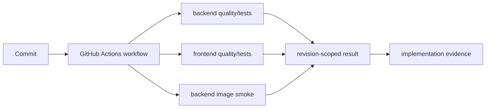

# Continuous integration

> **Documentation status:** Draft
> **Concept status:** `implemented`
> **Status boundary:** Repository quality gates execute in GitHub Actions. Exact run IDs and revisions are maintained only in [implementation evidence](../../IMPLEMENTATION-EVIDENCE.md); green CI is not deployment or a permanent property of HEAD.
> **Used by:** [Module 14](../modules/14-local-operations/README.md)

## What CI proves

CI starts clean workers and runs declared gates against one revision. Backend and frontend checks, contract tests, and image smoke catch repeatable regressions. CI does not authenticate through the product API, create a `Core.jobs` run, or prove production infrastructure.

The workflow is orchestration; `scripts/verify.sh` is a local verification entry point. A green result supports only gates actually listed and completed. Flaky, skipped, mocked, or environment-specific behavior must remain visible.

## Source and tests

- [`.github/workflows/ci.yml`](../../../.github/workflows/ci.yml) defines jobs and triggers.
- [`scripts/verify.sh`](../../../scripts/verify.sh) defines repository verification steps.
- [`test_docker_smoke_uses_ephemeral_validated_memory_key`](../../../backend/tests/unit/test_verify_script.py) and [`test_ci_backend_smoke_supplies_ephemeral_memory_key_without_literal_value`](../../../backend/tests/unit/test_verify_script.py) inspect secure smoke setup.
- Canonical run/revision evidence: [implementation evidence](../../IMPLEMENTATION-EVIDENCE.md).

## Interview answer

“CI proves named checks passed on clean workers for the revision recorded in the canonical evidence document. It does not prove later commits, public deployment, external-provider quality, runtime availability, or recovery objectives.”
