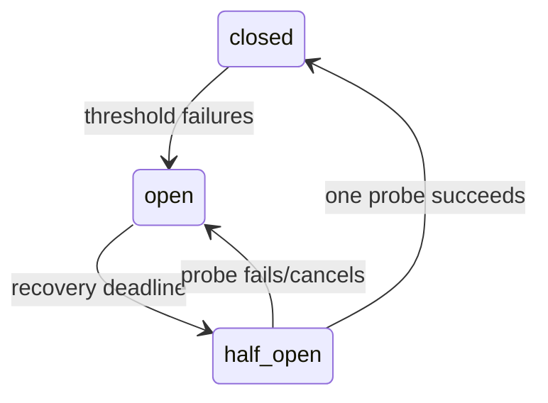

# Circuit breaker

**Status:** implemented, process-local

## Definition
A circuit breaker admits calls while closed, opens after enough failures to fail fast, and later permits a limited half-open probe to test recovery.

## Archon implementation
`backend/app/security/circuit_breaker.py::CircuitBreaker` uses an `asyncio.Lock`, monotonic clock, threshold, recovery timeout, epoch/generation guards, and a single probe token. A stale concurrent success cannot close a newly opened circuit. Cancelled probes return the breaker to open. `CircuitBreakingProvider` maps breaker/provider failures to sanitized `ProviderUnavailableError`.

## Failure modes and limits
State is app-process memory, not coordinated across replicas. Counted exceptions need classification; overbroad counting can open on caller errors. Reset is administrative/local. A breaker prevents cascading load; it does not repair providers or guarantee fallback correctness.

## Evidence
`backend/tests/security/test_pii_circuit_breaker.py` checks races, one probe, stale success, cancellation, sanitized rejection. `docs/evidence/local-portfolio-benchmark.json` demonstrates injected open/fail-fast/half-open/recovery, not external-provider recovery.

## Interview prompt
“The epoch/probe design makes transitions concurrency-safe, but its scope is one app process.”
