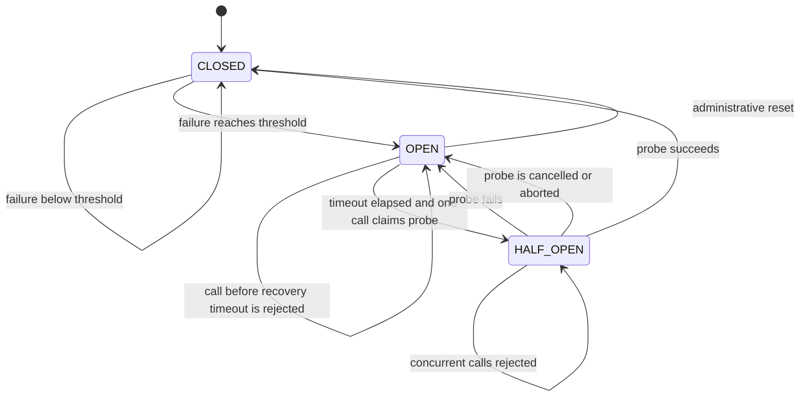
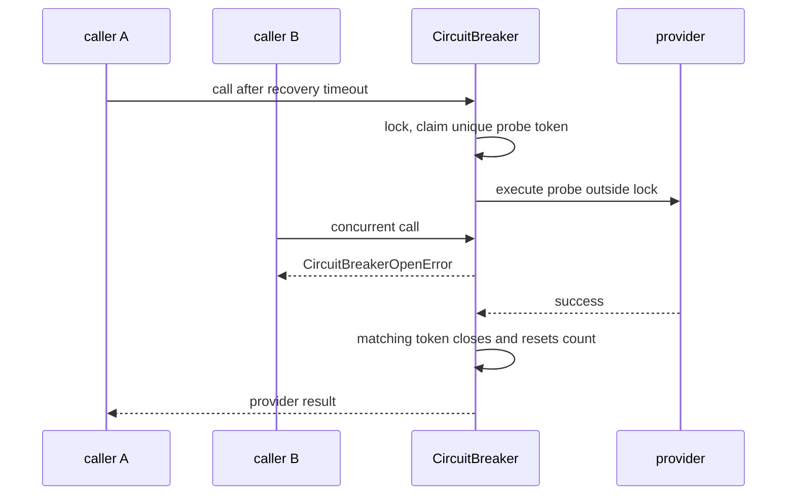

# Circuit breaker

**Status:** implemented and concurrency-safe within one process

## Definition

A circuit breaker stops repeatedly calling a dependency that is likely unavailable.
It is an admission-control state machine, not a retry loop and not a repair mechanism.
While **closed**, calls are admitted and failures are counted.
After the configured threshold, the breaker becomes **open** and calls fail fast.
After a recovery interval, exactly one caller may become a **half-open** probe.
A successful probe closes the breaker; a failed or cancelled probe opens it again.

## Why use one

Repeated slow failures consume sockets, worker slots, tokens, and latency budgets.
Fail-fast rejection preserves capacity for healthy dependencies and other users.
A controlled probe avoids a recovery stampede.
The tradeoff is intentional false rejection while the breaker believes the dependency is unhealthy.
That tradeoff must be observable and scoped to the right dependency and failure class.

## Exact Archon state machine

The implementation is `backend/app/security/circuit_breaker.py::CircuitBreaker`.
`CircuitState` has the exact values `closed`, `open`, and `half_open`.
Constructor defaults are a failure threshold of 5 and recovery timeout of 30 seconds.
It rejects thresholds below one and non-positive recovery timeouts.
The default clock is `time.monotonic`, avoiding wall-clock jumps.
An `asyncio.Lock` protects admission and transition bookkeeping.
The protected function executes outside the lock, allowing concurrent closed-state calls.

## A subtle half-open detail

The `state` property reports `HALF_OPEN` when stored state is open and the recovery interval has elapsed.
Reading the property alone does not reserve a probe or mutate stored state.
Inside `call`, the first eligible caller sets stored state to half-open and marks `_probe_in_flight`.
It also creates a unique `_probe_token`.
Further callers see half-open plus an in-flight probe and receive `CircuitBreakerOpenError`.
Therefore at most one probe executes in this process.

## Exact closed-state behavior

Each admitted call snapshots `_epoch` and `_generation`.
Each admission increments `_total_calls`.
A normal exception increments `_failure_count` only if its admission epoch is still current.
It updates `_last_failure_time` and increments `_generation`.
At the threshold it stores `OPEN` and increments `_epoch`.
A successful non-probe call resets failures only while still closed and when both snapshots still match.
This means a success admitted before a concurrent failure cannot erase that newer failure.
The implementation effectively tracks consecutive uncontested successes and failures under concurrency guards.
`asyncio.CancelledError` on an ordinary closed-state call is propagated and is not counted as a normal failure.
Other `BaseException` values are propagated and are not counted as normal failures.

## Exact probe behavior

A probe's normal exception increments the failure count, records the clock, clears its token, and stores open.
That failure also advances both epoch and generation.
A matching successful probe stores closed, resets failure count, increments success count, and clears the token.
Success also advances epoch and generation.
A cancelled probe calls `_abandon_probe`, then re-raises cancellation.
Abandonment clears the token, stores open, and resets `_last_failure_time` to the current clock.
That starts a fresh recovery wait rather than immediately permitting another probe.
The same abandonment rule applies to non-`Exception` `BaseException` values.
A stale completion cannot transition state unless its snapshots or token are still current.

## Rejection and provider boundary

`CircuitBreakerOpenError` contains a non-negative `recovery_time` estimate.
Its message is always `Model provider temporarily unavailable`.
Open and competing half-open calls are rejected before the provider function runs.
`backend/app/security/circuit_breaker.py::CircuitBreakingProvider` wraps the typed `ModelProvider` port.
It preserves `messages`, `tools`, `max_tokens`, and optional `response_format` on successful calls.
It translates both breaker-open and delegate exceptions to `ProviderUnavailableError`.
The public error text remains sanitized and chains the original exception internally.
This wrapper does not provide a fallback response or retry by itself.

## Generations, epochs, and races

`_epoch` invalidates admissions across major circuit transitions.
`_generation` invalidates a success after any newer failure, even before the circuit opens.
The unique token ensures only the current half-open probe can resolve probe state.
The lock makes compound checks and updates atomic within one event loop process.
The lock does not coordinate multiple application processes or hosts.
Each replica can therefore open, probe, and close independently.
A process restart forgets all breaker history.

## Failure classification

The breaker currently counts every ordinary `Exception` raised by the protected callable.
That can include provider outages, malformed requests, authentication failures, and programming defects.
Opening on caller-caused errors can unnecessarily block valid traffic.
Production adapters should classify transient dependency failures before they reach the breaker or configure separate boundaries.
Use different breakers for dependencies with independent health.
Avoid a single global breaker that lets one model or region suppress all others.
A timeout may count as a failure if it arrives as an ordinary timeout exception.
Cancellation is intentionally not counted as provider failure.

## Security and failure analysis

Fail-fast behavior reduces resource-exhaustion cascades.
Sanitized public errors prevent provider details and prompts from crossing the API boundary.
Internal exception chaining still requires safe logging and access controls.
An attacker who can force counted errors may hold a process-local breaker open.
Per-tenant or per-provider scoping may be needed to prevent noisy-neighbor denial of service.
Administrative `reset` is synchronous and does not acquire the async lock.
Call it only through controlled lifecycle or administrative coordination; racing reset with live calls is not a distributed safety mechanism.
A breaker does not make a non-idempotent retry safe.
A breaker does not validate fallback output.
A breaker does not undo side effects from a call that completed after the caller stopped waiting.

## Observability

`get_stats` exposes name, effective state, failure count, threshold, success count, total calls, and recovery timeout.
Structured events include `circuit_breaker_opened`, `circuit_breaker_rejected`, and `circuit_breaker_reset`.
Track opens, rejected calls, probe outcomes, and time spent open by provider and operation.
Alert on repeated reopen cycles and prolonged open state.
Correlate breaker events with provider latency and error-class metrics.
Do not put prompts, credentials, or raw provider exception strings in metric labels.
Because `state` can report half-open before a probe is claimed, interpret sampled state separately from probe-in-flight activity.
Expose process and replica identity when diagnosing divergent local states.

## Lab versus production

In a lab, an injected monotonic clock makes transitions deterministic.
In production, real timing, process restarts, and multiple replicas complicate behavior.
The current process-local breaker is useful protection for each application instance.
It does not enforce a cluster-wide open state.
A shared breaker can coordinate replicas but adds network dependence and consistency choices.
Production tuning should derive threshold and recovery interval from traffic volume, dependency SLOs, and error classes.
Low-volume dependencies may need a rolling error-rate policy rather than a raw consecutive count.
Deploy changes with dashboards and a safe manual override.

## Alternatives and complements

Timeouts bound how long one call waits; they do not suppress later calls.
Retries can recover transient failures but can amplify load unless bounded and coordinated with the breaker.
Concurrency limits cap in-flight work even while a provider is merely slow.
Rate limits control arrivals over time rather than dependency health.
Bulkheads isolate capacity between providers or tenants.
Load shedding rejects low-priority work before exhaustion.
Fallback substitutes another capability and needs independent semantic validation.
Health checks can inform routing but should not create synchronized probe storms.

## Exercise

1. Construct a breaker with threshold two and an injected numeric clock.
2. Raise one `ConnectionError`; confirm state remains closed.
3. Succeed once; confirm the failure count resets.
4. Raise two consecutive errors; confirm state is open and the protected function is not called on rejection.
5. Advance the clock beyond recovery and start a blocking probe.
6. Attempt a second call and confirm it receives `CircuitBreakerOpenError`.
7. Cancel the probe and verify state returns to open with a new recovery wait.
8. Advance again, succeed with one probe, and inspect `get_stats`.
9. Explain why the same experiment on two processes would produce two independent states.

## Exact source and test evidence

- `backend/app/security/circuit_breaker.py::CircuitBreaker.call` defines admission, counting, and transitions.
- `backend/app/security/circuit_breaker.py::CircuitBreaker._abandon_probe` defines cancellation behavior.
- `backend/app/security/circuit_breaker.py::CircuitBreakingProvider.complete` defines the sanitized typed boundary.
- `backend/tests/security/test_pii_circuit_breaker.py::TestCircuitBreaker::test_opens_after_threshold_failures` proves threshold opening.
- `backend/tests/security/test_pii_circuit_breaker.py::TestCircuitBreaker::test_only_one_half_open_probe_runs_and_success_closes` proves one probe.
- `backend/tests/security/test_pii_circuit_breaker.py::TestCircuitBreaker::test_stale_success_cannot_close_after_concurrent_failure_opens` proves stale-success protection.
- `backend/tests/security/test_pii_circuit_breaker.py::TestCircuitBreaker::test_cancelled_half_open_probe_returns_to_open_then_allows_one_probe` proves cancellation recovery.
- `docs/evidence/local-portfolio-benchmark.json` is injected local evidence, not proof of real external-provider recovery.

## 30-second interview answer

“Archon's breaker is a process-local, lock-protected state machine. Closed calls run concurrently, ordinary exceptions count toward the threshold, open calls fail fast, and after a monotonic recovery interval exactly one tokenized half-open probe runs. Probe success closes, while failure or cancellation reopens and starts a new wait. Epoch and generation guards prevent stale concurrent success from erasing newer failures. The provider wrapper emits a sanitized typed error, but the breaker neither retries nor coordinates replicas.”

## Self-checks

1. **When does open become half-open?** The `state` property reports half-open after the monotonic recovery interval; the first admitted caller then reserves the probe.
2. **Can two half-open probes run in one process?** No. `_probe_in_flight` and the lock reject the second caller.
3. **What happens when a probe is cancelled?** Its token is cleared, state returns to open, the failure time is refreshed, and cancellation is re-raised.
4. **Why are both epoch and generation needed?** They prevent stale completions from overwriting major transitions or newer failures.
5. **Does every thrown value increment failure count?** No. Ordinary `Exception` does; cancellation and other `BaseException` paths do not.
6. **Is state shared across replicas?** No. All state is process memory.
7. **Does `CircuitBreakingProvider` preserve raw provider errors publicly?** No. It raises `ProviderUnavailableError` with stable sanitized text.
8. **What should determine breaker scope?** Independent dependency health and failure semantics, often provider, region, operation, and sometimes tenant.
