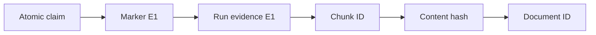
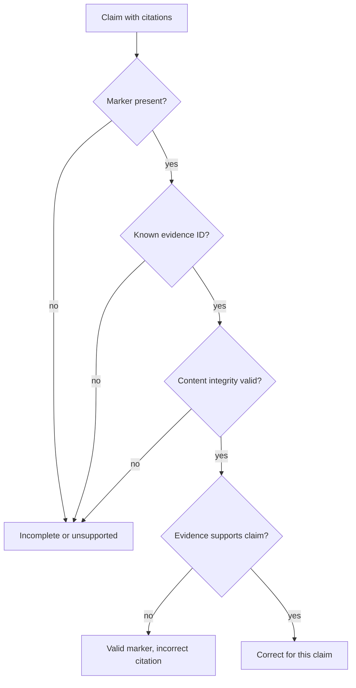

# Citations

**Status:** implemented for grounded document answers

## Beginner definition

A citation connects a specific answer claim to a specific evidence item.
A bracket marker alone is not enough.
The identifier must exist, resolve to stable evidence, and that evidence must support the attached claim.
Citations make inspection possible; they do not make a source true.

## Vocabulary

- **Citation marker:** the visible reference such as `[E1]`.
- **Evidence identity:** the document ID, chunk ID, and content hash behind a marker.
- **Citation presence:** whether a marker appears.
- **Citation validity:** whether the marker names evidence available in this run.
- **Citation correctness:** whether that evidence supports the attached claim.
- **Citation completeness:** whether every factual claim has adequate citation coverage.
- **Quote:** bounded source text shown for inspection.
- **Provenance:** the chain from answer claim to evidence and document.
- **Run-local ID:** an identifier whose meaning is confined to one retrieval run.

## Mental model

A citation is a receipt, not a decorative footnote.
The receipt number must belong to this transaction.
The listed item must match what the claim says was purchased.
A genuine receipt can still describe a defective product, just as a correct citation can point to a false source.

## Archon implementation

`backend/app/services/grounded_rag.py::DocumentEvidence` is the evidence record.
It carries `id`, `document_id`, `chunk_id`, `content_hash`, `title`, `score`, `quote`, and private `verification_text`.
`DocumentEvidence.public` deliberately omits the full verification text.
`DocumentEvidenceRetriever.retrieve` assigns `E1`, `E2`, and later IDs after deduplication.
These `E#` labels are run-local and cannot identify evidence across runs by themselves.
`_prompt` lists each evidence ID with document, chunk, hash, title, and bounded quote.
It asks the provider for atomic JSON claims with explicit `evidence_ids`.
`_parse_claims` accepts IDs matching `^E[1-9][0-9]*$`.
It removes duplicate IDs while preserving order.
It allows at most eight citations per claim and at most twenty claims.
It also supports conservative line-format compatibility using bracketed IDs.
`_supports_claim` rejects a claim with no citations or any unknown citation.
`_verify_document_claims` drops evidence whose content no longer matches its hash.
It returns only citations used by retained supported claims.
`GroundedDocumentWorkflow._finish` renders every retained claim followed by its `[E#]` markers.
The public result contains citation metadata and bounded quotes.
The durable ledger stores citation IDs, content hashes, and counts, not raw quote text.

## Correctness is claim-specific

Evidence can correctly support one claim and fail to support another.
A valid `E1` attached to the wrong sentence is citation-incorrect.
A correct citation set can be incomplete if another factual claim has none.
A complete set can still be incorrect if every marker points to irrelevant text.
Duplicate markers do not increase support.
A retrieval similarity score is not citation correctness.
The current support rule combines all cited evidence tokens for one claim, so multi-source support is possible within its lexical limits.

## Five separate quality questions

**Retrieval relevance:** were useful chunks selected?
**Groundedness:** are answer claims supported by supplied evidence?
**Faithfulness:** did generation stay within its context?
**Citation correctness:** does each claim point to evidence that supports it?
**Answer relevance:** does the answer address the question?
Citation correctness is narrower than groundedness because it assesses the explicit claim-to-source link.
An answer may be grounded in supplied context yet attach the wrong marker.
An answer may have correct citations and still be irrelevant to the question.

## Stable identity and replay

An `E#` marker only has meaning with its run.
For durable inspection, preserve run ID, document ID, chunk ID, and content hash.
The 16-character chunk hash detects changed persisted content in retrieval.
It does not authenticate the document's author or prove source truth.
If documents can be updated, define whether citations resolve to immutable versions or current content.
Replay should fail visibly when the referenced version is unavailable rather than silently showing replacement text.

## Security and failure modes

Treat citation titles and quotes as untrusted source data.
Escape them correctly in every renderer to prevent injection or unsafe links.
Do not allow the model to invent external URLs and call that provenance.
Scope evidence before assigning IDs so an unknown or foreign item cannot be cited.
Bound quote length to reduce prompt, response, and log exposure.
Never store raw sensitive quote text in operational ledger events.
Check content hashes before support verification to catch persisted tampering.
Beware citation laundering: a real source may not support the nearby claim.
Beware citation flooding: many markers can make a weak answer look authoritative.

## Observability

Track claims with no IDs, unknown IDs, retained IDs, and unsupported claim counts.
Track citation correctness on a human-labeled claim/evidence dataset.
Track citation completeness as a separate measure.
Track broken provenance resolution and hash-mismatch rates.
Track citations per claim and evidence reuse to detect flooding or monopolization.
The `claim_verified` event stores `cited_evidence_ids`, supported count, and unsupported count.
The `grounded_answer` event stores answer hash, citation IDs, and counts.
Recorded-run `citation_rate` is structural and does not semantically re-verify support.
Never report citation rate alone as “citation quality.”

## Alternatives and trade-offs

Inline `[E#]` markers are compact and easy to bind to atomic lines.
Footnotes improve prose readability but can obscure exact claim scope.
Sentence-level source arrays are machine-friendly but need careful UI rendering.
Quoted spans improve inspectability but increase exposure and can omit wider context.
External URLs are useful for users but are mutable and need validation or snapshots.
Extractive answers offer tighter spans but less synthesis.
Document-version IDs or signed source snapshots improve long-term replay at storage cost.

## Lab versus production

The lab implementation demonstrates bounded IDs, hash integrity, claim filtering, and safe ledger metadata.
Its tests cover unknown, missing, duplicate, and corrupted evidence paths.
The final acceptance run uses mock embeddings/provider, so citation structure is deterministic.
That does not prove a live model will choose semantically correct citations on varied documents.
Production needs citation correctness and completeness labels at claim level.
It needs immutable source versioning, access-controlled resolution, safe rendering, and retention policy.
Human audit samples should include plausible but unsupported citations, not only missing markers.

## Evidence in this repository

- `backend/app/services/grounded_rag.py::DocumentEvidence`
- `backend/app/services/grounded_rag.py::DocumentEvidence.public`
- `backend/app/services/grounded_rag.py::DocumentEvidenceRetriever.retrieve`
- `backend/app/services/grounded_rag.py::_parse_claims`
- `backend/app/services/grounded_rag.py::_supports_claim`
- `backend/app/services/grounded_rag.py::_verify_document_claims`
- `backend/app/services/grounded_rag.py::GroundedDocumentWorkflow._finish`
- `backend/tests/unit/test_grounded_rag.py::test_supported_claim_is_answered_with_verified_citation`
- `backend/tests/unit/test_grounded_rag.py::test_partial_unknown_and_missing_citations_are_unsupported`
- `backend/tests/unit/test_grounded_rag.py::test_duplicate_results_are_deduplicated`
- `backend/tests/unit/test_grounded_rag.py::test_tampered_persisted_evidence_is_skipped_before_provider_call`
- `backend/app/eval/service.py::EvaluationService._evaluate_case` computes structural recorded metrics.

## Exercise

Create three atomic claims and two evidence chunks.
Make one claim correctly cite `E1`, one cite valid but irrelevant `E2`, and one cite unknown `E9`.
Classify citation presence, validity, correctness, and completeness separately.
Change `E1` text without changing its stored hash and verify retrieval skips it.
Then attach the right evidence to an answer that does not address the question.
Explain why citation correctness can pass while answer relevance fails.

## 30-second interview answer

“A citation is a claim-to-evidence binding, not just brackets. In Archon's grounded workflow, run-local `E#` IDs resolve to document ID, chunk ID, content hash, title, score, and quote. Unknown IDs, tampered content, and unsupported claims are filtered; only used citations are returned. For production I would separately measure citation correctness and completeness and retain immutable, access-controlled provenance.”

## Self-checks

1. **Is citation presence the same as correctness?** No; a marker can exist but point to non-supporting evidence.
2. **Is `E1` globally stable?** No; it is meaningful only within its retrieval run.
3. **What durable fields strengthen identity?** Run ID, document ID, chunk ID, and content hash.
4. **Does a matching hash prove source truth?** No; it proves consistency with the hashed content.
5. **Are all retrieved sources returned as citations?** No; only evidence used by retained claims is cited.
6. **Can citation correctness pass while answer relevance fails?** Yes; correctly sourced claims can answer the wrong question.
7. **What does structural `citation_rate` miss?** Whether each cited source semantically supports its claim.
8. **Why bound quotes?** To limit prompt size, response size, and sensitive-data exposure.
