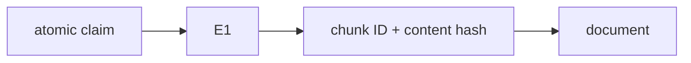

# Citations

**Status:** implemented for grounded document answers

## Definition
A citation is a verifiable link from an answer claim to a specific evidence item. Citation presence asks whether a marker exists; citation correctness asks whether it names existing evidence that supports that claim; completeness asks whether all claims are cited.

## Archon implementation
`DocumentEvidenceRetriever` assigns run-local `E1...` IDs and preserves document ID, chunk ID, content hash, title, score, quote, and full verification text. `_parse_claims` accepts bounded known-format IDs; `_supports_claim` rejects missing/unknown IDs; `_finish` emits only citations used by retained claims. The ledger stores IDs/hashes/counts, not quote text.

## Failure modes
A syntactically valid citation can be irrelevant; duplicate/changed content can break identity; citation rate can be 100% while sources are false. `E#` is run-local, so durable verification also needs document/chunk/hash. Quotes are bounded and retrieved content is integrity-checked.

## Evidence
`backend/tests/unit/test_grounded_rag.py` covers verified, unknown, missing, duplicate, and corrupted citations. Recorded-run `citation_rate` is a structural metric, not semantic re-verification.

## Interview prompt
“A citation is correct only when its stable evidence identity exists and supports the attached claim—not merely when brackets appear.”
