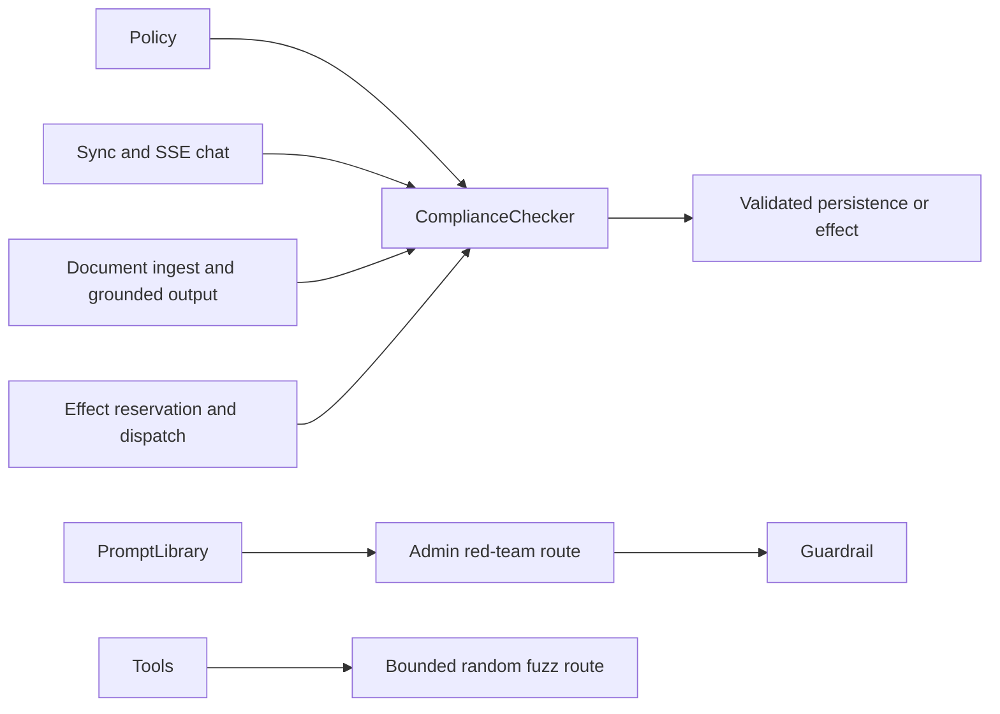
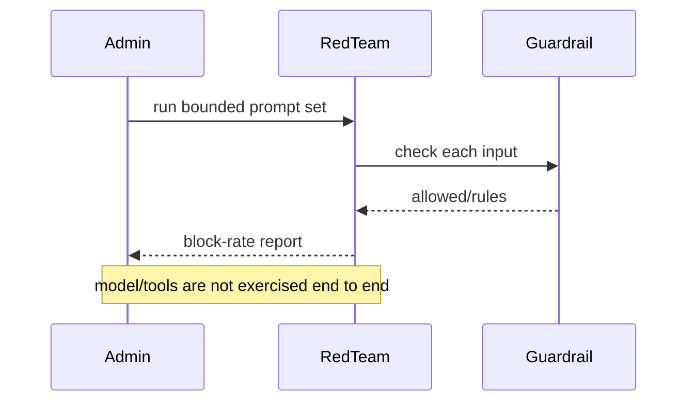

# Compliance controls and red teaming

> **Implementation status:** `implemented`
> **Status boundary:** Mandatory deterministic compliance runs before supported sync/SSE chat, document ingestion, structured-output persistence, model-progress persistence, and effect reservation/dispatch. Admin-only guardrail and bounded fuzz routes provide a local red-team baseline; legal certification and an exhaustive external full-trajectory program are not claimed.
> **Reviewed revision:** current hardening branch
> **Used by module:** [Module 09-evaluation-harness](../modules/09-evaluation-harness/README.md)
> **Catalog ID:** `compliance-red-teaming`

## Beginner explanation

Compliance controls encode obligations such as prohibited content or required disclaimers. Red teaming deliberately probes bypasses and unsafe behavior. A list of blocked phrases is a test aid, not legal certification, and testing a guardrail in isolation is not testing the whole agent.

## Problem and mental model

Treat the boundary as a contract with explicit inputs, outputs, state, failure behavior, and evidence. The important question is not whether a similarly named class or file exists, but whether the behavior is wired into a real path and whether a test or observation proves it.

## Architecture and components

## Startup and request sequence

## Archon implementation and source walkthrough

The mapped symbols implement mandatory deterministic compliance before supported persistence and effect boundaries. The admin red-team/fuzz routes add bounded regression probes. Versioned legal-policy approvals, exhaustive external full-trajectory attacks, and compliance certification remain outside this local technical boundary.

### Source symbols

| Source symbol | Role and boundary |
|---|---|
| [`backend/app/security/compliance.py:MandatoryComplianceService`](../../../backend/app/security/compliance.py) | Applies deterministic input/output rules at mandatory runtime boundaries. |
| [`backend/tests/integration/test_mandatory_compliance.py`](../../../backend/tests/integration/test_mandatory_compliance.py) | Proves chat/document/output/effect integration and ordering. |
| [`backend/app/routes/red_team.py:red_team_test`](../../../backend/app/routes/red_team.py) | Runs an admin-only static adversarial set against input guardrails. |
| [`backend/app/routes/red_team.py:fuzz_test`](../../../backend/app/routes/red_team.py) | Runs bounded random input probes against two built-in tools. |

### Tests

| Test | Contract proved and limit |
|---|---|
| [`backend/tests/unit/test_compliance.py::TestComplianceChecker`](../../../backend/tests/unit/test_compliance.py) | Proves deterministic rule behavior. |
| [`backend/tests/security/test_resource_security.py::test_sensitive_route_auth_and_roles`](../../../backend/tests/security/test_resource_security.py) | Proves normal users cannot invoke red-team routes. |

### Evidence boundary

Current implementation dimensions are centralized in [Implementation Evidence](../../IMPLEMENTATION-EVIDENCE.md). Source/tests below are repository evidence; they are not public-deployment or production-certification evidence.

## Try it: bounded study exercise

From the repository root, inspect the mapped source and run the mandatory-compliance integration test plus the admin red-team authorization tests. Confirm the enforced local boundaries and explain why they do not constitute legal certification or an exhaustive external red-team program.

**Done criteria:** identify the trust boundary, one proved behavior, and one unproved behavior without changing repository state.

## Risks, failures, and trade-offs

| Topic | Assessment |
|---|---|
| Principal risk | Keyword checks are bypassable and can overblock; test prompts themselves can contain sensitive payloads. |
| Current gap/failure | Deterministic rules remain bypassable in ways not represented by the bounded corpus; legal certification and exhaustive external trajectory testing are not claimed. |
| Trade-off | Deterministic rules are explainable; broader model-based classifiers cost more and introduce nondeterminism. |
| Evidence hygiene | Do not log secrets or hidden chain-of-thought; record revision, environment, command, and only redacted outcomes. |

## Lab vs production

The status is **implemented** for the local technical baseline. Mandatory compliance is wired before supported persistence and effect boundaries, while admin-only guardrail and bounded fuzz routes test deterministic controls. This does not prove external certification, jurisdiction-specific legal compliance, exhaustive full-agent attacks, public deployment, or a production SLO.

## Interview answer

> Compliance controls encode deterministic obligations such as prohibited content or required disclaimers; red teaming probes whether those controls fail. Archon’s supported chat, document, structured-output, model-progress, and effect paths invoke mandatory compliance, while admin-only guardrail/fuzz routes provide a regression baseline. This implementation is not legal certification or an exhaustive external full-agent red-team.

## Self-check

1. What problem does this concept solve, and what nearby concept is it not?
2. Trace the diagram’s trust boundary and failure path.
3. Which mapped symbol/test proves current behavior, or why are the lists empty?
4. What exact gap prevents a stronger status?
5. Which risk would you test first before production use?

Answer guide

A good answer names the contract in the beginner explanation, follows the sequence, cites the exact table entry (or the explicit absence), repeats the status boundary, and chooses a risk from the table rather than claiming unrecorded behavior.

## Related concepts and modules

- **Module:** [Module 09-evaluation-harness](../modules/09-evaluation-harness/README.md)
- **Course-day map:** [AIAMastery Days 1–30 coverage](../course-concept-coverage.md)
- **Evidence:** [Implementation Evidence](../../IMPLEMENTATION-EVIDENCE.md)
- **Historical context only:** [Feature and Course Audit v2](../../FEATURE-AND-COURSE-AUDIT-V2.md)
