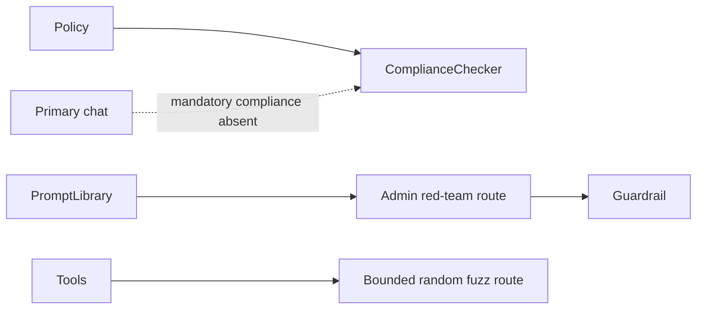
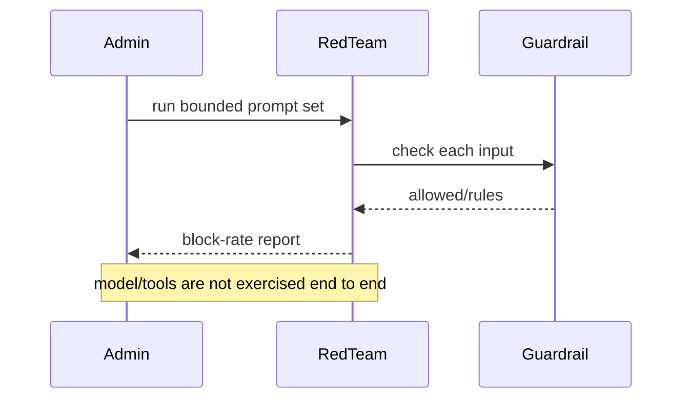

# Compliance controls and red teaming

> **Implementation status:** `partial`
> **Status boundary:** Rule-based compliance checks plus admin-only guardrail red-team and bounded fuzz routes exist and are unit-tested, but compliance is not a mandatory chat boundary and the probes do not execute full agent trajectories.
> **Reviewed revision:** `c115d62`
> **Used by module:** [Module 09-evaluation-harness](../modules/09-evaluation-harness/README.md)
> **Catalog ID:** `compliance-red-teaming`

## Beginner explanation

Compliance controls encode obligations such as prohibited content or required disclaimers. Red teaming deliberately probes bypasses and unsafe behavior. A list of blocked phrases is a test aid, not legal certification, and testing a guardrail in isolation is not testing the whole agent.

## Problem and mental model

Treat the boundary as a contract with explicit inputs, outputs, state, failure behavior, and evidence. The important question is not whether a similarly named class or file exists, but whether the behavior is wired into a real path and whether a test or observation proves it.

## Architecture and components

## Startup and request sequence

## Archon implementation and source walkthrough

At revision `c115d62`, the mapped symbols implement the bounded behavior below. No mandatory compliance call in both chat paths, versioned policy approvals, full-trajectory attacks, regression gate, or compliance certification.

### Source symbols

| Source symbol | Role and boundary |
|---|---|
| [`backend/app/security/compliance.py:ComplianceChecker`](../../../backend/app/security/compliance.py) | Applies deterministic input/output content rules. |
| [`backend/app/routes/red_team.py:red_team_test`](../../../backend/app/routes/red_team.py) | Runs an admin-only static adversarial set against input guardrails. |
| [`backend/app/routes/red_team.py:fuzz_test`](../../../backend/app/routes/red_team.py) | Runs bounded random input probes against two built-in tools. |

### Tests

| Test | Contract proved and limit |
|---|---|
| [`backend/tests/unit/test_compliance.py::TestComplianceChecker`](../../../backend/tests/unit/test_compliance.py) | Proves deterministic rule behavior. |
| [`backend/tests/security/test_resource_security.py::test_sensitive_route_auth_and_roles`](../../../backend/tests/security/test_resource_security.py) | Proves normal users cannot invoke red-team routes. |

### Evidence boundary

Current implementation dimensions are centralized in [Implementation Evidence](../../IMPLEMENTATION-EVIDENCE.md). Source/tests below are repository evidence; they are not public-deployment or production-certification evidence.

## Try it: bounded study exercise

From the repository root, inspect the mapped source and test, then run the named focused test with the project test environment if available. Confirm both the passing contract and this gap: No mandatory compliance call in both chat paths, versioned policy approvals, full-trajectory attacks, regression gate, or compliance certification.

**Done criteria:** identify the trust boundary, one proved behavior, and one unproved behavior without changing repository state.

## Risks, failures, and trade-offs

| Topic | Assessment |
|---|---|
| Principal risk | Keyword checks are bypassable and can overblock; test prompts themselves can contain sensitive payloads. |
| Current gap/failure | No mandatory compliance call in both chat paths, versioned policy approvals, full-trajectory attacks, regression gate, or compliance certification. |
| Trade-off | Deterministic rules are explainable; broader model-based classifiers cost more and introduce nondeterminism. |
| Evidence hygiene | Do not log secrets or hidden chain-of-thought; record revision, environment, command, and only redacted outcomes. |

## Lab vs production

The status remains **partial** at `c115d62`. Rule-based compliance checks plus admin-only guardrail red-team and bounded fuzz routes exist and are unit-tested, but compliance is not a mandatory chat boundary and the probes do not execute full agent trajectories. Unit tests, manifests, or local observations do not prove external-provider parity, sustained load, public deployment, legal compliance, or a production SLO.

## Interview answer

> Compliance controls encode obligations such as prohibited content or required disclaimers. Red teaming deliberately probes bypasses and unsafe behavior. A list of blocked phrases is a test aid, not legal certification, and testing a guardrail in isolation is not testing the whole agent. In Archon the honest status is **partial**: Rule-based compliance checks plus admin-only guardrail red-team and bounded fuzz routes exist and are unit-tested, but compliance is not a mandatory chat boundary and the probes do not execute full agent trajectories.

## Self-check

1. What problem does this concept solve, and what nearby concept is it not?
2. Trace the diagram’s trust boundary and failure path.
3. Which mapped symbol/test proves current behavior, or why are the lists empty?
4. What exact gap prevents a stronger status?
5. Which risk would you test first before production use?

Answer guide

A good answer names the contract in the beginner explanation, follows the sequence, cites the exact table entry (or the explicit absence), repeats the status boundary, and chooses a risk from the table rather than claiming unrecorded behavior.

## Related concepts and modules

- **Module:** [Module 09-evaluation-harness](../modules/09-evaluation-harness/README.md)
- **Course-day map:** [AIAMastery Days 1–30 coverage](../course-concept-coverage.md)
- **Evidence:** [Implementation Evidence](../../IMPLEMENTATION-EVIDENCE.md)
- **Historical context only:** [Feature and Course Audit v2](../../FEATURE-AND-COURSE-AUDIT-V2.md)
