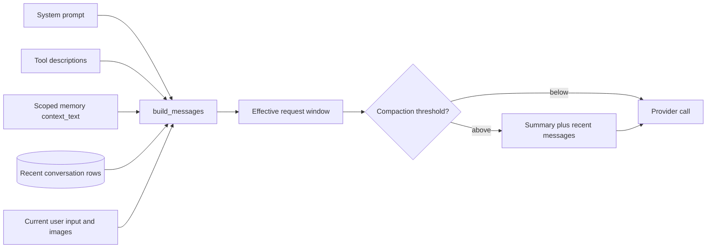
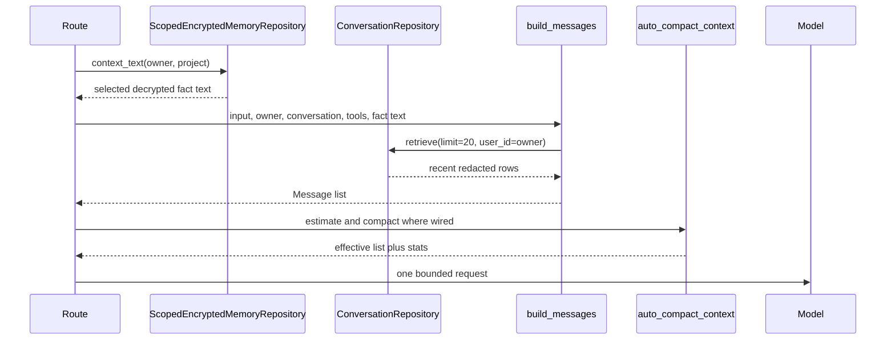
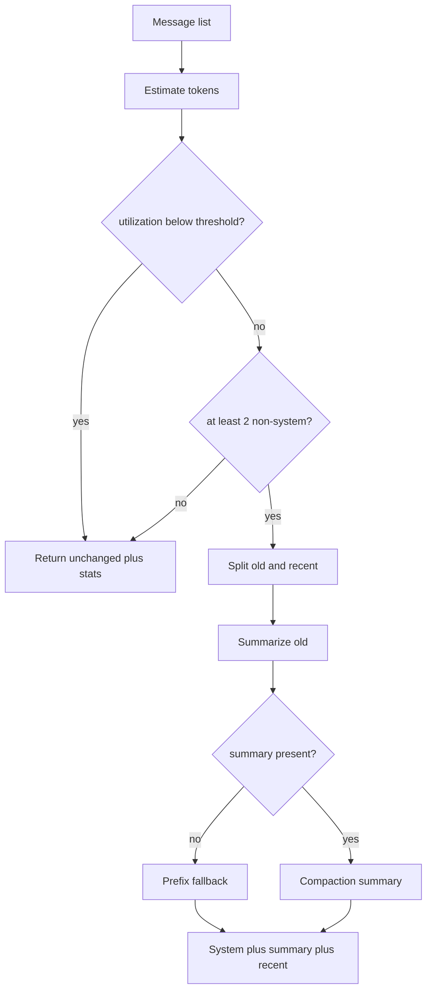

# Context windows

> **Implementation status:** `implemented`
> **Boundary:** sync and SSE share token-aware compaction with output reserve, and every runtime iteration fails closed before dispatch when its request bound exceeds the configured context allowance. Without a provider tokenizer, Archon counts each UTF-8 byte as one token plus framing and reserves 22k tokens per validated image; this is intentionally conservative, not an exact usage estimate. Persisted provenance describes initial effective context rather than every later tool/model call.

## Beginner explanation

A context window is everything sent to the model for one invocation.
It can include system instructions, tool descriptions, selected durable facts, recent conversation messages, images, and the current user turn.
The window is temporary: it is constructed for a request and is not itself a durable memory store.
A model can only condition its answer on content that fits and is selected, even if much more data exists in the database.

Three layers must stay distinct:

1. **Conversation rows** are durable ordered user/assistant messages.
2. **Encrypted facts** are separately selected owner/project-scoped durable memory.
3. **Effective context** is the per-call projection assembled from those stores plus instructions and current input.

Persisting a conversation does not prove every turn reached a later model call.
Storing a fact does not prove it was selected, and a context item does not automatically become durable after the call.

## Assembly model



`backend/app/runtime/context.py::build_messages` renders `SYSTEM_PROMPT`, native-tool guidance, the Brussels current date, optional persistent-memory text, and optional extra system instructions.
It retrieves at most 20 conversation messages with the authenticated `user_id`, then appends the current user message and image tuple.
The fixed count is a retrieval bound, not a token guarantee: one large message can consume far more tokens than many small ones.

## Per-call sequence



Sync and streaming now call the same `compact_effective_context` helper after `prepare_effective_context`, so their initial selection, compaction, source-ID partition, and manifest update share one implementation.
`AgentRuntime` also bounds the full messages-plus-tools request before every provider call and returns `context_budget_exhausted` before dispatch when the configured allowance minus output reserve would be exceeded. The fallback bound is one token per UTF-8 byte plus explicit framing and 22,000 tokens per validated image; it intentionally sacrifices usable context rather than undercounting adversarial text when an exact provider tokenizer is unavailable.
This per-iteration gate prevents late overflow after tool results, but it does not persist a separate provenance manifest for every later model call.

## Compaction

`backend/app/services/auto_compact.py::auto_compact_context` estimates tokens with `get_token_count(content) + 4` per message.
The default maximum is 200,000 estimated tokens, the compaction threshold is 75%, and ten recent messages are retained by default.
Below threshold it returns the original messages and utilization statistics.
At or above threshold, if at least two non-system messages exist, it keeps all system messages, summarizes older conversation messages, and retains recent messages.
If summarization returns nothing, it falls back to short prefixes from up to five old messages.
That fallback is availability-oriented, not semantically lossless.



## Ordering and instruction priority

The builder places the primary prompt in a system message before history and the current user turn.
Persistent facts are appended inside that system prompt under a labeled section.
This raises their instruction priority, so only properly scoped and intentionally selected facts should enter it.
Conversation messages retain their stored roles; invalid roles fail when converted through `Role(item["role"])`.
The current user input is last and may carry images.
Tool descriptions are rendered into the system prompt while native schemas are supplied by provider/runtime integration.

## Invariants

- Retrieval must use the authenticated owner, not a caller-supplied foreign identity.
- Persistent memory selection must bind both owner and project.
- System instructions remain separate from dialogue roles.
- Current input is included exactly once in the built list.
- Context construction must be bounded by message, token, byte, tool, and time limits where applicable.
- Compaction must retain recent messages and make summary insertion explicit.
- Effective context must not be logged wholesale merely for debugging.
- A message-count limit must never be described as a hard token limit.

## Source symbols and tests

| Source symbol | Contract |
|---|---|
| `backend/app/runtime/context.py::build_messages` | Ordered context assembly and 20-message history bound |
| `backend/app/runtime/support.py::compact_effective_context` | Shared sync/SSE compaction and provenance-manifest update |
| `backend/app/runtime/engine.py::AgentRuntime.run` | Per-provider-call messages/tools context admission and output reserve |
| `backend/app/memory/scoped.py::ScopedEncryptedMemoryRepository.context_text` | Owner/project facts rendered as bullets |
| `backend/app/services/auto_compact.py::auto_compact_context` | Threshold, summary, recent retention, and stats |
| `backend/app/services/auto_compact.py::MAX_CONTEXT_TOKENS` | Default estimation budget, not provider proof |

`backend/tests/unit/test_wiring_gaps.py::TestImageInputPlumbing::test_images_flow_through_build_messages` checks image propagation.
`backend/tests/unit/test_runtime_sse.py::test_chat_uses_typed_runtime_and_preserves_history` checks history in the typed runtime path.
`backend/tests/unit/test_memory_startup.py` checks whether encrypted memory is enabled or deliberately hidden.
`backend/tests/unit/test_scoped_encrypted_memory.py::test_bound_tools_and_conversation_search_are_owner_scoped` supports scope separation.
These tests do not constitute a complete token-by-token context provenance report.

## Security and failure modes

| Threat/failure | Control or response | Residual risk |
|---|---|---|
| Cross-owner history | `user_id` passed to repository retrieval | New call sites can omit scope if not reviewed |
| Cross-project facts | `context_text(user_id, project_id)` | Incorrect route project binding selects wrong scope |
| Prompt injection in history/facts | Role boundaries and policy/tool enforcement | The model can still follow malicious text |
| Context overflow | Retrieval bounds and optional compaction | Estimates differ from provider tokenization |
| Summary distortion | Preserve recent turns and label summary | Lost qualifiers can change behavior |
| Secret leakage in telemetry | Log counts and hashes, not effective context | Provider receives intentionally selected cleartext |
| Stale fact | Explicit replace/remove memory operations | No automatic truth or expiry guarantee |

Encryption at rest does not protect data while it is decrypted for selection and sent to a provider.
Provider retention, regional processing, and contract controls are deployment concerns outside this local implementation.

## Observability

Record safe aggregate fields: message count, estimated input tokens, budget, utilization, compaction flag, before/after counts, tokens saved, provider/model ID, run ID, and latency.
The compactor emits `context_compacting` and `context_compacted` structured logs with counts and estimates.
Avoid message text, summary text, images, raw tool schemas containing secrets, or decrypted fact contents.
A useful production dashboard separates retrieval count, estimated window size, provider-reported input tokens, compaction rate, and context-related failures.
A discrepancy between local estimates and provider usage is a calibration signal, not proof that either side is malicious.

## Trade-offs

More context can improve recall but increases cost, latency, distraction, and attack surface.
Recent-only history is cheap and predictable but can omit an old constraint.
Summaries compress long dialogue but introduce another lossy interpretation step.
Putting facts in a system section improves salience but gives stale or poisoned memory more influence.
Exact tokenization is provider-specific; a cheap estimator is portable but imprecise.
Capturing full context provenance aids debugging but creates a high-value privacy store, so Archon currently avoids claiming it.

## Lab versus production

A lab can use mock providers, a 20-message bound, and local token estimates to demonstrate selection and compaction.
Production should set provider/model-specific limits, calibrate local estimates against reported usage, bound image/tool-schema contributions, monitor context failures, and test adversarial long inputs.
It should also define data-processing policy for decrypted facts sent externally and decide whether per-call provenance warrants its additional privacy/storage cost.
Do not infer a public SLO or exact tokenizer parity from the managed local acceptance.

## Exercise

Run focused, credential-free tests:

```bash
cd backend
uv run pytest -q \
  tests/unit/test_wiring_gaps.py::TestImageInputPlumbing::test_images_flow_through_build_messages \
  tests/unit/test_runtime_sse.py::test_chat_uses_typed_runtime_and_preserves_history \
  tests/unit/test_scoped_encrypted_memory.py::test_bound_tools_and_conversation_search_are_owner_scoped
```

Then trace one request from `prepare_messages` to `build_messages` and identify the owner, project, history limit, and current-turn position.
For an advanced exercise, call `auto_compact_context` with a tiny `max_tokens` and verify that system messages and recent turns remain while old turns become a labeled summary.

## 30-second interview answer

“Context is the bounded input to one model call, not durable memory. Archon builds it from system and tool instructions, owner/project-scoped encrypted facts, up to 20 owner-scoped conversation rows, and the current user turn. Where compaction is wired, old dialogue may become a labeled summary while recent messages remain. Message counts and token estimates are bounds and signals, not exact provider guarantees, and Archon does not claim a complete effective-context provenance inspector.”

## Self-check

1. **Are conversation rows the context window?** No; they are one source selected into a per-call window.
2. **Does encrypted storage mean the provider sees ciphertext?** No; selected facts are decrypted before use.
3. **Why is 20 messages not a token guarantee?** Message sizes, images, system text, and tool schemas vary.
4. **What does compaction preserve?** System messages and a configurable number of recent non-system messages.
5. **What happens when summarization is empty?** A bounded prefix fallback is used.
6. **Can logs contain the whole effective context?** They should not; use safe aggregate metadata.
7. **What is the remaining context limitation?** Estimates are conservative rather than provider-exact, and persisted provenance describes initial effective context rather than every later model call.

## Related concepts

- [Conversation lifecycle](conversation-lifecycle.md)
- [Encrypted memory](encrypted-memory.md)
- [Checkpoints](checkpoints.md)
- [Run Ledger](run-ledger.md)
- [Retrieval](retrieval.md)
- [Tool contracts](tool-contracts.md)
- [Structured logging](structured-logging.md)
