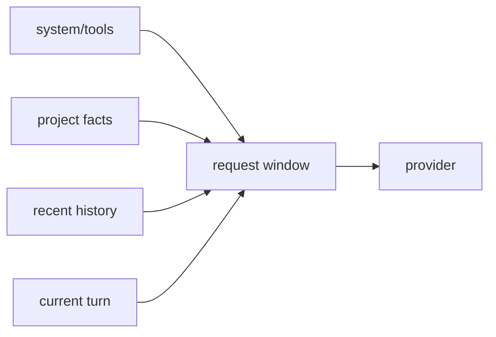

# Context windows

**Status:** partial

## Definition
A context window is the bounded sequence of instructions, history, memory, evidence, tool schemas, and current input supplied to one model call. It is not durable memory.

## Archon implementation
`backend/app/runtime/context.py::build_messages` builds system/tool instructions, optional project-memory text, up to 20 owner-scoped conversation messages, then the current user message. `backend/app/services/auto_compact.py::auto_compact_context` estimates token use, summarizes older turns at a threshold, and retains recent turns, but complete live-path compaction evidence is limited.

## Invariants and trade-offs
Selection must preserve identity scope and instruction priority. More context raises cost/latency and can dilute attention; truncation/summary can lose facts. A fixed message count is not a token guarantee. Never log effective context merely to prove it exists.

## Evidence and limits
Tests: `backend/tests/unit/test_memory_startup.py`, `backend/tests/unit/test_conversations.py`. Source: `build_messages`, `auto_compact_context`. Archon lacks a complete provenance/token-contribution inspector; compaction code is partial evidence, not proof on every route.

## Interview prompt
“Context is per-call input assembled from scoped stores; memory is durable data from which some context is selected.”
