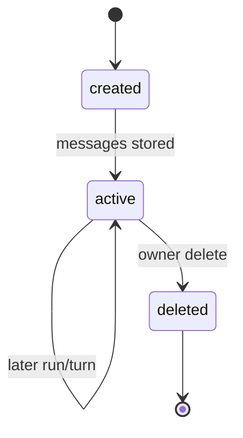

# Conversation lifecycle

**Status:** implemented

## Definition
A conversation is owner-scoped durable metadata plus ordered user/assistant messages. A run is one execution associated with a conversation; one conversation may have many runs.

## Archon implementation
`backend/app/services/conversations.py::ConversationRepository` provides `create`, `list`, `get`, `store`, `retrieve`, `retrieve_through`, `search`, and `delete`. Titles and message content pass through `PersistenceRedactor`; database methods enforce `user_id`. `build_messages` reads recent history before a call, and chat paths persist turns.

## Invariants and failure modes
Foreign and absent resources should not reveal ownership. Deletion/history/search must use the same owner boundary. Redaction is lossy by design. Conversation persistence is not encrypted by `ScopedEncryptedMemoryRepository`; do not conflate message rows with encrypted fact memory.

## Evidence and limits
Tests: `backend/tests/unit/test_conversations.py`, `backend/tests/security/test_conversation_ownership.py`, `backend/tests/integration/test_conversation_persistence.py`. No automatic conversation expiry or full effective-context provenance is claimed.

## Interview prompt
“Conversation owns durable dialogue; run owns one execution trajectory; context is the selected per-request projection.”
