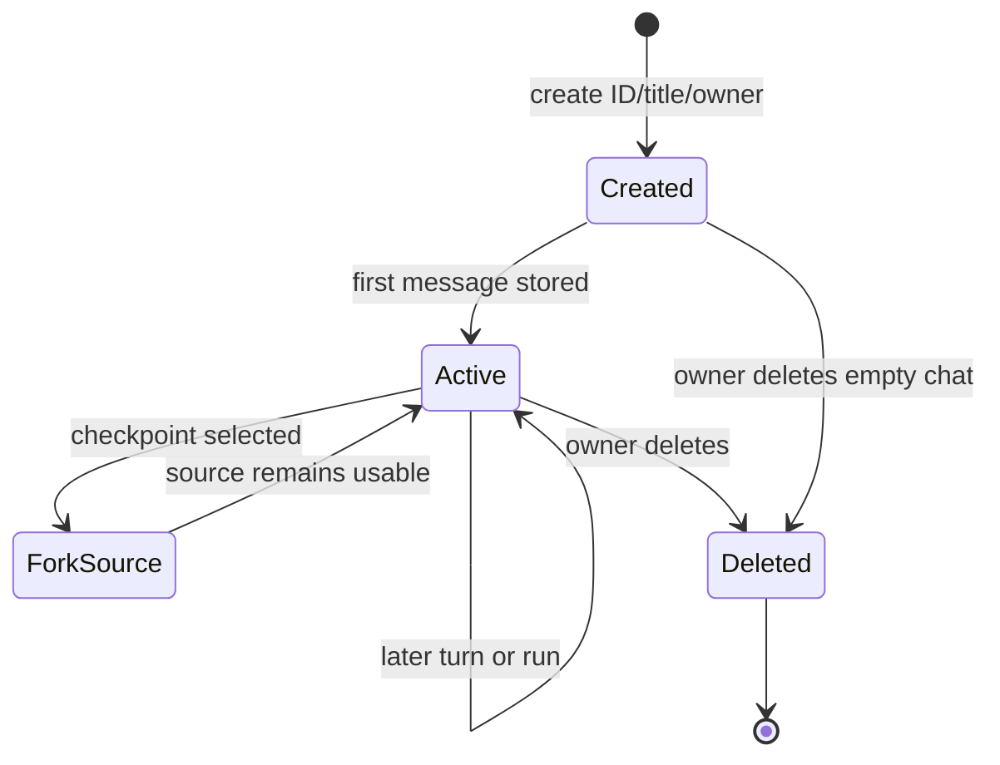
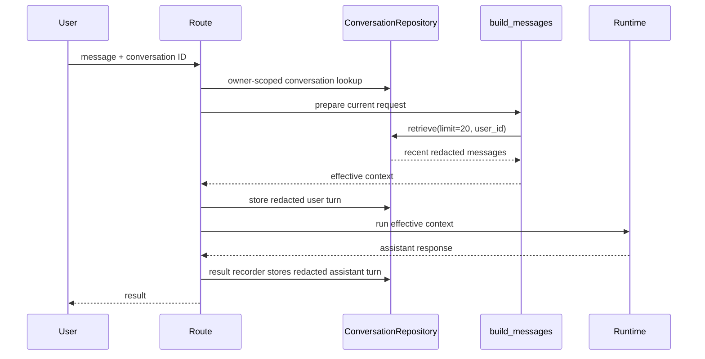
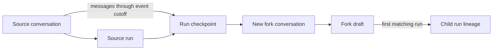

# Conversation lifecycle

> **Implementation status:** `implemented`
> **Boundary:** Conversation CRUD and message persistence are durable and owner-scoped; a conversation is not a run, encrypted fact store, effective context, or workspace.

## Beginner explanation

A conversation is the durable chat container a user sees: metadata plus ordered user and assistant messages.
A run is one execution attempt associated with a conversation.
One conversation can accumulate many turns and many runs over time.
When a new model call starts, Archon selects some conversation rows into an effective context, but the conversation itself remains larger and durable.

Keep these stores separate:

| Object | Persists | Scope | Purpose |
|---|---|---|---|
| `ConversationRow` | ID, title, owner, timestamps, active flag | owner | Chat container |
| `MessageRow` | role, redacted content, timestamp | via owned conversation | Durable dialogue |
| `MemoryFactRow` | encrypted fact and provenance | owner + project | Selected long-term facts |
| `RunRow` | execution status, metrics, lineage | owner + project | One invocation summary |
| effective context | selected instructions/history/facts/current input | request | One provider call |

Conversation message rows are not encrypted by `ScopedEncryptedMemoryRepository`.
They are redacted before persistence, but encryption and redaction solve different problems.

## Lifecycle



`is_active` exists on `ConversationRow`, but the public lifecycle shown by current repository methods is create, use, retrieve/search, and delete.
Do not invent archival or expiry semantics that are not implemented.

## Request and persistence sequence



Persistence and provider execution are different boundaries.
A stored user turn can survive restart, while an interrupted runtime may not produce a completed assistant turn.
The Run Ledger is the place to inspect run status and safe control events; conversation history is the human dialogue record.

## Repository walkthrough

`backend/app/services/conversations.py::ConversationRepository` owns a `DatabaseStore` and exposes its `RunRepository` as `runs`.
`create` redacts the title, creates a conversation for `user_id`, and returns a zero message count.
`list` delegates to owner-scoped listing.
`get` retrieves owned metadata, then messages, and computes `message_count`.
`store` redacts content before delegating to the database.
`retrieve` and `retrieve_through` return bounded ordered role/content records.
`search` searches only the authenticated owner's persisted conversations.
`delete` removes only a matching owned conversation.
`append_runtime_event` delegates execution events to the separate Run Ledger repository.

The database layer defines `ConversationRow` and `MessageRow` in `backend/app/services/db_store.py`.
`MessageRow.conversation_id` is indexed; ownership enforcement comes from repository queries joining or checking the conversation.
That means every new message query must preserve the owner boundary rather than assuming the message ID alone is sufficient.

## Identity and not-found behavior

Owner-scoped lookup treats a foreign resource like a missing resource.
This avoids revealing whether another user's conversation ID exists.
API authentication supplies the owner; clients should not be allowed to choose another user's `user_id` in the request body.
Project scope applies to runs and encrypted facts, while current conversation ownership is primarily by user.
Do not infer project isolation for conversation rows unless a query and schema explicitly provide it.

## Ordering, redaction, and deletion

Messages are retrieved in database-defined order and exposed as role/content dictionaries.
Titles and contents pass through `PersistenceRedactor` before persistence.
Redaction is intentionally lossy: a restored or forked message may differ from the original user input.
Deletion makes the conversation unavailable through owner-scoped APIs; tests verify history also becomes unavailable.
Deletion is not documented as cryptographic erasure, backup purge, provider deletion, or deletion of unrelated encrypted facts.
Retention and legal hold need separate policy.

## Fork relationship



A fork copies redacted conversation messages into a new conversation.
It does not mutate or delete the source conversation.
The child conversation exists before a child run, and only one new run consumes its draft lineage.
Neither source nor target conversation is an arbitrary filesystem snapshot.

## Invariants

- Conversation metadata and message operations use an authenticated owner boundary.
- Foreign and absent IDs are indistinguishable through protected reads.
- Persisted title and content are redacted first.
- Role/content rows are durable across repository re-instantiation.
- A conversation may be associated with multiple `RunRow` records.
- Run events are not mixed into user-visible message history.
- Encrypted facts remain a separate owner/project-scoped store.
- Effective context is reconstructed and may include only recent rows.

## Source symbols and tests

| Source or test | Evidence |
|---|---|
| `backend/app/services/conversations.py::ConversationRepository` | Public persistence façade and exact CRUD symbols |
| `backend/app/services/db_store.py::ConversationRow` | Durable metadata fields |
| `backend/app/services/db_store.py::MessageRow` | Durable dialogue fields |
| `backend/app/runtime/context.py::build_messages` | Selection of up to 20 owner-scoped messages |
| `backend/app/routes/conversations.py` | Authenticated conversation API |
| `backend/app/routes/chat.py` | Chat/history integration |
| `backend/tests/unit/test_conversations.py::TestConversationCRUD` | Create/list/get/delete/history and fresh-store survival |
| `backend/tests/security/test_conversation_ownership.py` | Authentication and foreign-owner non-disclosure |
| `backend/tests/integration/test_conversation_persistence.py` | Lifecycle and restart persistence |
| `backend/tests/integration/test_pii_resilience_live.py::test_sync_and_sse_redact_user_assistant_and_artifact_persistence` | Live-path redaction evidence |

Evidence of durable rows is not evidence that every route includes every row in model context.
Evidence of redaction is not evidence of encryption for conversation content.

## Security and failure modes

| Threat/failure | Control or behavior | Residual risk |
|---|---|---|
| ID guessing | Owner predicate and missing-like response | New queries can regress scoping |
| PII in messages/title | `PersistenceRedactor` before storage | Detection is imperfect and lossy |
| Partial runtime failure | Conversation and Run Ledger show separately persisted state | Cross-store operations are not one universal transaction |
| Invalid role | Context conversion can fail closed | Database constraints may not encode every semantic rule |
| Unlimited growth | Retrieval limits bound reads | No automatic conversation expiry is claimed |
| Delete misunderstanding | API removes owned conversation | Backups/provider copies have separate lifecycles |
| Prompt injection in old turn | It remains untrusted dialogue | Model/tool policy must enforce authority |

Operational logs should never include raw message content simply because the database already stores a redacted form.
Owner checks and redaction are complementary: neither replaces the other.

## Observability

Track owner-safe conversation ID, correlation ID, run ID, operation, status, message count, retrieval limit, duration, and stable error category.
Metrics can include create/read/delete rates, history length distribution, search latency, persistence failures, and orphaned or failed-run rates.
Do not emit message text, titles before redaction, encrypted facts, tool payloads, or provider exceptions containing prompts.
Use the Run Ledger for ordered safe execution events and conversation history for dialogue; joining them by IDs should not blur their meanings.
A successful message write proves persistence, not provider receipt or semantic correctness.

## Trade-offs

Durable history improves continuity and user control but increases retention and privacy obligations.
Redaction reduces exposure but can remove useful detail and does not provide ciphertext-at-rest guarantees.
Owner-scoped 404 behavior limits enumeration but makes operator diagnosis depend on safe internal telemetry.
Recent-message selection bounds model cost but creates a gap between stored history and effective context.
Deleting a whole conversation is easy to reason about, while fine-grained message editing would require stronger ordering and audit semantics.

## Lab versus production

SQLite tests demonstrate restart behavior and query contracts locally.
Production should use supported migrations, backups, access controls, encryption at the database/storage layer, retention schedules, and restore drills.
It should monitor database growth and ensure replicas/backups obey deletion policy.
No local test establishes multi-region ordering, regulatory compliance, or a production availability SLO.
Mock-model responses validate persistence wiring, not external provider behavior.

## Exercise

Run the focused lifecycle and ownership suites:

```bash
cd backend
uv run pytest -q \
  tests/unit/test_conversations.py \
  tests/security/test_conversation_ownership.py \
  tests/integration/test_conversation_persistence.py
```

Create a diagram from one assertion in each suite: durable restart, foreign-owner miss, and delete/history behavior.
Then identify where redaction occurs and explain why that does not make conversation rows encrypted facts.

## 30-second interview answer

“An Archon conversation is owner-scoped durable metadata plus ordered redacted user/assistant rows. A run is one execution associated with that conversation, while encrypted facts are a separate owner/project store and effective context is rebuilt per request from selected history, facts, instructions, and current input. CRUD, search, restart persistence, and ownership are tested. Deletion and redaction do not imply provider erasure, cryptographic memory storage, or that every stored turn reached a later model call.”

## Self-check

1. **Can one conversation have multiple runs?** Yes; runs represent executions, not chat containers.
2. **Are message rows encrypted by scoped memory?** No; they are separate redacted conversation storage.
3. **Does stored history equal effective context?** No; the builder selects a bounded subset.
4. **How should a foreign conversation ID appear?** Indistinguishable from a missing ID.
5. **Does delete prove backup erasure?** No; backup retention is separate.
6. **What persists across repository restart?** Conversation metadata and stored messages in the configured database.
7. **What records execution status?** `RunRow` and safe `RuntimeEventRow` entries in the Run Ledger.

## Related concepts

- [Context windows](context-windows.md)
- [Encrypted memory](encrypted-memory.md)
- [Checkpoints](checkpoints.md)
- [Replay, fork, and compare](replay-fork-compare.md)
- [Run Ledger](run-ledger.md)
- [Authorization and ownership](authorization-ownership.md)
- [Structured logging](structured-logging.md)
