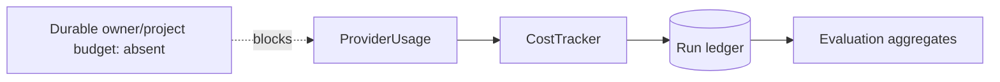
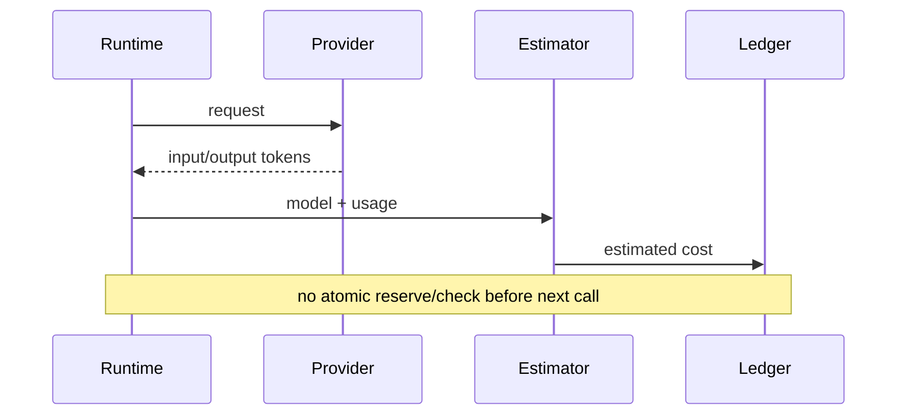

# Cost, usage, and budgets

> **Implementation status:** `partial`
> **Status boundary:** Runs record token and estimated cost data and evaluations aggregate it, but the chat cost tracker is recreated per response and no durable monetary budget prevents spend.
> **Reviewed revision:** `6e3e13f`
> **Used by module:** [Module 07-run-ledger](../modules/07-run-ledger/README.md)
> **Catalog ID:** `cost-usage-budgets`

## Beginner explanation

Usage measurement says what a model call consumed; costing applies a price; a budget stops or asks before a limit is exceeded. Reporting five cents after a run is not budget enforcement. Prices also change, so every estimate needs model and price-version context.

## Problem and mental model

Treat the boundary as a contract with explicit inputs, outputs, state, failure behavior, and evidence. The important question is not whether a similarly named class or file exists, but whether the behavior is wired into a real path and whether a test or observation proves it.

## Architecture and components

## Startup and request sequence

## Archon implementation and source walkthrough

At revision `6e3e13f`, the mapped symbols implement the bounded behavior below. No persistent price version, reservation, atomic counter, hard budget, or cross-replica enforcement.

### Source symbols

| Source symbol | Role and boundary |
|---|---|
| [`backend/app/observability/cost_tracker.py:CostTracker.record`](../../../backend/app/observability/cost_tracker.py) | Calculates estimates and process-local threshold alerts. |
| [`backend/app/routes/stream.py:chat_stream_real`](../../../backend/app/routes/stream.py) | Records response usage/cost in the run ledger. |
| [`backend/app/eval/service.py:EvaluationService._aggregate`](../../../backend/app/eval/service.py) | Aggregates recorded cost and token metrics. |

### Tests

| Test | Contract proved and limit |
|---|---|
| [`backend/tests/unit/test_eval_wire.py::test_stream_done_event_includes_cost_usd`](../../../backend/tests/unit/test_eval_wire.py) | Checks SSE completion exposes a cost estimate. |
| [`backend/tests/unit/test_recorded_evaluations.py::test_scores_good_and_bad_recorded_runs_by_explicit_case_key`](../../../backend/tests/unit/test_recorded_evaluations.py) | Exercises recorded cost metrics in deterministic evaluation. |

### Evidence boundary

Current implementation dimensions are centralized in [Implementation Evidence](../../IMPLEMENTATION-EVIDENCE.md). Source/tests below are repository evidence; they are not public-deployment or production-certification evidence.

## Try it: bounded study exercise

From the repository root, inspect the mapped source and test, then run the named focused test with the project test environment if available. Confirm both the passing contract and this gap: No persistent price version, reservation, atomic counter, hard budget, or cross-replica enforcement.

**Done criteria:** identify the trust boundary, one proved behavior, and one unproved behavior without changing repository state.

## Risks, failures, and trade-offs

| Topic | Assessment |
|---|---|
| Principal risk | Concurrent requests can overspend and stale prices can misstate cost. |
| Current gap/failure | No persistent price version, reservation, atomic counter, hard budget, or cross-replica enforcement. |
| Trade-off | Post-hoc estimates are easy; hard budgets require durable atomic accounting and a defined degradation policy. |
| Evidence hygiene | Do not log secrets or hidden chain-of-thought; record revision, environment, command, and only redacted outcomes. |

## Lab vs production

The status remains **partial** at `6e3e13f`. Runs record token and estimated cost data and evaluations aggregate it, but the chat cost tracker is recreated per response and no durable monetary budget prevents spend. Unit tests, manifests, or local observations do not prove external-provider parity, sustained load, public deployment, legal compliance, or a production SLO.

## Interview answer

> Usage measurement says what a model call consumed; costing applies a price; a budget stops or asks before a limit is exceeded. Reporting five cents after a run is not budget enforcement. Prices also change, so every estimate needs model and price-version context. In Archon the honest status is **partial**: Runs record token and estimated cost data and evaluations aggregate it, but the chat cost tracker is recreated per response and no durable monetary budget prevents spend.

## Self-check

1. What problem does this concept solve, and what nearby concept is it not?
2. Trace the diagram’s trust boundary and failure path.
3. Which mapped symbol/test proves current behavior, or why are the lists empty?
4. What exact gap prevents a stronger status?
5. Which risk would you test first before production use?

Answer guide

A good answer names the contract in the beginner explanation, follows the sequence, cites the exact table entry (or the explicit absence), repeats the status boundary, and chooses a risk from the table rather than claiming unrecorded behavior.

## Related concepts and modules

- **Module:** [Module 07-run-ledger](../modules/07-run-ledger/README.md)
- **Course-day map:** [AIAMastery Days 1–30 coverage](../course-concept-coverage.md)
- **Evidence:** [Implementation Evidence](../../IMPLEMENTATION-EVIDENCE.md)
- **Historical context only:** [Feature and Course Audit v2](../../FEATURE-AND-COURSE-AUDIT-V2.md)
