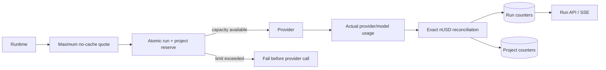
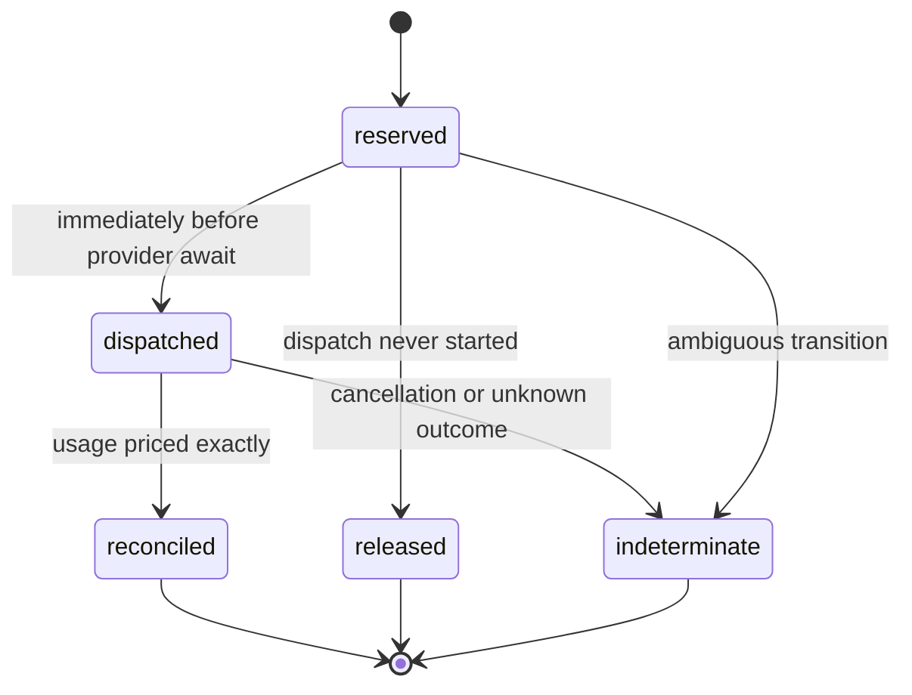

# Cost, usage, and durable budgets

> **Implementation status:** `partial`
> **Status boundary:** exact nUSD run/project reservations and reconciliation are wired into sync and SSE model calls, but live-provider pricing, PostgreSQL contention, and deployment evidence are not recorded.
> **Used by module:** [Module 07-run-ledger](../modules/07-run-ledger/README.md)
> **Catalog ID:** `cost-usage-budgets`

## Beginner explanation

Usage reports what a model call consumed. Pricing converts that usage into money. A budget must reserve an upper bound **before** dispatch, then reconcile actual usage afterward. Reporting cost after a run is observability; preventing an over-budget call is enforcement.

Archon uses integer nano-US-dollars (`nUSD`) for enforcement. It does not use binary floating point in authoritative counters.

## Architecture

## Runtime sequence

1. `DurableBudgetedProvider` opens immutable run/project limits.
2. It allocates a deterministic run-local call ordinal and charge ID.
3. `quote_model_call_nusd` prices the maximum applicable candidate without assuming cache discounts.
4. `MonetaryBudgetRepository.reserve_call` updates project then run counters atomically.
5. A rejected reserve returns `monetary_budget_exhausted` before provider invocation.
6. Immediately before the provider await, the charge becomes `dispatched`.
7. The returned provider/model and token usage are detached from provider-owned objects.
8. `price_model_usage_nusd` recomputes actual cost; caller-supplied cost is not trusted.
9. Reconciliation moves reserved funds to spent and releases the unused quote.
10. Sync, SSE, and run detail project the durable counters; in-memory `CostTracker` remains observational.

## Source walkthrough

| Source | Responsibility |
|---|---|
| [`backend/app/observability/cost_tracker.py`](../../../backend/app/observability/cost_tracker.py) | Exact Decimal pricing, provider/model allowlists, cache-aware actuals, conservative quotes. |
| [`backend/app/services/monetary_budget.py`](../../../backend/app/services/monetary_budget.py) | Atomic project/run accounts and durable charge lifecycle. |
| [`backend/app/runtime/monetary_budget.py`](../../../backend/app/runtime/monetary_budget.py) | Cancellation-safe provider wrapper around every `complete()` call. |
| [`backend/app/runtime/factory.py`](../../../backend/app/runtime/factory.py) | Shared opt-in wiring for sync and SSE. |
| [`backend/app/routes/chat.py`](../../../backend/app/routes/chat.py) | Sync projection of authoritative spend. |
| [`backend/app/routes/stream.py`](../../../backend/app/routes/stream.py) | SSE cost plus limit/reserved/remaining projection. |
| [`backend/app/routes/runs.py`](../../../backend/app/routes/runs.py) | Owner-scoped durable budget summary as decimal strings. |

## Tests

| Test | Contract |
|---|---|
| [`backend/tests/unit/test_monetary_budget.py`](../../../backend/tests/unit/test_monetary_budget.py) | Atomic limits, duplicates, recovery, exact pricing, owner isolation. |
| [`backend/tests/unit/test_budgeted_provider.py`](../../../backend/tests/unit/test_budgeted_provider.py) | Reserve/dispatch/reconcile and repeated-cancellation safety. |
| [`backend/tests/unit/test_durable_budget_wiring.py`](../../../backend/tests/unit/test_durable_budget_wiring.py) | Factory, stop reasons, real SQLite run creation, block-before-provider. |
| [`backend/tests/integration/test_effect_budget_migration.py`](../../../backend/tests/integration/test_effect_budget_migration.py) | Reversible schema migration and integer constraints. |
| [`backend/tests/integration/test_run_replay_api.py`](../../../backend/tests/integration/test_run_replay_api.py) | Owner-scoped API projection. |

## Failure semantics

| Condition | Behavior |
|---|---|
| Unknown provider/model price | Fail closed before dispatch. |
| Run or project lacks capacity | No provider call; safe budget stop. |
| Duplicate charge/ordinal | No second provider call. |
| Cancellation before dispatch | Release reservation. |
| Cancellation after dispatch | Retain funds and mark indeterminate. |
| Actual cost exceeds quote | Mark indeterminate; do not silently overspend. |
| Cache counters absent | Preserve unknown; do not treat as reported zero. |

## Security and privacy

The charge ledger stores safe identities, integer amounts, token counters, and timestamps. It does not store prompts, messages, tool arguments, raw provider payloads, API keys, or exception strings. API amounts are decimal strings to avoid JSON-float ambiguity.

## What this does not prove

- Price tables are code/configuration and require maintenance when providers change prices.
- SQLite concurrency tests and generated PostgreSQL SQL do not replace live PostgreSQL contention tests.
- Deterministic provider doubles do not prove real-provider billing parity.
- Local wiring does not prove a public deployment, production SLO, or legal/compliance guarantee.

## Exercise

1. Set a small run limit with durable budgets enabled.
2. Run a priced mock provider call that fits and inspect the reconciled charge.
3. Run a call whose conservative quote exceeds the remaining limit.
4. Prove the provider was not invoked.
5. Confirm run and project `spent + reserved <= limit` still holds.

**Done criteria:** cite the charge row, run/project counters, stop reason, and focused test output without exposing request content.

## Interview answer

> Archon enforces monetary budgets with durable integer nUSD accounts. Every model call reserves a conservative upper bound across fallback candidates before dispatch, marks dispatch durably, and reconciles exact provider-reported usage before returning the response. Unknown prices and insufficient capacity fail closed. Cancellation after dispatch becomes indeterminate rather than releasing potentially billable funds. The honest limitation is that live provider and PostgreSQL contention evidence is still pending.

## Self-check

1. Why is post-hoc cost reporting not a budget?
2. Why does the quote ignore cache discounts?
3. Why are `dispatched` cancellations not automatically released?
4. Why are provider and model validated as a pair?
5. Which evidence is still missing for production claims?

## Related concepts

- [Run ledger](run-ledger.md)
- [Structured output and prompt caching](structured-output-prompt-caching.md)
- [Implementation Evidence](../../IMPLEMENTATION-EVIDENCE.md)
