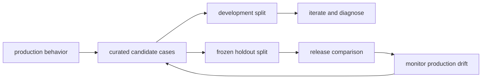
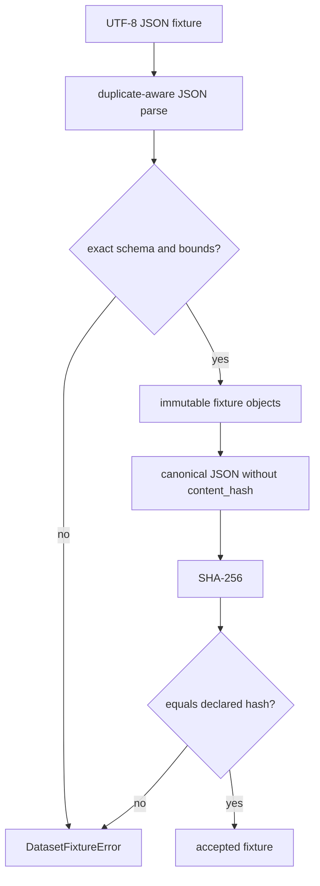

# Evaluation datasets

**Status:** implemented with deliberately narrow coverage

## What an evaluation dataset is

An evaluation dataset is a versioned collection of cases that names behavior worth preserving.
A case connects an input or recorded run to explicit expectations.
A dataset is not merely a JSON file: its identity, provenance, schema, and review process are part of the measurement.
Changing a case can change the score, so content changes must produce a visibly different dataset identity.
A reproducible dataset does not automatically represent real traffic or prove model quality.

## Why beginners should care

Without fixed cases, a developer may remember only successful demonstrations.
With fixed cases, the same behavior can be checked before and after a change.
Development cases help diagnose failures quickly.
A frozen holdout set gives a less biased comparison than cases repeatedly tuned against.
Production sampling finds distribution shifts that a frozen set cannot anticipate.
These roles should remain separate rather than being collapsed into one convenient file.

## The shipped Archon fixture

The concrete fixture is `backend/app/eval/datasets/grounded-v1.json`.
It declares `schema_version: 1`, `dataset_id: grounded-v1`, and `version: 1.0.0`.
Its declared `content_hash` is a lowercase canonical SHA-256 digest.
It contains exactly two cases today: `grounded-citation` and `safe-abstention`.
`grounded-citation` expects a grounded run, text containing `[E`, and no `unsupported` text.
`safe-abstention` expects a non-grounded run, a specific abstention phrase, and no `fabricated source` text.
That scope exercises selected grounded-answer and abstention regressions only.
It does not sample broad domains, languages, tool use, long contexts, or adversarial behavior.

## Exact schema and identity rules

`backend/app/eval/fixtures.py::EvaluationFixture` is the immutable top-level value.
`backend/app/eval/fixtures.py::EvaluationFixtureCase` is the immutable case value.
`backend/app/eval/fixtures.py::load_evaluation_fixture` performs strict loading.
`backend/app/eval/fixtures.py::fixture_content_hash` computes identity.
The loader accepts exactly five top-level keys and exactly four keys per case.
Unknown fields and missing fields fail because key sets must match exactly.
Duplicate JSON object keys fail in `_unique_object` rather than being silently overwritten.
Only schema version `1` is accepted.
`dataset_id` must be a non-empty string no longer than 255 characters.
`version` must be a non-empty string no longer than 100 characters.
The loader validates the version as a bounded identifier; it does not parse semantic-version grammar.
The hash must be exactly 64 lowercase hexadecimal characters.
A fixture must contain between 1 and 100 cases.
Case keys must be non-empty, at most 255 characters, and unique.
`grounded` must be a real boolean.
Each expectation field must be a list of at most 100 unique strings.
Each expectation must be non-empty and at most 500 characters.

## Canonical hashing

`fixtures.py::_canonical` excludes the declared `content_hash` field to avoid self-reference.
It includes cases in fixture order, so reordering cases changes the identity.
It serializes object keys in sorted order with compact separators.
It rejects non-JSON numeric values through `allow_nan=False`, though the current schema has no numeric case fields.
The UTF-8 canonical bytes are hashed with SHA-256.
The hash detects accidental or unauthorized drift; it is not a digital signature.
Someone able to edit both content and hash can create a self-consistent modified fixture.
Repository review and trusted release provenance are therefore still required.

## Mapping datasets to recorded runs

`backend/app/eval/service.py::EvaluationService._load_dataset` uses an allowlist of dataset IDs to paths.
The default allowlist maps only `grounded-v1` to the shipped fixture.
The loaded fixture's internal `dataset_id` must equal the requested allowlist key.
`EvaluationService._validate_mapping` requires every fixture case key exactly once.
It also requires every source run ID to be unique.
Request order does not control association: items are reordered into fixture order by `case_key`.
This prevents positional mix-ups and gives stable persistence and aggregation order.
A source run must belong to the requesting owner and requested project.
A source run must be completed and have `completed_at` set.

## Durable evaluation versus transient evaluation

The dataset is used by the durable recorded-run path in `backend/app/eval/service.py`.
That path reads already-persisted Run Ledger events and answer summaries.
It does not invoke a model, retriever, or tool during evaluation.
It persists dataset ID, version, hash, source run IDs, case checks, metrics, and aggregate results.
By contrast, `backend/app/eval/harness.py::EvalHarness` calls an agent inline and returns an in-memory summary.
`backend/app/eval/evaluators.py` also contains transient lexical and PII-based heuristics.
Do not describe those transient helpers as equivalent to a durable recorded-run evaluation.
They differ in inputs, persistence, reproducibility, privacy surface, and intended maturity.

## What the fixture can and cannot prove

The fixture can prove that a known recorded trajectory is mapped and scored deterministically.
It can expose regressions in exact grounded-state and phrase checks.
Its stable hash can prove which exact fixture bytes, after canonicalization, were evaluated.
The tests can prove pagination, ordering, owner/project isolation, and persistence behavior.
Two hand-authored cases cannot estimate general model quality.
Deterministic fake runs cannot prove live-provider reliability or semantic correctness.
A passing contains check cannot prove that the surrounding answer is truthful.
An expected non-grounded abstention is not evidence that every unsupported query will be refused.
Model-quality claims need representative samples, sound labels, uncertainty intervals, and external validity.

## Designing a stronger dataset

Start from a written task taxonomy rather than available examples.
Include ordinary success, abstention, malformed input, long context, and dependency failure.
Include high-risk security cases and cases where the right answer is to stop.
Tag cases by domain, language, risk, difficulty, and expected capability.
Measure subgroup results so a good aggregate cannot hide a weak slice.
Document where cases came from and whether consent or retention restrictions apply.
Remove exact production secrets and minimize personal data.
Deduplicate near-identical examples before splitting to reduce leakage.
Freeze a holdout before selecting prompts, models, or thresholds.
Version labels and evaluator logic as carefully as prompts.
Record expected ambiguity instead of forcing false single-answer certainty.
Use expert adjudication for disputed high-impact labels.
Track additions and removals in reviewable change history.

## Security and failure analysis

A malicious fixture could include prompt injection if a future evaluator sends raw cases to a model.
The current recorded evaluator does not send fixture content to a model, reducing that attack surface.
Expectation strings can still create misleading gates if reviewers treat lexical checks as semantics.
Path allowlisting prevents callers from selecting arbitrary server files as datasets.
Strict size bounds limit pathological fixture growth.
Owner/project checks prevent cross-tenant source-run evaluation and disclosure.
Persisted results intentionally avoid raw answer text and raw event payloads.
Hash verification catches drift but does not authenticate the fixture author.
Treat dataset access, reviews, and release signatures as separate controls.

## Observability and governance

Log dataset ID, semantic version, and hash with every evaluation run.
Track case count, pass rate, mean score, and tagged subgroup rates over time.
Alert on unknown hashes, loader failures, missing cases, and abrupt distribution shifts.
Keep raw sensitive examples out of ordinary metrics labels and logs.
Record evaluator code revision beside dataset identity in a mature system.
Review false positives and false negatives, not only the top-line pass rate.
Retain enough lineage to reproduce a decision without retaining unnecessary user content.

## Lab versus production

In the lab, the two-case fixture is fast, deterministic, and easy to understand.
In production, use larger reviewed datasets with provenance, splits, tags, and retention policy.
In the lab, a repository hash and tests are reasonable drift controls.
In production, add artifact signing, access control, approval workflow, and immutable storage.
In the lab, exact phrase checks illustrate mechanics.
In production, validate metric construct validity and calibrate any semantic judge.
In both settings, deterministic fixture evidence must not be presented as model-quality proof.

## Alternatives and complements

Golden files are useful when the entire output must remain stable but can be brittle for generative text.
Property-based tests cover invariants across generated inputs but do not replace representative examples.
Metamorphic tests check relations such as paraphrase invariance without requiring one golden answer.
Shadow traffic measures realistic behavior but raises privacy and operational concerns.
Human review provides nuanced judgment but costs more and needs agreement measurement.
Online experiments estimate user outcomes but should not be the first safety gate.
A mature program combines these methods rather than choosing one universal dataset.

## Exercise

1. Copy `grounded-v1.json` to a temporary path.
2. Load it with `load_evaluation_fixture` and record its accepted identity.
3. Add one expectation without changing `content_hash`; confirm `DatasetFixtureError` reports hash mismatch.
4. Recompute the hash with `fixture_content_hash`, update the declared hash, and load again.
5. Try a duplicate case key and an unknown case field; explain why both fail before evaluation.
6. Design three additional cases and tag their intended distribution slice in accompanying notes.
7. State explicitly which claims those deterministic cases still cannot support.

## Source and test evidence

- `backend/app/eval/datasets/grounded-v1.json` is the exact shipped data artifact.
- `backend/app/eval/fixtures.py::load_evaluation_fixture` enforces schema, bounds, uniqueness, and hash identity.
- `backend/app/eval/fixtures.py::fixture_content_hash` defines canonical identity.
- `backend/app/eval/service.py::EvaluationService._validate_mapping` enforces complete case mapping and unique runs.
- `backend/tests/unit/test_evaluation_fixtures.py::test_grounded_fixture_has_stable_verified_hash` locks the known fixture identity.
- `backend/tests/unit/test_evaluation_fixtures.py::test_fixture_loader_rejects_schema_version_cases_and_hash` exercises rejection paths.
- `backend/tests/unit/test_recorded_evaluations.py::test_scores_good_and_bad_recorded_runs_by_explicit_case_key` proves explicit mapping and scoring.
- These tests are deterministic implementation evidence, not representative model-quality evidence.

## 30-second interview answer

“An evaluation dataset is a versioned, reviewable sample of behavior with explicit expectations. Archon strictly loads an allowlisted JSON fixture, rejects duplicate or unknown fields and bounds violations, and verifies a canonical SHA-256 hash. The recorded evaluator maps every case exactly once to a unique completed owner/project-scoped run. That gives reproducible regression evidence, but the shipped two-case deterministic fixture is not representative evidence of model quality; production needs provenance, holdouts, subgroup analysis, privacy controls, and broader coverage.”

## Self-checks

1. **Why exclude `content_hash` from canonical bytes?** Including it would make the digest self-referential; the hash covers the substantive identity fields and cases.
2. **Does a matching SHA-256 authenticate the author?** No. It detects content drift relative to the declaration, but a writer can change both content and hash.
3. **Why map by `case_key` instead of request position?** Explicit keys prevent accidental case/run swaps and permit stable fixture-order persistence.
4. **What does the two-case fixture prove?** Loader and evaluator behavior plus selected grounded/abstention regressions, not broad model quality.
5. **Why separate development and holdout cases?** Repeated tuning against development cases biases their scores; a frozen holdout supports a cleaner comparison.
6. **Can a contains check establish faithfulness?** No. A substring can appear in an unsupported or misleading answer.
7. **Why is the dataset path allowlisted?** It prevents a caller-controlled ID from turning evaluation into arbitrary server-file access.
8. **What must change when fixture content changes?** At minimum the canonical hash, and under sound governance the dataset version as well.
