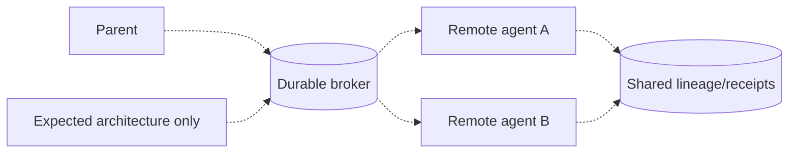

# Distributed agent networks

> **Implementation status:** `deferred`
> **Status boundary:** No distributed agent network is implemented; Archon intentionally focuses on one bounded local verifier child rather than claiming a swarm, broker, consensus layer, or cross-node orchestration.
> **Reviewed revision:** `6e3e13f`
> **Used by module:** [Module 11-bounded-delegation](../modules/11-bounded-delegation/README.md)
> **Catalog ID:** `distributed-agent-networks`

## Beginner explanation

A distributed agent network coordinates agents in different processes or machines through durable messages and explicit ownership. It must handle duplicates, partial failure, version skew, and network partitions. Several serial model calls inside one API request are not a distributed network.

## Problem and mental model

Treat the boundary as a contract with explicit inputs, outputs, state, failure behavior, and evidence. The important question is not whether a similarly named class or file exists, but whether the behavior is wired into a real path and whether a test or observation proves it.

## Architecture and components



## Startup and request sequence

```mermaid
sequenceDiagram
    Parent->>Broker: idempotent job + scoped capability
    Broker->>AgentA: leased delivery
    AgentA->>Ledger: signed result/heartbeat
    alt timeout or duplicate
      Broker->>AgentB: bounded retry/deduplicate
    end
    Note over Parent,Ledger: Deferred; no current implementation
```

## Archon implementation and source walkthrough

This is an expected architecture, not a source walkthrough. No broker, discovery, leases, distributed cancellation, deduplication, cross-node auth, or deployment evidence. The diagram and sequence define the boundary a future design would need; they do not imply scheduled work.

### Source symbols

| Source symbol | Role and boundary |
|---|---|
| None | No Archon implementation is claimed for this concept. |

### Tests

| Test | Contract proved and limit |
|---|---|
| None | No implementation test is claimed; adjacent tests do not establish this concept. |

### Evidence boundary

There is no runtime evidence for this concept. Use the repository and current [implementation evidence](../../IMPLEMENTATION-EVIDENCE.md) to confirm the negative boundary; do not infer implementation from adjacent features.

## Try it: bounded study exercise

Code-reading exercise: search the repository for the missing components named in the gap. Confirm that adjacent features do not satisfy them. No service should be started and no data should be changed.

**Done criteria:** identify the trust boundary, one proved behavior, and one unproved behavior without changing repository state.

## Risks, failures, and trade-offs

| Topic | Assessment |
|---|---|
| Principal risk | Network partitions and retries duplicate side effects; compromised peers expand the blast radius. |
| Current gap/failure | No broker, discovery, leases, distributed cancellation, deduplication, cross-node auth, or deployment evidence. |
| Trade-off | Distribution adds throughput and fault domains but greatly increases correctness and security complexity. |
| Evidence hygiene | Do not log secrets or hidden chain-of-thought; record revision, environment, command, and only redacted outcomes. |

## Lab vs production

The status remains **deferred** at `6e3e13f`. No distributed agent network is implemented; Archon intentionally focuses on one bounded local verifier child rather than claiming a swarm, broker, consensus layer, or cross-node orchestration. Unit tests, manifests, or local observations do not prove external-provider parity, sustained load, public deployment, legal compliance, or a production SLO.

## Interview answer

> A distributed agent network coordinates agents in different processes or machines through durable messages and explicit ownership. It must handle duplicates, partial failure, version skew, and network partitions. Several serial model calls inside one API request are not a distributed network. In Archon the honest status is **deferred**: No distributed agent network is implemented; Archon intentionally focuses on one bounded local verifier child rather than claiming a swarm, broker, consensus layer, or cross-node orchestration.

## Self-check

1. What problem does this concept solve, and what nearby concept is it not?
2. Trace the diagram’s trust boundary and failure path.
3. Which mapped symbol/test proves current behavior, or why are the lists empty?
4. What exact gap prevents a stronger status?
5. Which risk would you test first before production use?

<details>
<summary>Answer guide</summary>

A good answer names the contract in the beginner explanation, follows the sequence, cites the exact table entry (or the explicit absence), repeats the status boundary, and chooses a risk from the table rather than claiming unrecorded behavior.

</details>

## Related concepts and modules

- **Module:** [Module 11-bounded-delegation](../modules/11-bounded-delegation/README.md)
- **Course-day map:** [AIAMastery Days 1–30 coverage](../course-concept-coverage.md)
- **Evidence:** [Implementation Evidence](../../IMPLEMENTATION-EVIDENCE.md)
- **Historical context only:** [Feature and Course Audit v2](../../FEATURE-AND-COURSE-AUDIT-V2.md)
