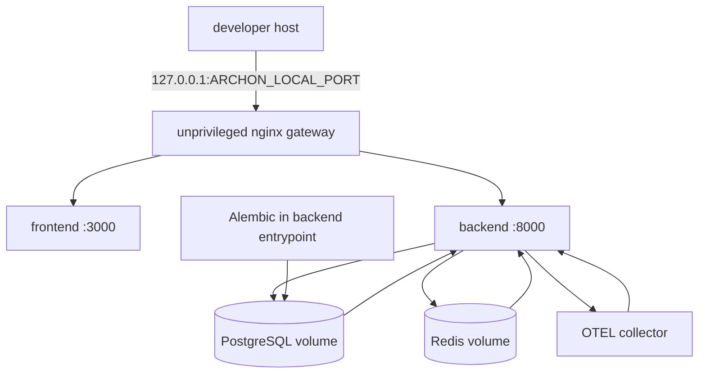
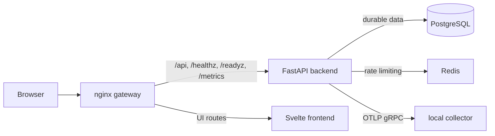

# Docker and Compose

> **Documentation status:** Draft
> **Concept status:** `implemented`
> **Status boundary:** The verified target is a hardened, loopback-only, single-host local Compose stack; public or multi-host deployment remains deferred.
> **Used by:** [Module 14](../modules/14-local-operations/README.md)

## Beginner explanation

A container image packages a program and its runtime files.
Docker starts an image as an isolated process called a container.
Compose describes several containers, their configuration, networks, volumes, health checks, and startup dependencies in one file.
The file is a recipe; it does not prove the stack has run.
Archon uses Compose as a reproducible local production-like target, not as proof of public deployment.
Only one gateway port is published, and it binds to the host loopback address.
PostgreSQL, Redis, backend, frontend, and the OpenTelemetry collector remain internal to the Compose network.

## Vocabulary

| Term | Plain-English meaning |
|---|---|
| image | immutable package used to start a container |
| service | Compose definition for one container role |
| volume | Docker-managed storage that outlives a container |
| health check | command used by Compose to judge a service’s current health |
| loopback | host-only address `127.0.0.1`, not a public interface |
| digest pin | immutable image-content identifier following `@sha256:` |
| one-shot migration | schema upgrade that must finish before normal service |

Compose ordering is not application correctness.
A healthy container can still serve wrong results.
A persistent volume is not a backup.
A loopback bind reduces exposure but does not secure a compromised host or Docker daemon.

## Deployment topology



[`docker-compose.local.yml`](../../../docker-compose.local.yml) defines six services: `gateway`, `backend`, `frontend`, `postgres`, `redis`, and `otel-collector`.
The gateway is the only published service and maps `127.0.0.1:${ARCHON_LOCAL_PORT:-8080}:8080`.
[`deploy/nginx.local.conf`](../../../deploy/nginx.local.conf) sends application routes to backend or frontend and disables buffering for SSE.
Database and cache names resolve only on the Compose network.
PostgreSQL uses `postgres-data`; Redis uses `redis-data` even though Redis is not part of the durable backup contract.

## Startup and readiness sequence

```mermaid
sequenceDiagram
    participant C as Compose
    participant P as PostgreSQL
    participant R as Redis
    participant O as OTEL collector
    participant B as Backend
    participant F as Frontend
    participant G as Gateway
    C->>P: start; pg_isready
    C->>R: start; redis-cli ping
    C->>O: start collector
    C->>B: start after required dependencies
    B->>P: alembic upgrade head
    B->>B: application lifespan and /readyz
    C->>F: start and health check
    C->>G: start after backend/frontend healthy
    G-->>C: loopback service available
```

The backend image contains Alembic files.
[`backend/container-entrypoint.sh`](../../../backend/container-entrypoint.sh) runs `alembic upgrade head` before starting the application.
Migration failure therefore stops backend startup rather than hiding code/schema drift.
The backend readiness path checks its repository, rate limiter, and configured OTLP state.
The gateway waits for backend and frontend health according to the Compose graph.
Dependency checks are bounded observations, not a global availability promise.

## Configuration and hardening

Required values use Compose’s `${NAME:?message}` form so missing secrets fail configuration.
The repository does not embed a default PostgreSQL password, application secret, or encryption master key.
The backend target explicitly supports `${ARCHON_LOCAL_PLATFORM:-linux/amd64}` because the observed local path had that platform boundary.
External dependency images are digest-pinned.
Application images use non-root users; the backend Dockerfile declares `USER archon`, and the frontend declares `USER node`.
Configured containers use `no-new-privileges`; gateway and collector use read-only roots with `/tmp` tmpfs.
Execution tooling is disabled in this local target rather than receiving Docker authority by default.
Host mounts for nginx and collector configuration are read-only.
These controls reduce risk but do not make containers virtual machines or remove kernel risk.

## Request path



The nginx configuration preserves long-lived SSE by turning `proxy_buffering` off and using a long read timeout.
This routing is ordinary infrastructure.
It does not create a product run simply because a health or metrics endpoint is requested.
Authentication remains an application concern for protected API routes.
The operational probes are intentionally distinct from authenticated business objects.

## Exact source, tests, and evidence

| Source or test | Contract supported | Limit |
|---|---|---|
| [`docker-compose.local.yml`](../../../docker-compose.local.yml) | six-service graph, loopback ingress, required secrets, volumes, health ordering | manifest is not execution |
| [`deploy/nginx.local.conf`](../../../deploy/nginx.local.conf) | backend/frontend routing and SSE settings | local gateway only |
| [`backend/container-entrypoint.sh`](../../../backend/container-entrypoint.sh) | migration before application process | not zero-downtime migration |
| [`scripts/local-deploy-smoke.sh`](../../../scripts/local-deploy-smoke.sh) | bounded running-stack checks | local platform/environment |
| [`test_only_loopback_gateway_is_published`](../../../backend/tests/unit/test_local_deployment.py) | only gateway has a port and its host IP is loopback | static rendered config |
| [`test_compose_requires_secrets_and_uses_safe_local_dependencies`](../../../backend/tests/unit/test_local_deployment.py) | required secrets, digest count, Redis, disabled execution, platform | not a secret-manager audit |
| [`test_images_run_nonroot_and_backend_migrates`](../../../backend/tests/unit/test_local_deployment.py) | image users, pinned build inputs, Alembic entrypoint | does not inspect runtime kernel isolation |
| [`test_gateway_routes_backend_and_frontend_with_sse_settings`](../../../backend/tests/unit/test_local_deployment.py) | routes and stream proxy contract | no sustained streaming load |

Runtime interpretation belongs in [Implementation Evidence](../../IMPLEMENTATION-EVIDENCE.md).
The evidence reports a local observation only.
Historical cloud manifests, if present elsewhere, are not selected or verified deployment architecture.

## Try it: bounded exercise

### Goal

Render the Compose model and verify exposure/hardening contracts without starting services.

### Setup and steps

Run from the repository root with Docker Compose and backend test dependencies installed.
Use synthetic values only; `docker compose config` expands secrets into output, so do not save or share rendered output containing real values.

```bash
cd backend
uv run pytest -q tests/unit/test_local_deployment.py
cd ..
POSTGRES_PASSWORD=test-only \
ARCHON_SECRET_KEY=test-only \
ARCHON_ENCRYPTION_MASTER_KEY=MDAxMjM0NTY3ODlhYmNkZWYwMTIzNDU2Nzg5YWJjZGVmMA \
docker compose -f docker-compose.local.yml config --services
```

### Done criteria

- [ ] The focused tests pass or the blocker is documented.
- [ ] Exactly six service names are rendered.
- [ ] You can identify the sole host-published port.
- [ ] You can trace migration before backend service.
- [ ] No container or volume was started by the exercise.

## Security and failure modes

| Threat or failure | Control and behavior | Residual risk |
|---|---|---|
| accidental public database | no `ports` for PostgreSQL/Redis/backend/frontend | other host processes and Docker remain trusted |
| missing secret | Compose interpolation fails closed | secret distribution and rotation are external |
| mutable dependency image | digest pins select content | registry and base-image provenance still matter |
| root container abuse | non-root users and `no-new-privileges` | shared kernel remains |
| filesystem write abuse | read-only roots and tmpfs where configured | volumes intentionally remain writable |
| migration failure | entrypoint exits; backend cannot become healthy | repair and rollback remain operator work |
| Redis failure | startup/readiness fails for configured limiter | no clustered cache failover |
| collector failure | configured telemetry cannot be reported ready | no hosted backend or durable trace retention |
| port collision | Compose startup fails | operator chooses another local port |
| disk exhaustion | volumes or image build fail | capacity alerting is absent |
| stale container | explicit rebuild/update process required | no automated rollout controller |

## Observability and evidence path

```text
Compose manifest → rendered config → container states/health → gateway probes → smoke assertions → canonical local evidence
```

Useful inspection includes `docker compose ps`, service health, bounded logs, `/readyz`, and smoke exit status.
Container logs must still pass application redaction rules.
Compose health does not replace metrics, traces, authenticated checks, or restore evidence.
The local deployment smoke checks selected behavior, including a locally observed OTLP span, but does not create production telemetry evidence.
Record revision, platform, Compose version, command, and cleanup state for every observation.

## Alternatives and trade-offs

| Alternative | Benefit | Cost or boundary |
|---|---|---|
| host processes | simplest debugging | weak reproducibility and dependency isolation |
| Kubernetes | scheduling, rollout, multi-host primitives | much greater operational complexity |
| managed platform | less host maintenance | platform constraints and provider coupling |
| rootless Podman Compose | different daemon/security model | compatibility and team tooling work |
| public reverse proxy | remote access | TLS, identity, network policy, abuse controls required |

Compose is selected for a single-host local learning and evidence target.
It should not be stretched into a multi-host orchestration claim.

## Lab vs production

| Dimension | Demonstrated | Missing or unverified |
|---|---|---|
| ingress | loopback nginx | public TLS, DNS, WAF, load balancer |
| scheduling | one Docker host | replicas, rescheduling, zones, rolling updates |
| state | local Docker volumes | managed HA database, backup policy, capacity |
| security | required secrets, non-root, selected read-only roots | secret manager, image signing, host hardening audit |
| telemetry | local collector wiring/observation | hosted backend, retention, alerting, sampling |
| operations | local smoke and cleanup | SLOs, on-call, autoscaling, failover |

The concept is `implemented` for the hardened loopback local target and no broader deployment status.

## Interview answer

### 30-second answer

> Archon Compose defines a six-service, single-host local topology. Only unprivileged nginx is published on loopback; backend, frontend, PostgreSQL, Redis, and the OTEL collector stay internal. Required secrets fail closed, images are pinned, app containers are non-root, and Alembic runs before backend readiness. Tests and a local smoke support that boundary, but it is not public ingress, orchestration, failover, or production deployment.

## Self-check

1. Why is a Compose file not deployment evidence?
2. Which service is published to the host, and on what address class?
3. Where does schema migration occur relative to application startup?
4. What persists when a PostgreSQL container is replaced?
5. Which exact test verifies exposure?
6. Why does `no-new-privileges` not eliminate container risk?
7. What does the local OTEL service prove and not prove?

<details>
<summary>Answer guide</summary>

1. It is a desired-state recipe; only a scoped runtime observation proves execution.
2. The `gateway` service, bound to `127.0.0.1` loopback.
3. `backend/container-entrypoint.sh` runs `alembic upgrade head` before the app process.
4. The `postgres-data` Docker volume, unless explicitly removed.
5. `test_only_loopback_gateway_is_published`.
6. Containers still share the host kernel and trust Docker and host configuration.
7. It supports local collector wiring and observation only, not hosted retention, production sampling, or SLOs.

</details>

## Related concepts

- [Liveness and readiness](liveness-readiness.md)
- [Database migrations](migrations.md)
- [Backup and restore](backup-restore.md)
- [Tracing and OpenTelemetry](tracing-opentelemetry.md)
- [Module 14](../modules/14-local-operations/README.md)
