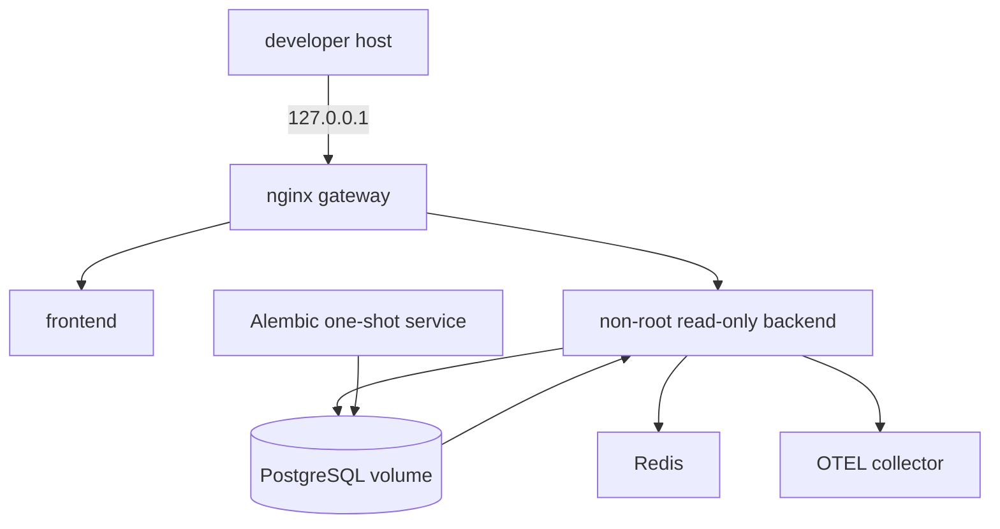

# Docker and Compose

> **Documentation status:** Draft
> **Concept status:** `implemented`
> **Status boundary:** The verified target is a hardened, loopback-only, single-host local Compose stack. Public or multi-host deployment remains deferred.
> **Used by:** [Module 14](../modules/14-local-operations/README.md)

## Deployment topology

Compose describes how local services start together; it does not itself prove they ran. Archon’s target exposes only the nginx gateway on loopback. PostgreSQL and Redis remain internal, migrations complete before backend readiness, and persistent volumes hold authoritative database state.

Images/dependencies are pinned for reproducibility, secrets are supplied externally, health ordering gates startup, and application containers use constrained filesystems/users where configured. Host security and the Docker daemon remain trusted infrastructure.

## Source and tests

- [`docker-compose.local.yml`](../../../docker-compose.local.yml) is the service graph.
- [`deploy/nginx.local.conf`](../../../deploy/nginx.local.conf) defines loopback gateway routing/SSE behavior.
- [`scripts/local-deploy-smoke.sh`](../../../scripts/local-deploy-smoke.sh) exercises the running target.
- [`test_only_loopback_gateway_is_published`](../../../backend/tests/unit/test_local_deployment.py) checks exposure.
- [`test_images_run_nonroot_and_backend_migrates`](../../../backend/tests/unit/test_local_deployment.py) checks hardening and migration ordering.
- Runtime observations: [implementation evidence](../../IMPLEMENTATION-EVIDENCE.md).

## Interview answer

“Compose gives Archon a reproducible local production-like topology with one loopback gateway, internal data services, migration ordering, readiness, and an OTEL collector. That is valuable operational evidence but not public deployment, orchestration, failover, or scale proof.”
