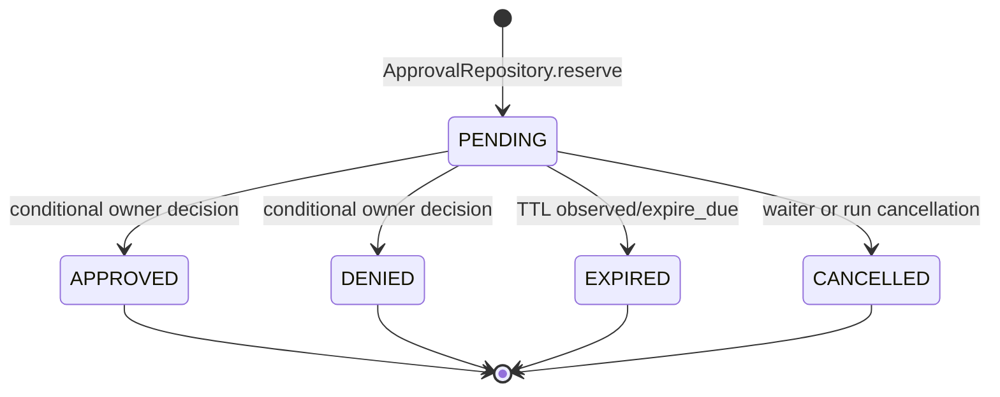
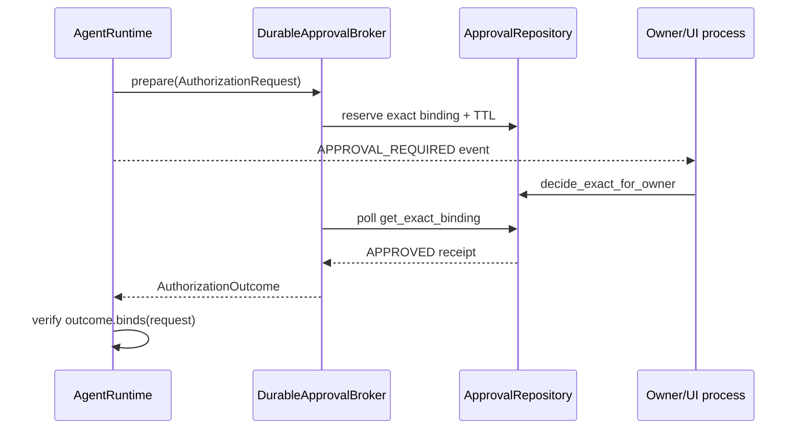

# Durable approvals

## Beginner explanation

A durable approval is a database-backed, expiring decision about one exact proposed effect.
It is not “this user trusts the terminal tool”; it is “this owner approves this call ID, canonical tool name, and argument digest in this run before expiry.”
Persistence lets a different process or a restarted waiter observe the decision without broadening permission.

## Prerequisites and vocabulary

- **`ASK`:** policy outcome requiring human authorization before execution.
- **Exact binding:** owner/run/call identity plus canonical tool name and argument hash.
- **Digest:** SHA-256 of canonical JSON arguments; hides ordinary raw values but is not encryption.
- **Receipt:** persisted `ApprovalRecord` retained after a terminal decision.
- **TTL:** time-to-live after which pending approval becomes expired.
- **Conditional update:** SQL update whose `WHERE status = pending` makes one transition win.
- **Fail closed:** ambiguity, mismatch, timeout, or unavailable storage results in no execution.

## Problem and mental model

Human latency is much longer than a request handler's normal lifetime. Model approval as a one-use ticket in durable storage, not as a Boolean future tied to one process.
The ticket permits only the effect whose identity was shown; changing the arguments invalidates the ticket.





## Exact binding and Archon symbols

The runtime constructs [`AuthorizationRequest`](../../../backend/app/security/approvals.py) from native `tool_call_id`, canonical `tool_name`, `arguments_hash`, risk classes, and matched rule.
[`AuthorizationOutcome.binds`](../../../backend/app/security/approvals.py) compares call ID, name, and digest exactly.
[`ApprovalRecord`](../../../backend/app/security/approval_repository.py) adds `user_id`, `conversation_id`, `run_id`, status, reason, and timestamps; it intentionally has no raw-arguments field.
[`ApprovalRepository.reserve`](../../../backend/app/security/approval_repository.py) inserts the receipt with a positive TTL.
[`ApprovalRepository.decide_exact_for_owner`](../../../backend/app/security/approval_repository.py) updates only a live, pending owner/run/call row.
[`ApprovalRepository.cancel_one`, `cancel_run`, and `expire_due`](../../../backend/app/security/approval_repository.py) preserve terminal audit state.
[`DurableApprovalBroker.wait_for_decision`](../../../backend/app/security/live_approvals.py) polls across processes and translates terminal status to a sanitized outcome.
[`DurableBrokerToolAuthorizer`](../../../backend/app/security/live_approvals.py) supplies `prepare`, `authorize`, and `cancel` to the runtime.

## Behavior-focused tests—and their limits

- [`test_cross_process_prepare_decide_and_poll`](../../../backend/tests/unit/test_durable_live_approvals.py) proves separate broker instances coordinate through one database. It does not test a multi-region database outage.
- [`test_immediate_decision_and_restart_authorize`](../../../backend/tests/unit/test_durable_live_approvals.py) proves a later broker can consume a persisted decision. It does not resume the complete agent run after a process crash.
- [`test_exact_run_binding_and_concurrent_decision_has_one_winner`](../../../backend/tests/unit/test_durable_live_approvals.py) proves one concurrent decision wins and run identity is checked. It does not prove external tool execution is exactly once.
- [`test_database_schema_has_no_raw_arguments`](../../../backend/tests/unit/test_durable_live_approvals.py) checks the approval schema. It does not prove digests cannot leak low-entropy values through guessing.
- [`test_mismatched_approval_binding_never_executes`](../../../backend/tests/unit/test_runtime_policy.py) proves runtime mismatch rejection against fakes. It does not validate UI presentation accuracy.

## Bounded executable exercise

Timebox: 15 minutes. Run two focused tests:

```bash
cd backend
pytest -q \
  tests/unit/test_durable_live_approvals.py::test_immediate_decision_and_restart_authorize \
  tests/unit/test_approval_repository.py::test_concurrent_decisions_have_exactly_one_winner
```

Then list the fields that must remain equal from proposal through execution. Do not add a new approval scope in this exercise.

## Security and failure modes

- Reusing approval by tool name would authorize changed arguments; exact digests prevent that broad replay.
- Owner, conversation, or run confusion can cross trust boundaries; repository queries scope identity explicitly.
- Duplicate or ambiguous call IDs fail closed instead of selecting an arbitrary pending row.
- Expiry races are handled by conditional updates against `status` and `expires_at`.
- Database unavailability means approval is unavailable, not implicitly allowed.
- Cancellation after an external handler starts cannot undo that handler; approvals are not transaction managers.
- A digest protects storage minimization, not confidentiality against dictionary attacks.

## Observability and evidence

Safe evidence includes approval ID, owner/run IDs, call ID, canonical tool, argument digest, risks, matched rule, status, reason code, and timestamps.
Runtime events `APPROVAL_REQUIRED` and `APPROVAL_DECIDED` provide ordered control-plane evidence without raw arguments.
Monitor pending count, decision latency, expiry rate, cancellation rate, losing conditional updates, and repository failures.
Investigations should join the approval receipt to run events by exact binding, not merely by tool name.

## Alternatives and tradeoffs

An in-memory [`ApprovalBroker`](../../../backend/app/security/live_approvals.py) is lower latency and simpler but loses state on restart and cannot coordinate processes.
A message broker can push decisions instead of polling, but still needs durable exact-binding records and deduplication.
Long-lived reusable grants reduce friction but expand blast radius and require revocation; Archon's implemented durable scope is one exact call.
Database polling is portable and clear, at the cost of query load and polling latency.

## Lab versus production

SQLite and short polling intervals make restart/concurrency behavior easy to test locally.
Production needs durable migrations, database high availability, authenticated owner decisions, UI display of exact effect, retention rules, clock discipline, rate limits, and operational alerts.
Durable approval persistence does not make the whole paused runtime resumable; that requires durable workflow/checkpoint semantics.

## 30-second interview answer

“Archon treats approval as a one-shot durable receipt, not a reusable yes. The runtime reserves `AuthorizationRequest` before publishing the prompt; the database binds owner, conversation, run, native call ID, canonical tool, SHA-256 argument digest, risks, rule, and expiry. Conditional pending-to-terminal updates give one winner, and the runtime rechecks `AuthorizationOutcome.binds`. This survives broker restart, but it does not guarantee exactly-once external effects or full run resumption.”

## Self-check questions

1. **Why hash arguments?** To bind exact canonical arguments while avoiding raw-argument persistence.
2. **Which decision may execute?** Only an unexpired approval whose outcome exactly binds the request.
3. **Why reserve before publishing the event?** So an immediate UI response cannot race a missing record.
4. **How is one-shot behavior enforced?** Conditional SQL updates require the row still be pending.
5. **What happens on cancellation?** The exact pending receipt becomes cancelled and the cancellation propagates.
6. **Does durability imply exactly-once tools?** No; each external effect needs its own idempotency strategy.

## Related modules and concepts

- Module: [Policy and approvals](../modules/05-policy-and-approvals/README.md).
- Concepts: [policy engine](policy-engine.md), [idempotency](idempotency.md), [authorization and ownership](authorization-ownership.md), and [checkpoints](checkpoints.md).
