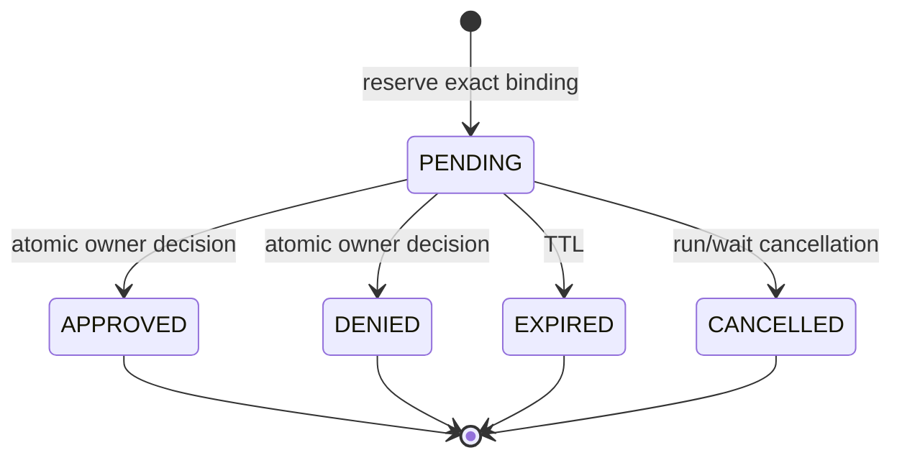

# Durable approvals

## Definition

A durable approval is a persisted, expiring, one-shot decision for one exact proposed effect—not a reusable “yes to this tool.”

## Exact binding

Archon binds `user_id`, `conversation_id`, `run_id`, native `tool_call_id`, canonical `tool_name`, and SHA-256 of canonical JSON arguments. `AuthorizationOutcome.binds` must match the request. The row stores the digest, risks, rule, status, and timestamps—not raw arguments. Conditional updates permit only one terminal decision.

Sources: [`AuthorizationRequest` and `AuthorizationOutcome`](../../../backend/app/security/approvals.py), [`ApprovalRecord` and `ApprovalRepository`](../../../backend/app/security/approval_repository.py), and [`DurableApprovalBroker`](../../../backend/app/security/live_approvals.py). Tests: [`test_approval_repository.py`](../../../backend/tests/unit/test_approval_repository.py), [`test_durable_live_approvals.py`](../../../backend/tests/unit/test_durable_live_approvals.py), and runtime adversarial cases in [`test_runtime_policy.py`](../../../backend/tests/unit/test_runtime_policy.py).

## Guarantees and gaps

Persistence permits cross-process decisions and restart-safe receipts. Expiry, cancellation, owner scope, and exact binding prevent broad replay. It does not guarantee that an external side effect is exactly once after a crash; that requires tool/service idempotency.
