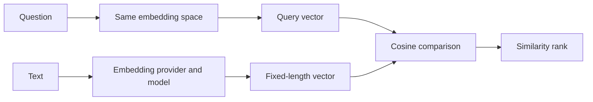
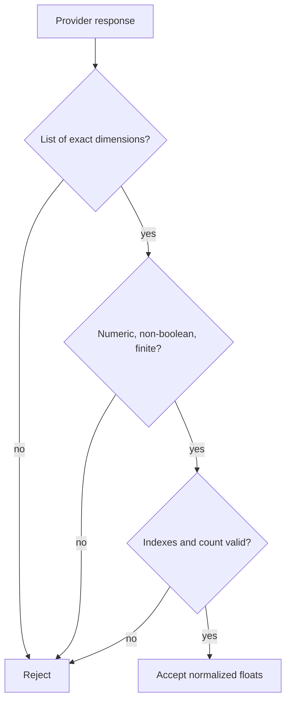

# Embeddings

**Status:** implemented for the Azure Foundry development boundary

## Beginner definition

An embedding converts text into a fixed-length list of numbers called a vector.
A retriever compares a question vector with stored chunk vectors to rank geometric similarity.
Nearby vectors are intended to represent related language, but proximity is only a model signal.
Similarity is not truth, logical entailment, authorization, citation correctness, or answer relevance.

## Vocabulary

- **Vector:** an ordered list of numeric coordinates.
- **Dimension:** the number of coordinates in a vector.
- **Embedding model:** the provider/model mapping text to vectors.
- **Query embedding:** the vector produced for the user's question.
- **Document embedding:** the vector produced for a stored chunk.
- **Cosine similarity:** normalized dot product used here to compare vector direction.
- **Model drift:** changed behavior after a model or provider revision.
- **Re-embedding:** rebuilding stored vectors with a compatible model and configuration.
- **Mock embedding:** deterministic test data without demonstrated semantic geometry.

## Mental model

Imagine a coordinate map where semantically related passages should appear near one another.
The map is learned, not a database of facts.
Changing the embedding model is like changing coordinate systems: old and new coordinates should not be mixed.
A compass can point toward a likely neighborhood without proving that a particular house contains the answer.

## Archon implementation

The source of truth is `backend/app/services/chunker.py`.
`EmbeddingCapability` reports provider, model, dimensions, mock status, and readiness.
`EmbeddingService` accepts `mock`, `openai`, and `foundry` providers at construction. Foundry uses the Azure AI model-inference `/embeddings` shape with explicit API version and `api-key` authentication while retaining the same endpoint allowlist, DNS pinning, redirect, timeout, dimension, finite-number, and index checks.
Dimensions must be between 1 and 4,096.
`EmbeddingService.embed` embeds one string.
`EmbeddingService.embed_batch` embeds a list and preserves provider response order.
`validate_embedding` requires a list of exactly the configured dimension.
It rejects booleans even though Python otherwise treats them as integers.
It rejects non-numeric values, NaN, and infinity, then normalizes values to floats.
`EmbeddingService._mock_embed` derives deterministic values from SHA-256 text bytes.
The mock pads or truncates to the requested dimensions.
`EmbeddingService.capability` labels mock readiness as `non-production`.
The OpenAI request includes `input`, `model`, and `dimensions`.
Provider items are sorted and validated by their indexes.
Unexpected indexes, counts, vectors, or payload shapes fail closed.

## Endpoint hardening

`validate_embedding_endpoint` requires HTTPS and an explicit allowlisted host.
It rejects URL credentials, query strings, and fragments.
Private, localhost, or IP-literal endpoints require explicit opt-in.
The call resolves DNS under a five-second deadline.
It rechecks resolved addresses immediately before sending credentials.
The selected IP is pinned while the original hostname is retained for `Host` and TLS SNI.
The HTTP client uses a 30-second timeout, disables redirects, and sets `trust_env=False`.
These controls reduce SSRF, redirect, proxy-environment, and DNS-rebinding exposure.
They do not establish semantic embedding quality.

## Similarity and metric boundaries

`backend/app/services/vector_store.py::cosine_similarity` rejects unequal dimensions.
It returns zero if either vector has zero norm.
**Retrieval relevance** evaluates whether ranked chunks help answer a question.
**Groundedness** evaluates whether claims are supported by supplied evidence.
**Faithfulness** evaluates whether an answer stays within its context.
**Citation correctness** evaluates whether cited evidence exists and supports its claim.
**Answer relevance** evaluates whether the answer addresses the question.
An embedding can improve retrieval relevance while leaving every downstream property unresolved.

## Security and failure modes

Never send credentials to a user-controlled embedding URL.
Never mix dimensions or model versions in one index without an explicit compatibility plan.
Reject malformed vectors before persistence and again on retrieval.
Treat provider text inputs as sensitive data subject to retention and residency requirements.
Redact prohibited sensitive content before embedding because vectors may leak attributes.
Rate-limit and batch carefully to avoid cost or denial-of-service surprises.
A model outage should not silently substitute incompatible vectors.
A zero vector produces a zero cosine score and carries no useful direction.
Deterministic mock vectors can rank unrelated text highly by accident.

## Observability

Record provider, model, dimensions, latency, batch size, failures, and token or request cost where available.
Expose `EmbeddingService.capability` in readiness rather than claiming a mock is production-ready.
Alert on vector validation failures and response-count mismatches.
Track norm distributions and rates of zero vectors without logging raw text or vectors.
Version every indexed chunk with embedding configuration outside the vector itself.
Measure retrieval recall on stable labeled queries before and after model changes.
Separate transport availability from semantic quality dashboards.

## Alternatives and trade-offs

Sparse lexical retrieval preserves exact terms and can outperform embeddings for identifiers.
Hybrid retrieval combines lexical and dense signals.
A local embedding model can improve privacy but adds serving and upgrade work.
A hosted provider reduces model operations but adds network, privacy, and vendor dependencies.
Cross-encoder reranking can improve precision after candidate retrieval at higher latency.
Task-specific fine-tuning may improve domain matching but requires representative labels.

## Lab versus production

The deterministic mock remains appropriate for cost-free plumbing tests and is explicitly `non-production`.
The managed live acceptance uses Azure Foundry `text-embedding-3-small`, validates 1,536 finite non-zero coordinates, persists document vectors, embeds the query independently, and retrieves the expected evidence before grounded generation.
This proves one development deployment and one sentinel retrieval contract—not broad semantic quality, production SLA, domain recall, privacy approval, or migration readiness.
Production evaluation still requires a representative labeled corpus, recall/precision slices, latency/cost tracking, re-indexing, rollback, quota, and model-version procedures.

## Evidence in this repository

- `backend/app/services/chunker.py::EmbeddingCapability`
- `backend/app/services/chunker.py::EmbeddingService`
- `backend/app/services/chunker.py::EmbeddingService.capability`
- `backend/app/services/chunker.py::EmbeddingService._foundry_embed`
- `backend/scripts/embedding_smoke.py`
- `docs/evidence/live-rag-hardening.json` records sanitized live vector and ingest/query results.
- The older `docs/evidence/local-portfolio-benchmark.json` remains deterministic mock evidence only.

## Exercise

Embed three repeated strings and three semantically related paraphrases with the mock provider.
Confirm repeated strings produce identical vectors and exact configured dimensions.
Compute pairwise cosine similarities with `cosine_similarity`.
Explain why any paraphrase ranking observed from the hash-based mock is accidental rather than semantic evidence.
Repeat the evaluation with an approved real provider on a labeled dataset in a safe environment.
Record provider, model, dimensions, dataset version, recall, latency, and cost.

## 30-second interview answer

“Embeddings map text into a shared vector space so a retriever can rank similarity. Archon validates dimensions and finite numeric values, hardens provider endpoint access, and keeps its deterministic mock explicitly non-production. The managed development target also passed Azure Foundry `text-embedding-3-small` vector and persisted ingest/query acceptance. Cosine similarity remains a ranking signal, not truth or entailment; broad production quality still requires labeled retrieval benchmarks and versioned re-indexing.”

## Self-checks

1. **What does an embedding score prove?** Only geometric similarity under a particular embedding configuration.
2. **Can mock determinism prove semantic quality?** No; it proves repeatable plumbing behavior only.
3. **Why reject boolean coordinates?** They are not legitimate numeric embedding values despite Python integer compatibility.
4. **What happens when dimensions differ?** Validation or cosine computation raises an error.
5. **Why pin DNS while retaining Host/SNI?** To reduce rebinding risk while preserving hostname-based HTTP and TLS checks.
6. **When should stored chunks be re-embedded?** When the model, dimensions, preprocessing, or embedding semantics change.
7. **Does a real provider make retrieved facts true?** No; source truth and claim support remain separate evaluations.
8. **What does final repository evidence use?** Mock embeddings/provider, so it is not live semantic-quality evidence.
