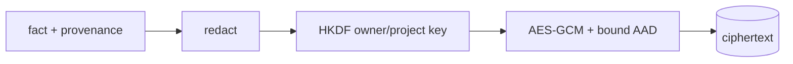

# Encrypted memory

**Status:** implemented

## Definition
Encrypted memory stores selected durable facts as authenticated ciphertext while enforcing caller scope. Encryption protects bytes at rest; authorization controls who may ask to decrypt them.

## Archon implementation
`backend/app/memory/scoped.py::ScopedEncryptedMemoryRepository` redacts content/provenance, derives a 256-bit key with HKDF from the master key plus owner/project/version, and encrypts JSON with AES-GCM and a random 12-byte nonce. AAD binds owner, project, fact ID, and version. Mutations lock `MemoryScopeRow` and enforce `MAX_MEMORY_CHARS`. `EncryptedMemoryStore` is a separate in-memory Fernet teaching store.

## Invariants and failure modes
Tamper, wrong key, version mismatch, or ciphertext swapping raises `MemoryEncryptionError`. Scope predicates remain mandatory. Key loss is data loss; compromise exposes data derivable under that key. There is no online key rotation, expiry, or external KMS claim.

## Evidence
`backend/tests/unit/test_scoped_encrypted_memory.py` checks raw DB plaintext absence, restart, scope isolation, swap/tamper/wrong-key failures, quotas, and concurrent mutation. `backend/tests/integration/test_memory_api_scoping.py` checks API scope.

## Interview prompt
“AEAD plus identity-bound AAD makes both confidentiality and row substitution detectable; transactions make quota enforcement atomic.”
