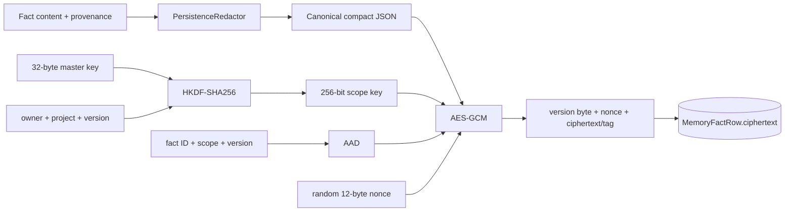
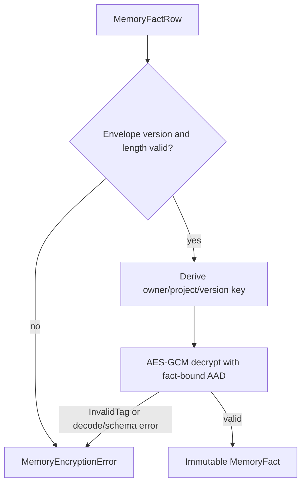

# Encrypted memory

> **Implementation status:** `implemented`
> **Boundary:** Selected facts and provenance are encrypted and owner/project scoped; conversation rows, effective context, logs, and provider traffic are separate concerns.

## Beginner explanation

Encrypted memory is Archon's durable store for selected facts such as a user preference.
Before a fact is written, Archon redacts it, packages content with provenance, derives a scope-specific key, and encrypts the package with authenticated encryption.
On read, it verifies authenticity before returning plaintext to the authorized application path.

Encryption protects database bytes at rest from casual disclosure.
Authorization decides who may request decryption.
Redaction reduces sensitive content before encryption.
All three controls matter, and none substitutes for the others.

Do not conflate these layers:

| Layer | Example | Guarantee |
|---|---|---|
| conversation rows | prior user/assistant turns | Durable redacted dialogue |
| encrypted facts | “prefers metric units” | Authenticated ciphertext scoped by owner/project |
| effective context | facts and turns selected for one call | Temporary model input |
| Run Ledger | hashes, IDs, status events | Safe control-flow evidence, not memory content |

A durable fact is not automatically true, current, selected, or sent on every request.

## Cryptographic envelope



`ScopedEncryptedMemoryRepository._key` derives 32 bytes with HKDF-SHA256.
Its info includes `archon/memory/v1`, `user_id`, `project_id`, and key version; its salt is `archon-scoped-memory-hkdf-v1`.
`_aad` binds the domain label, owner, project, fact ID, and version.
AES-GCM uses a fresh 12-byte nonce from `os.urandom` for every encryption.
The stored envelope begins with the key-version byte followed by nonce and authenticated ciphertext.

## Mutation sequence and quota

```mermaid
sequenceDiagram
  participant Caller
  participant Repo as ScopedEncryptedMemoryRepository
  participant Scope as MemoryScopeRow
  participant Facts as MemoryFactRow
  Caller->>Repo: add(owner, project, content, provenance)
  Repo->>Repo: redact and validate
  Repo->>Scope: create if absent; atomic UPDATE lock
  Repo->>Facts: decrypt current scoped facts
  Repo->>Repo: calculate character total
  alt over MAX_MEMORY_CHARS
    Repo-->>Caller: MemoryLimitError; rollback
  else within quota
    Repo->>Repo: derive key; AES-GCM encrypt with AAD
    Repo->>Facts: insert ciphertext
    Repo->>Scope: update chars_used
    Repo-->>Caller: authenticated MemoryFact
  end
```

`MemoryScopeRow` is an aggregate and serialization point.
`_lock_scope` uses conflict-safe creation and an `UPDATE ... RETURNING` that holds a transaction-duration write lock.
This makes quota checks and mutations atomic across repository instances: concurrent writers cannot both spend the same remaining character budget.
`MAX_MEMORY_CHARS` defaults to 2,000 decrypted content characters per owner/project scope.

## Read and authentication behavior



The authenticated AAD prevents a valid ciphertext from being silently moved to another owner, project, fact ID, or version.
`_decrypt` also validates JSON shape and provenance key/value types.
Tamper, wrong key, malformed payload, and row swapping fail closed as `MemoryEncryptionError`.
The returned provenance is a `MappingProxyType`, preventing mutation of the decoded fact object.

## Operations

`list` decrypts facts in creation/ID order for one owner/project.
`add` creates a UUID fact after redaction, quota calculation, and scope locking.
`replace` finds the first case-insensitive substring match, re-encrypts new content/provenance, and updates aggregate usage.
`remove` deletes all scoped facts containing a case-insensitive substring.
`delete_all` clears only the requested owner/project scope.
`export` currently returns the same authenticated fact tuple as `list`.
`context_text` renders decrypted facts as bullet lines for later context assembly.

Substring mutation is simple and explainable but can match more facts than a caller intended.
Fact IDs are safer for precise lifecycle control, though current public operations include text-based matching.

## Invariants

- The master key decoder accepts the configured 256-bit key format and rejects malformed or known weak values at startup.
- Database queries always include `user_id` and `project_id` for scoped operations.
- Plaintext content and provenance are redacted before encryption.
- Every encryption gets a fresh nonce.
- AAD binds ciphertext to owner, project, fact ID, and version.
- Authentication failure never returns partial plaintext.
- Quota accounting and mutation occur in one transaction under a scope lock.
- Key loss means encrypted facts cannot be recovered.
- Encryption at rest does not validate factual accuracy or freshness.

## Source symbols and tests

| Symbol | Role |
|---|---|
| `backend/app/memory/scoped.py::ScopedEncryptedMemoryRepository` | Durable implementation |
| `ScopedEncryptedMemoryRepository._key` | HKDF key derivation |
| `ScopedEncryptedMemoryRepository._aad` | Identity and row binding |
| `ScopedEncryptedMemoryRepository._encrypt` / `_decrypt` | AES-GCM envelope |
| `ScopedEncryptedMemoryRepository._lock_scope` | Mutation serialization |
| `ScopedEncryptedMemoryRepository.context_text` | Explicit fact-to-context projection |
| `backend/app/memory/keys.py::decode_memory_master_key` | Master-key validation |
| `backend/app/services/db_store.py::MemoryFactRow` | Ciphertext row |
| `backend/app/services/db_store.py::MemoryScopeRow` | Quota aggregate |
| `backend/app/memory/encrypted_memory.py::EncryptedMemoryStore` | Separate in-memory Fernet teaching implementation |

`backend/tests/unit/test_scoped_encrypted_memory.py::test_two_users_and_projects_are_isolated_and_raw_db_has_no_plaintext` checks scope and raw bytes.
`test_restart_decrypts_and_wrong_key_and_tampering_fail_closed` checks durability and authentication failure.
`test_ciphertext_cannot_be_swapped_between_rows` proves AAD row binding.
`test_independent_engines_serialize_concurrent_adds_at_limit` and `test_concurrent_replace_delete_add_preserves_aggregate_and_restart` exercise concurrency.
`backend/tests/security/test_persistence_redaction.py::test_scoped_memory_redacts_content_and_provenance_before_encryption` checks defense in depth.
`backend/tests/integration/test_memory_api_scoping.py` checks authenticated API scope and documented project input.

## Security and failure modes

| Threat/failure | Control/behavior | Residual risk |
|---|---|---|
| Database file copied | Ciphertext rather than fact plaintext | Metadata and access patterns remain visible |
| Ciphertext bit flip | AES-GCM tag failure | Availability loss for affected facts |
| Row substitution | Fact/scope/version-bound AAD fails | Correct DB integrity and backups still matter |
| Foreign API request | Owner/project predicates | Bugs in new call sites remain possible |
| Concurrent quota race | Transactional scope lock | SQLite contention differs from PostgreSQL load |
| Master-key loss | Fail closed; data becomes unreadable | No recovery without protected backup |
| Master-key compromise | Derived scope keys become derivable | No external KMS or online rotation claim |
| Stale/false fact | Explicit replace/remove only | Encryption preserves falsehood faithfully |
| Context exfiltration | Tool policy and provider controls | Selected plaintext exists in process and provider request |

There is no demonstrated online key rotation workflow, automatic expiry, hardware-backed key custody, or external KMS integration.
Do not claim that a version field alone constitutes rotation.

## Observability

Emit safe operation type, owner/project pseudonymous identifiers where policy permits, success/failure reason, fact count, characters used, quota rejections, decryption-failure count, and latency.
Never log plaintext facts, provenance, master or derived keys, nonce-plus-ciphertext dumps, or exception chains that may expose configuration.
A spike in `MemoryEncryptionError` should trigger integrity/key-configuration investigation, not automatic deletion.
A spike in `MemoryLimitError` is a capacity/product signal, not an authentication failure.
Monitor lock wait and transaction retries separately from cryptographic failures.

## Trade-offs

Per-scope derived keys reduce accidental cross-scope reuse without storing one key per tenant.
One master key simplifies deployment but creates a high-value root secret and broad compromise radius.
AES-GCM provides confidentiality and integrity, but nonce uniqueness and key custody become critical.
Decrypting all scoped facts makes simple substring operations easy, but does not scale like indexed search.
Redaction before encryption reduces breach impact, but can damage fact utility and cannot detect every secret.
A strict character quota bounds abuse but is not a token, row-count, or ciphertext-byte quota.

## Lab versus production

Local SQLite tests provide strong deterministic evidence for restart, tamper, and concurrency contracts.
Production should source the master key from a managed secret/KMS path, restrict process and backup access, rehearse key recovery, and design versioned rotation before it is needed.
It should monitor database and lock behavior under realistic load and define retention/export/delete policy.
Backups must preserve ciphertext and the independently protected key; storing both together defeats much of the protection.
No test here establishes HSM custody, compliance certification, side-channel resistance, or provider-side privacy.

## Exercise

Run the focused suites without placing real secrets in fixtures:

```bash
cd backend
uv run pytest -q \
  tests/unit/test_scoped_encrypted_memory.py \
  tests/security/test_persistence_redaction.py::test_scoped_memory_redacts_content_and_provenance_before_encryption \
  tests/integration/test_memory_api_scoping.py
```

Inspect one `MemoryFactRow` in the test database and confirm the plaintext fixture is absent.
Then explain why swapping two ciphertext blobs fails even when both were encrypted under the same owner/project key.

## 30-second interview answer

“Archon stores selected facts as redacted JSON encrypted with AES-GCM. It derives a 256-bit owner/project/version key from a 32-byte master key using HKDF, uses a random 12-byte nonce, and authenticates owner, project, fact ID, and version as AAD. Scope predicates authorize access, while a locked `MemoryScopeRow` makes quota mutations atomic. Tamper, wrong key, malformed data, or row swapping fails closed. This protects fact bytes at rest; it does not encrypt conversation rows, prove facts true, or protect plaintext once selected into model context.”

## Self-check

1. **Why are authorization and encryption both required?** Encryption protects stored bytes; authorization controls legitimate decryption requests.
2. **What stops ciphertext row swapping?** AAD includes owner, project, fact ID, and version.
3. **Is the nonce secret?** No, but it must be fresh/unique for a key; it is stored in the envelope.
4. **What happens with the wrong master key?** AES-GCM authentication fails and `MemoryEncryptionError` is raised.
5. **Does `context_text` keep facts encrypted?** No; it returns decrypted bullets for context assembly.
6. **What serializes concurrent quota mutations?** `_lock_scope` updates `MemoryScopeRow` inside the transaction.
7. **Does the implementation rotate keys online?** No; versioning exists, but no rotation workflow is claimed.
8. **Are conversation messages encrypted by this repository?** No; they use a separate persistence path.

## Related concepts

- [Context windows](context-windows.md)
- [Conversation lifecycle](conversation-lifecycle.md)
- [Authorization and ownership](authorization-ownership.md)
- [Checkpoints](checkpoints.md)
- [Run Ledger](run-ledger.md)
- [Backup and restore](backup-restore.md)
- [Structured logging](structured-logging.md)
