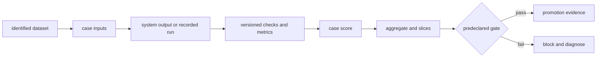
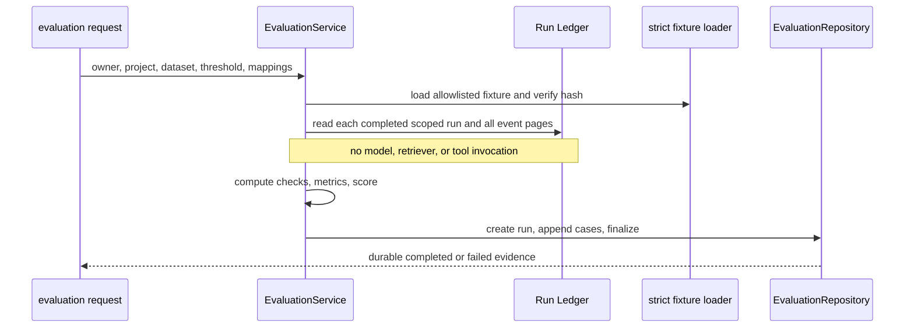

# Evaluation harness

**Status:** implemented with distinct durability and maturity levels

## Definition

An evaluation harness binds cases, system outputs, checks or metrics, aggregation, and a decision threshold.
Its purpose is to make a measurement procedure repeatable.
Repeatability does not guarantee that the chosen cases or metrics measure the intended quality.
A harness can be deterministic while evaluating the wrong construct.
A statistically strong dataset can also be undermined by a buggy or changing harness.
Treat dataset validity, evaluator validity, and execution reproducibility as separate questions.

## The evaluation loop

A useful harness answers five questions.
What exact cases ran?
What exact system outputs were measured?
Which evaluator logic produced each score?
How were scores aggregated?
What decision was made from those values?

## Three implementations in this repository

Archon has multiple evaluation mechanisms, and they must not be conflated.
`backend/app/eval/harness.py::EvalHarness` is an inline, transient test helper.
It calls an `agent_fn` for each in-memory `EvalCase` and returns an in-memory `EvalSummary`.
`backend/app/eval/evaluators.py` contains heuristic faithfulness, relevance, safety, and cost functions.
`backend/app/eval/service.py::EvaluationService` is the preferred evidence-first recorded-run path.
It evaluates completed Run Ledger trajectories and persists evaluation runs and case results.
The durable path does not call a model, retriever, or tool while evaluating.
The inline paths execute or inspect current responses and do not provide the same durable lineage.

## The transient `EvalHarness`

`EvalCase` supports `expected_output`, contains and not-contains lists, tags, and `max_latency_ms`.
`EvalHarness.run` executes cases sequentially through `_eval_case`.
It measures elapsed time with `time.monotonic`.
Dictionary responses use the `response` field; objects may expose a `response` attribute; others become strings.
Exact matching trims surrounding whitespace.
Contains and not-contains checks are case-insensitive substring tests.
The latency check passes when measured latency is less than or equal to the case maximum.
A case with no checks receives score `1.0` and passes, which is convenient but risky.
A case score is the fraction of checks that pass.
A case passes only when every configured check passes.
Exceptions produce a failed result with score zero and the exception text in `error`.
`EvalSummary` reports totals, averages, pass rate, results, and per-tag passed/total counts.
`quality_gate` compares overall pass rate to `_quality_threshold`.
The helper does not persist the run, dataset identity, environment, or evaluator version.

## The heuristic evaluators

`evaluate_faithfulness` splits answer sentences and measures keyword overlap with context.
Its threshold is more than 30 percent overlap among words longer than three characters.
This lexical proxy can reward copied but incorrect text and punish valid paraphrases.
`evaluate_relevance` measures question-word overlap and boosts partial overlap by 1.5, capped at one.
`evaluate_safety` calls `PIIDetector` and scores high-risk PII as zero and lower-risk findings as 0.5.
That is a PII heuristic, not a complete safety policy.
`evaluate_cost` scores token use against a configured maximum.
`run_batch_eval` averages the four dimensions equally.
When a case raises, it appends zeros to the detail record but does not append those zeros to score lists.
Therefore the current aggregate computation can omit failed cases from dimension averages.
Treat this module as illustrative heuristic evaluation, not the durable production gate.

## The durable recorded-run harness

`EvaluationService.evaluate` requires non-empty owner and project IDs.
Its threshold must be finite and between zero and one inclusive.
The dataset path is selected from an allowlist.
Every fixture case key must be mapped exactly once to a unique source run ID.
Each source run must be owner-visible, in the requested project, and successfully completed.
`_stored_events` reads ledger pages of 100 until the complete trajectory is assembled.
Evaluation follows fixture order even if the request mappings are reversed.
The service creates the durable evaluation only after all source runs have been computed.
It appends each case and then finalizes the aggregate.
If persistence fails after creation, it attempts to finalize the evaluation with status `failed` and `passed=None`.

## Exact recorded checks and metrics

`EvaluationService._evaluate_case` reads `evidence_retrieved`, `claim_verified`, and `grounded_answer` events.
Malformed negative, Boolean, or non-integer count values become zero through `_nonnegative_int`.
The most recently encountered relevant event values determine counts.
A run is actually grounded only if a grounded event exists, supported count is positive, and unsupported count is zero.
The grounded check compares that Boolean to the case's expected `grounded` value.
Contains and not-contains checks inspect the bounded persisted `answer_summary` with `casefold` matching.
The score is passing checks divided by all checks.
The case passes when its score is at least the supplied threshold.
Metrics include evidence, supported, unsupported, and citation counts.
They also include citation, support, and unsupported rates.
Run latency, cost, and token fields are copied into case metrics.
The aggregate includes case counts, pass rate, mean score, total tokens, total cost, and mean latency.
It also averages citation, support, and unsupported rates.
The whole evaluation passes only if every case passes.

## Reproducibility versus validity

Recorded-run evaluation is reproducible because it reads durable events and a hashed fixture.
It avoids live provider variance during scoring.
Its checks are still exact rules over safe event fields and an answer summary.
They are not fresh semantic judgments of the full answer.
`actual_grounded` trusts the recorded verification counts and event shape.
A citation count does not establish that cited evidence entails a claim.
A threshold changes pass/fail without changing underlying measurements.
Comparisons are meaningful only when dataset and evaluator semantics are compatible.
Deterministic success is genuine regression evidence, but it is not model-quality proof.

## Security and failure handling

Owner and project checks prevent cross-tenant run selection.
A foreign, wrong-project, or absent run produces the same non-disclosing not-found boundary.
Only completed runs are accepted, avoiding evaluation of changing trajectories.
Dataset allowlisting blocks arbitrary path selection.
Persisted evaluation data excludes raw answer text and raw event payloads.
The source run IDs, summary-derived checks, and numeric metrics remain sensitive metadata and need access control.
The inline harness stores exception strings and full response text in memory; careless logging can leak provider or user data.
Never feed untrusted output into an LLM judge without prompt-injection controls and strict output validation.
A persistence error must not be reported as a passing or indefinitely running evaluation.

## Observability

Record evaluation ID, dataset ID/version/hash, threshold, and evaluator code revision.
Measure status counts, case latency, pass rate, mean score, and subgroup metrics.
Distinguish source-run latency from evaluation computation latency.
Alert on failed finalization, unknown dataset IDs, invalid mappings, and incomplete source runs.
Track evaluator disagreement and human-review overturn rates when adding semantic judges.
Avoid raw prompts, answers, and exception strings in ordinary telemetry.
Use stable low-cardinality labels rather than case IDs in global metrics systems.

## Lab versus production

In a lab, `EvalHarness` gives immediate feedback around exact strings and latency.
In production, its in-memory outputs and mutable case list are insufficient audit evidence.
In a lab, heuristic overlap scores are useful to learn aggregation mechanics.
In production, calibrate metrics against expert labels and document known bias.
The durable `EvaluationService` is a stronger production foundation because results and source lineage survive restart.
Its current two-case fixture and lexical checks remain narrow, so durability should not be mistaken for validity.
Production gates should pin dataset, evaluator, model configuration, and environment.
Use confidence intervals and minimum slice sizes before drawing broad conclusions.

## Alternatives and complements

Unit tests are best for deterministic protocol invariants.
Property and metamorphic tests probe transformations without one exact answer.
Human rubrics capture nuance but require reviewer calibration and adjudication.
LLM-as-judge can scale semantic review but introduces model drift, bias, cost, and injection risk.
Pairwise ranking may be more reliable than absolute scoring for preference questions.
Online experiments measure user impact but should follow offline safety checks.
The right architecture often combines a fast transient suite, a durable regression suite, and sampled human review.

## Exercise

1. Create two `EvalCase` values, one with a substring check and one with no checks.
2. Run `EvalHarness` with a deterministic fake agent and explain why the empty-check case passes.
3. Make the fake agent raise and verify that the result scores zero rather than disappearing.
4. Read a recorded fixture and map its cases to completed runs in reversed request order.
5. Verify that persisted case order follows fixture order.
6. Compare two thresholds over the same recorded cases and separate changed decisions from unchanged measurements.
7. Write one validity threat for every metric you used.

## Exact evidence

- `backend/app/eval/harness.py::EvalHarness._eval_case` defines transient execution and checks.
- `backend/app/eval/harness.py::EvalHarness.quality_gate` gates on overall pass rate.
- `backend/app/eval/evaluators.py::run_batch_eval` defines the illustrative heuristic batch path.
- `backend/app/eval/service.py::EvaluationService.evaluate` defines durable recorded evaluation.
- `backend/app/eval/service.py::EvaluationService._evaluate_case` defines exact recorded checks and metrics.
- `backend/tests/unit/test_eval.py::TestEvalHarness` covers the transient harness.
- `backend/tests/unit/test_recorded_evaluations.py::test_results_survive_restart_compare_without_runtime_dependencies_and_store_no_raw_data` proves durable restart behavior and raw-data exclusion.
- `backend/tests/unit/test_recorded_evaluations.py::test_persistence_failure_finalizes_evaluation_as_safe_failed_record` proves terminal failure handling.
- `backend/tests/integration/test_recorded_evaluation_api.py::test_recorded_evaluation_api_persists_and_survives_restart` proves API-level persistence.
- Deterministic tests establish implementation behavior, not representative model quality.

## 30-second interview answer

“An evaluation harness makes a measurement procedure repeatable by binding cases, outputs, checks, aggregation, and a gate. Archon has a transient inline `EvalHarness` and lexical heuristics, but its stronger path is `EvaluationService`, which evaluates completed owner/project-scoped Run Ledger trajectories without calling a model, retriever, or tool and persists the result. That durable lineage supports regression auditing. It still uses narrow deterministic checks, so passing it is implementation evidence, not broad model-quality proof.”

## Self-checks

1. **What is the difference between reproducibility and validity?** Reproducibility means rerunning the procedure yields traceable results; validity means the procedure measures the intended quality.
2. **Does `EvalHarness.quality_gate` inspect average score?** No. It compares `summary.pass_rate` with the configured quality threshold.
3. **Why are recorded runs useful?** They remove live dependency variance during evaluation and preserve source evidence for later audit.
4. **Does recorded evaluation semantically judge the full answer?** No. It checks safe event fields and bounded answer-summary substrings.
5. **What happens after a durable append failure?** The service attempts to finalize the created evaluation as `failed` with `passed=None`.
6. **Why can an empty transient case be dangerous?** With no checks, `_eval_case` assigns score 1.0 and passes it.
7. **Are PII checks a complete safety evaluator?** No. `evaluate_safety` is specifically a detector-based PII heuristic.
8. **Why predeclare thresholds?** Choosing a threshold after seeing outcomes turns the gate into post-hoc justification and weakens comparisons.
