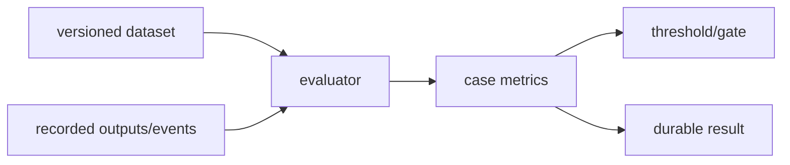

# Evaluation harness

**Status:** implemented with multiple maturity levels

## Definition
An evaluation harness binds cases, system outputs, checks/metrics, aggregation, and a threshold into a reproducible run. Regression reproducibility and metric validity are separate properties.

## Archon implementation
- `backend/app/eval/harness.py::EvalHarness`: calls an agent and checks exact/contains/not-contains/latency.
- `backend/app/eval/evaluators.py`: heuristic faithfulness, relevance, safety, and cost.
- `backend/app/eval/service.py::EvaluationService`: preferred evidence-first path; evaluates completed owner/project-scoped Run Ledger trajectories without model/retriever/tool access and persists results.

## Invariants and limits
Inputs and evaluator versions must be identifiable; errors must not count as passes; subgroup metrics matter; thresholds should be predeclared. Current recorded checks use safe events and bounded answer summaries, not fresh semantic judging. Deterministic success is real regression evidence, not model-quality proof.

## Evidence
`backend/tests/unit/test_eval.py`, `backend/tests/unit/test_recorded_evaluations.py`, `backend/tests/integration/test_recorded_evaluation_api.py`.

## Interview prompt
“The harness makes measurements repeatable; the dataset and evaluator determine whether those measurements are meaningful.”
