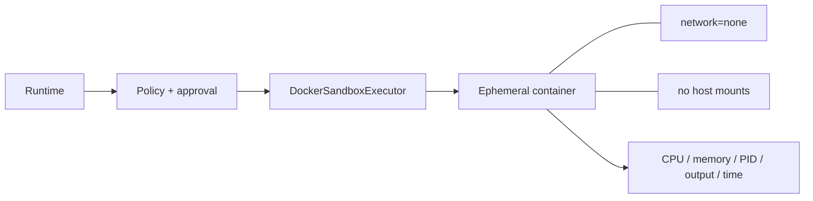
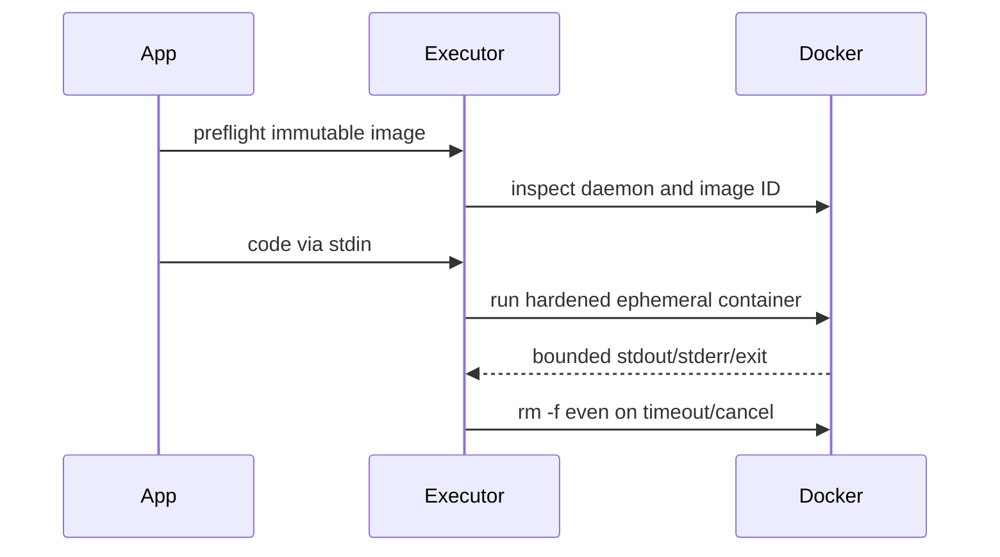

# Execution isolation and the Docker sandbox

> **Implementation status:** `implemented`
> **Status boundary:** Optional Python and shell execution is Docker-only, digest-pinned, networkless, mountless, resource-bounded, and fail-closed; it is disabled by default and is not a VM-grade or multi-tenant production sandbox claim.
> **Reviewed revision:** `6e3e13f`
> **Used by module:** [Module 05-policy-and-approvals](../modules/05-policy-and-approvals/README.md)
> **Catalog ID:** `execution-isolation-sandbox`

## Beginner explanation

Execution isolation places untrusted code in a smaller blast radius than the application host. Archon starts a fresh container with no network or host mount, drops privileges, limits resources, and removes it afterward. A command blocklist is only defense in depth; the container boundary is the sandbox.

## Problem and mental model

Treat the boundary as a contract with explicit inputs, outputs, state, failure behavior, and evidence. The important question is not whether a similarly named class or file exists, but whether the behavior is wired into a real path and whether a test or observation proves it.

## Architecture and components

## Startup and request sequence

## Archon implementation and source walkthrough

At revision `6e3e13f`, the mapped symbols implement the bounded behavior below. Most tests fake Docker; local smoke evidence is not hostile multi-tenant certification, seccomp customization, or microVM isolation.

### Source symbols

| Source symbol | Role and boundary |
|---|---|
| [`backend/app/tools/sandbox.py:DockerSandboxExecutor`](../../../backend/app/tools/sandbox.py) | Builds and runs the hardened Docker boundary. |
| [`backend/app/tools/terminal.py:terminal_tool`](../../../backend/app/tools/terminal.py) | Refuses execution without an injected isolated executor. |
| [`backend/app/main.py:create_app`](../../../backend/app/main.py) | Preflights configured execution and fails startup closed. |

### Tests

| Test | Contract proved and limit |
|---|---|
| [`backend/tests/unit/test_docker_sandbox.py::test_fixed_docker_argv_has_all_boundaries_and_no_content`](../../../backend/tests/unit/test_docker_sandbox.py) | Asserts the hardened argv and absence of host mounts. |
| [`backend/tests/unit/test_docker_sandbox.py::test_legacy_code_adapter_has_no_host_fallback`](../../../backend/tests/unit/test_docker_sandbox.py) | Proves no direct host fallback. |
| [`backend/tests/unit/test_sandbox_wire.py::test_execution_tools_absent_without_executor`](../../../backend/tests/unit/test_sandbox_wire.py) | Proves disabled-mode wiring. |

### Evidence boundary

Current implementation dimensions are centralized in [Implementation Evidence](../../IMPLEMENTATION-EVIDENCE.md). Source/tests below are repository evidence; they are not public-deployment or production-certification evidence.

## Try it: bounded study exercise

From the repository root, inspect the mapped source and test, then run the named focused test with the project test environment if available. Confirm both the passing contract and this gap: Most tests fake Docker; local smoke evidence is not hostile multi-tenant certification, seccomp customization, or microVM isolation.

**Done criteria:** identify the trust boundary, one proved behavior, and one unproved behavior without changing repository state.

## Risks, failures, and trade-offs

| Topic | Assessment |
|---|---|
| Principal risk | Container/runtime vulnerabilities and daemon privilege remain outside the Python controls. |
| Current gap/failure | Most tests fake Docker; local smoke evidence is not hostile multi-tenant certification, seccomp customization, or microVM isolation. |
| Trade-off | Docker is practical and inspectable locally; stronger VM isolation costs startup time and operations complexity. |
| Evidence hygiene | Do not log secrets or hidden chain-of-thought; record revision, environment, command, and only redacted outcomes. |

## Lab vs production

The status remains **implemented** at `6e3e13f`. Optional Python and shell execution is Docker-only, digest-pinned, networkless, mountless, resource-bounded, and fail-closed; it is disabled by default and is not a VM-grade or multi-tenant production sandbox claim. Unit tests, manifests, or local observations do not prove external-provider parity, sustained load, public deployment, legal compliance, or a production SLO.

## Interview answer

> Execution isolation places untrusted code in a smaller blast radius than the application host. Archon starts a fresh container with no network or host mount, drops privileges, limits resources, and removes it afterward. A command blocklist is only defense in depth; the container boundary is the sandbox. In Archon the honest status is **implemented**: Optional Python and shell execution is Docker-only, digest-pinned, networkless, mountless, resource-bounded, and fail-closed; it is disabled by default and is not a VM-grade or multi-tenant production sandbox claim.

## Self-check

1. What problem does this concept solve, and what nearby concept is it not?
2. Trace the diagram’s trust boundary and failure path.
3. Which mapped symbol/test proves current behavior, or why are the lists empty?
4. What exact gap prevents a stronger status?
5. Which risk would you test first before production use?

Answer guide

A good answer names the contract in the beginner explanation, follows the sequence, cites the exact table entry (or the explicit absence), repeats the status boundary, and chooses a risk from the table rather than claiming unrecorded behavior.

## Related concepts and modules

- **Module:** [Module 05-policy-and-approvals](../modules/05-policy-and-approvals/README.md)
- **Course-day map:** [AIAMastery Days 1–30 coverage](../course-concept-coverage.md)
- **Evidence:** [Implementation Evidence](../../IMPLEMENTATION-EVIDENCE.md)
- **Historical context only:** [Feature and Course Audit v2](../../FEATURE-AND-COURSE-AUDIT-V2.md)
