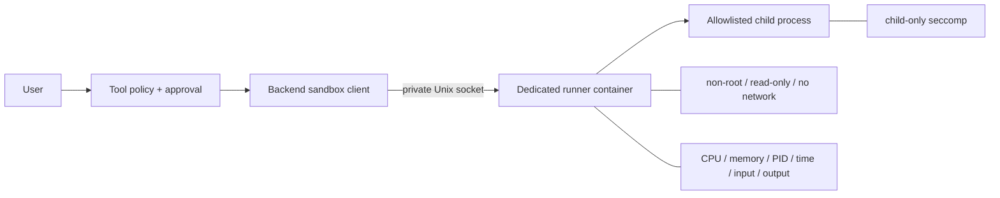
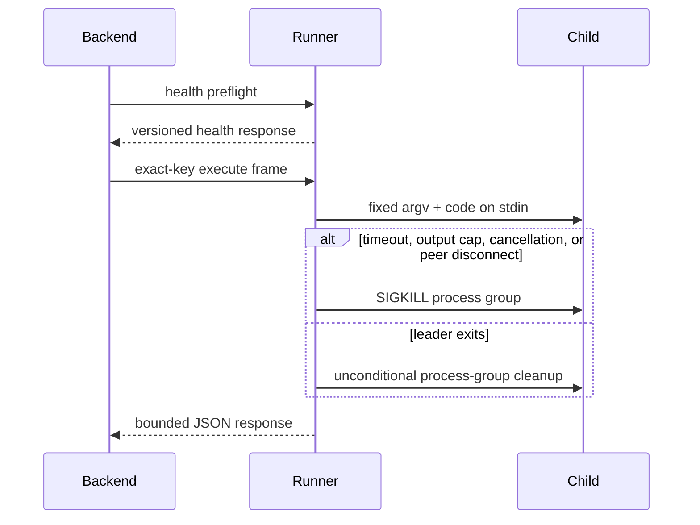

# Execution isolation and the sandbox runner

> **Implementation status:** `implemented` for the verified local target
> **Status boundary:** Live execution crosses a private Unix socket into a separate, non-root, networkless, resource-bounded runner container. This is not VM-grade hostile multi-tenant certification or public deployment.
> **Reviewed revision:** S8.7 candidate
> **Used by module:** [Module 05-policy-and-approvals](../modules/05-policy-and-approvals/README.md)
> **Catalog ID:** `execution-isolation-sandbox`

## Beginner explanation

Archon does not execute optional Python or shell snippets inside the backend process. Policy and approvals run first; accepted code travels as a bounded JSON frame over a private Unix socket to a dedicated runner. The runner accepts only fixed `python` and `shell` commands and sends code through stdin.

## Architecture

The backend and runner share only the socket volume. The runner receives no Docker socket, project mount, published port, or provider credential.

## Lifecycle contract

Only one execution is active per runner. Additional requests fail with the closed `runner_busy` code. The client never falls back to host subprocess or Docker execution.

## Implemented boundaries

| Boundary | Implementation |
|---|---|
| Process separation | `sandbox_runner/server.py`, separate Compose service |
| Client contract | `backend/app/tools/sandbox_client.py` |
| Startup fail-closed | `backend/app/main.py` preflight when enabled |
| Runtime container | non-root UID, network none, rootfs read-only, all capabilities dropped, no-new-privileges |
| Resources | CPU, memory, PID, tmpfs, wall-time, input, output, file and descriptor limits |
| Same-UID child risk | child seccomp blocks sockets, ptrace/process memory, daemon signals, process-group escape, and socket-path mutation |
| Descendant cleanup | process group killed on every completion path; Compose `init: true` reaps orphans |
| Protocol | exact keys/version/request ID; idle deadline; final encoded response frame capped |
| Status UI | authenticated metadata-only `/api/sandbox/status` and dashboard panel |

## Verification

- `backend/tests/security/test_sandbox_runner.py`
  - allowlist, timeouts, truncation and safe errors;
  - concurrent `runner_busy` behavior;
  - client disconnect cancellation and recovery;
  - successful-parent detached-child cleanup;
  - seccomp socket and mutation denial on Linux;
  - JSON-escape frame expansion.
- `scripts/sandbox-runner-smoke.sh`
  - executes through the backend client;
  - inspects real container flags;
  - proves network/control socket denial, timeout, orphan cleanup and bounded escaped output;
  - cleans containers, networks and volumes by default.

## Risks and limits

- Container/kernel vulnerabilities remain outside the Python controls.
- This is one serial local runner, not a distributed scheduler or hostile multi-tenant platform.
- Linux seccomp is proven in Linux tests and Docker smoke; macOS skips the syscall-specific unit test.
- Shell/Python functionality is intentionally reduced by seccomp and the read-only/networkless boundary.
- No public deployment or production SLO is claimed.

## Interview answer

> Archon separates control and execution. The backend authorizes work and sends a strict bounded request over a private Unix socket. A dedicated non-root container runs fixed commands with no network, no project or Docker mount, cgroup limits, child seccomp, and unconditional process-group cleanup. Startup fails closed if the runner is unavailable. Tests and a real Compose smoke prove the local boundary, but I do not claim VM-grade multi-tenant isolation.

## Self-check

1. Why is a separate runner safer than invoking Docker or subprocesses from the backend?
2. Why must the child be blocked from the runner’s own Unix socket?
3. Why is killing only the leader PID insufficient?
4. Why must output be bounded after JSON encoding?
5. Which claims remain explicitly unproved?
