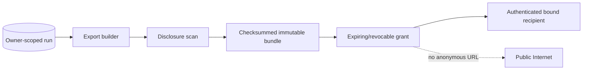

# Redacted run export and sharing

> **Implementation status:** `implemented` for authenticated recipient-bound sharing
> **Status boundary:** Immutable disclosure-scanned exports and expiring/revocable grants bound to an authenticated recipient and closed purpose are implemented. Public anonymous sharing is deliberately deferred.
> **Reviewed boundary:** S8.10 documentation candidate based at `440f08e`; no final gate claimed
> **Used by module:** [Module 07-run-ledger](../modules/07-run-ledger/README.md)
> **Catalog ID:** `export-share-redaction`

## Beginner explanation

Run export packages prompts, events, tools, evidence, and metrics for another reader. Sharing changes the trust boundary, so stored data that was safe for its owner may still reveal business context or secrets. Export needs an explicit schema, redaction pass, authorization, expiry, and revocation.

## Problem and mental model

Treat the boundary as a contract with explicit inputs, outputs, state, failure behavior, and evidence. The important question is not whether a similarly named class or file exists, but whether the behavior is wired into a real path and whether a test or observation proves it.

## Architecture and components



## Startup and request sequence

```mermaid
sequenceDiagram
    Owner->>Exporter: select run + fields + recipient
    Exporter->>Redactor: sanitize complete bundle
    Redactor->>Owner: preview omissions
    Owner->>Share: approve expiry/scope
    Recipient->>Share: authorized read
    Note over Owner,Share: Implemented locally; anonymous redemption excluded
```

## Archon implementation and source walkthrough

`RunExportService` builds immutable versioned evidence bundles, scans disclosures, verifies integrity on download/redemption, and stores only a domain-separated HMAC token digest. Grants bind an authenticated recipient, purpose, expiry, owner, and export; redemption rechecks active state. No public anonymous URL or external token-delivery service exists.

### Source symbols

| Source symbol | Role and boundary |
|---|---|
| [`backend/app/services/run_exports.py:RunExportService`](../../../backend/app/services/run_exports.py) | Builds/verifies bundles and creates, revokes, and redeems recipient-bound grants. |
| [`backend/app/routes/runs.py`](../../../backend/app/routes/runs.py) / [`backend/app/routes/shares.py`](../../../backend/app/routes/shares.py) | Authenticated owner/export and recipient redemption API boundaries. |

### Tests

| Test | Contract proved and limit |
|---|---|
| [`backend/tests/security/test_run_exports.py`](../../../backend/tests/security/test_run_exports.py) | Owner/recipient scope, hash-only token storage, disclosure scan, integrity, expiry, and revocation races. |
| [`backend/tests/integration/test_run_export_migration.py`](../../../backend/tests/integration/test_run_export_migration.py) | Durable export/grant schema lifecycle. |

### Evidence boundary

Current local implementation dimensions and explicit limits are centralized in [Implementation Evidence](../../IMPLEMENTATION-EVIDENCE.md). Deterministic tests establish the authenticated sharing contract, not anonymous Internet disclosure or public deployment.

## Try it: bounded study exercise

Run `cd backend && uv run pytest -q tests/security/test_run_exports.py tests/integration/test_run_export_migration.py`, then explain why a token alone is insufficient: redemption also requires the bound authenticated recipient and purpose. Do not use real secrets or personal data.

**Done criteria:** identify the trust boundary, one proved behavior, and one unproved behavior without changing repository state.

## Risks, failures, and trade-offs

| Topic | Assessment |
|---|---|
| Principal risk | Exports can leak prompts, tool arguments, credentials, PII, proprietary evidence, or hidden authorization metadata. |
| Current gap/failure | No anonymous public edge, capability URL, CDN/cache invalidation, abuse controls, takedown process, or public deployment evidence. |
| Trade-off | Static downloads are simple but hard to revoke; server-hosted grants improve control but require durable authorization. |
| Evidence hygiene | Do not log secrets or hidden chain-of-thought; record revision, environment, command, and only redacted outcomes. |

## Lab vs production

Authenticated recipient-bound export and sharing are **implemented locally**. [Public anonymous sharing remains deferred](../../REMAINING-DEFERRED-GAPS.md#5-public-anonymous-sharing): it would require a separately threat-modeled public edge, owner consent/minimization, abuse controls, cache invalidation, takedown, and adversarial public-edge evidence. Local tests do not prove public deployment, legal compliance, or a production SLO.

## Interview answer

> Archon builds immutable, disclosure-scanned run-evidence bundles and shares them through expiring, revocable grants bound to one authenticated recipient and purpose. Only a token digest is stored and integrity/disclosure checks repeat at redemption. That is implemented local authenticated sharing—not an anonymous public link, hosting claim, or legal-compliance claim.

## Self-check

1. What problem does this concept solve, and what nearby concept is it not?
2. Trace the diagram’s trust boundary and failure path.
3. Which mapped symbol/test proves current behavior, or why are the lists empty?
4. What exact gap prevents a stronger status?
5. Which risk would you test first before production use?

<details>
<summary>Answer guide</summary>

A good answer names the contract in the beginner explanation, follows the sequence, cites the exact table entry (or the explicit absence), repeats the status boundary, and chooses a risk from the table rather than claiming unrecorded behavior.

</details>

## Related concepts and modules

- **Module:** [Module 07-run-ledger](../modules/07-run-ledger/README.md)
- **Course-day map:** [AIAMastery Days 1–30 coverage](../course-concept-coverage.md)
- **Evidence:** [Implementation Evidence](../../IMPLEMENTATION-EVIDENCE.md)
- **Historical context only:** [Feature and Course Audit v2](../../FEATURE-AND-COURSE-AUDIT-V2.md)
