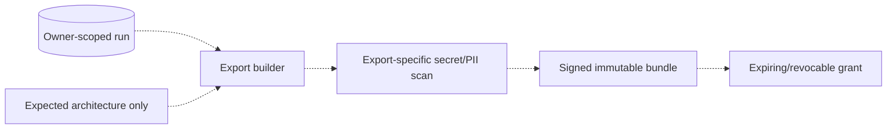
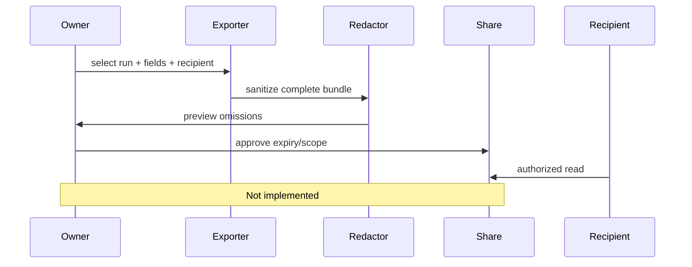

# Redacted run export and sharing

> **Implementation status:** `not-implemented`
> **Status boundary:** Archon has owner-scoped run reads and persistence redaction, but no export bundle, share token, recipient policy, revocation, expiry, or export-specific redaction/secret scan.
> **Reviewed revision:** `6e3e13f`
> **Used by module:** [Module 07-run-ledger](../modules/07-run-ledger/README.md)
> **Catalog ID:** `export-share-redaction`

## Beginner explanation

Run export packages prompts, events, tools, evidence, and metrics for another reader. Sharing changes the trust boundary, so stored data that was safe for its owner may still reveal business context or secrets. Export needs an explicit schema, redaction pass, authorization, expiry, and revocation.

## Problem and mental model

Treat the boundary as a contract with explicit inputs, outputs, state, failure behavior, and evidence. The important question is not whether a similarly named class or file exists, but whether the behavior is wired into a real path and whether a test or observation proves it.

## Architecture and components

## Startup and request sequence

## Archon implementation and source walkthrough

This is an expected architecture, not a source walkthrough. No exporter or sharing model exists; persistence redaction does not establish safe disclosure. The diagram and sequence define the boundary a future design would need; they do not imply scheduled work.

### Source symbols

| Source symbol | Role and boundary |
|---|---|
| None | No Archon implementation is claimed for this concept. |

### Tests

| Test | Contract proved and limit |
|---|---|
| None | No implementation test is claimed; adjacent tests do not establish this concept. |

### Evidence boundary

There is no runtime evidence for this concept. Use the repository and current [implementation evidence](../../IMPLEMENTATION-EVIDENCE.md) to confirm the negative boundary; do not infer implementation from adjacent features.

## Try it: bounded study exercise

Code-reading exercise: search the repository for the missing components named in the gap. Confirm that adjacent features do not satisfy them. No service should be started and no data should be changed.

**Done criteria:** identify the trust boundary, one proved behavior, and one unproved behavior without changing repository state.

## Risks, failures, and trade-offs

| Topic | Assessment |
|---|---|
| Principal risk | Exports can leak prompts, tool arguments, credentials, PII, proprietary evidence, or hidden authorization metadata. |
| Current gap/failure | No exporter or sharing model exists; persistence redaction does not establish safe disclosure. |
| Trade-off | Static downloads are simple but hard to revoke; server-hosted grants improve control but require durable authorization. |
| Evidence hygiene | Do not log secrets or hidden chain-of-thought; record revision, environment, command, and only redacted outcomes. |

## Lab vs production

The status remains **not-implemented** at `6e3e13f`. Archon has owner-scoped run reads and persistence redaction, but no export bundle, share token, recipient policy, revocation, expiry, or export-specific redaction/secret scan. Unit tests, manifests, or local observations do not prove external-provider parity, sustained load, public deployment, legal compliance, or a production SLO.

## Interview answer

> Run export packages prompts, events, tools, evidence, and metrics for another reader. Sharing changes the trust boundary, so stored data that was safe for its owner may still reveal business context or secrets. Export needs an explicit schema, redaction pass, authorization, expiry, and revocation. In Archon the honest status is **not-implemented**: Archon has owner-scoped run reads and persistence redaction, but no export bundle, share token, recipient policy, revocation, expiry, or export-specific redaction/secret scan.

## Self-check

1. What problem does this concept solve, and what nearby concept is it not?
2. Trace the diagram’s trust boundary and failure path.
3. Which mapped symbol/test proves current behavior, or why are the lists empty?
4. What exact gap prevents a stronger status?
5. Which risk would you test first before production use?

Answer guide

A good answer names the contract in the beginner explanation, follows the sequence, cites the exact table entry (or the explicit absence), repeats the status boundary, and chooses a risk from the table rather than claiming unrecorded behavior.

## Related concepts and modules

- **Module:** [Module 07-run-ledger](../modules/07-run-ledger/README.md)
- **Course-day map:** [AIAMastery Days 1–30 coverage](../course-concept-coverage.md)
- **Evidence:** [Implementation Evidence](../../IMPLEMENTATION-EVIDENCE.md)
- **Historical context only:** [Feature and Course Audit v2](../../FEATURE-AND-COURSE-AUDIT-V2.md)
