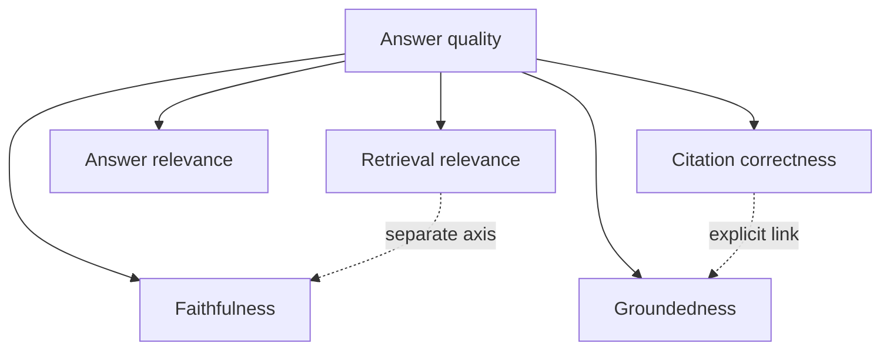

# Faithfulness

**Status:** partial

## Beginner definition

Faithfulness asks whether an answer stays within what its supplied context supports.
A faithful answer does not contradict the context or add unsupported factual details.
Faithfulness is evaluated after retrieval and generation.
It does not tell us whether the retrieved context was the best context or whether the source itself was true.

## Vocabulary

- **Context:** evidence made available to the answer generator.
- **Claim decomposition:** splitting an answer into independently checkable assertions.
- **Unsupported addition:** a factual detail absent from the context.
- **Contradiction:** a claim whose meaning conflicts with the context.
- **Hallucination:** generated content not supported by the relevant evidence, under a stated definition.
- **Heuristic evaluator:** a fast rule-based approximation of a quality property.
- **Semantic judge:** a model or human assessing meaning rather than exact token overlap.
- **False positive:** an evaluator accepts an unfaithful claim.
- **False negative:** an evaluator rejects a faithful claim.

## Mental model

Faithfulness is the discipline of a witness repeating only what appears in the supplied record.
The witness may accurately repeat a bad or irrelevant record.
A keyword checker is like an auditor matching vocabulary; it can miss paraphrases and be fooled by copied words.
A semantic judge reads meaning, but the judge can also be inconsistent or biased.

## Two operational proxies in Archon

The stronger answer-path proxy is `backend/app/services/grounded_rag.py::_supports_claim`.
It works on atomic claims and explicitly cited `DocumentEvidence`.
It requires known evidence IDs and valid evidence snapshots.
It checks at least 90% substantive-token coverage.
It requires claim numbers to occur in the cited evidence.
It requires matching relevant polarity.
`_verify_document_claims` keeps only claims that pass and returns the rest as unsupported.
This path is conservative and citation-aware, but it is not semantic entailment.

The broad evaluation proxy is `backend/app/eval/evaluators.py::evaluate_faithfulness`.
It splits an answer on `.`, `!`, and `?`.
It ignores answer fragments of ten characters or fewer.
For each sentence, it selects whitespace-separated words longer than three characters.
It counts a sentence as grounded when more than 30% of those words appear as substrings in lowercased context.
It returns the fraction of counted sentences rounded to two decimals.
Empty answer or context returns zero.
No substantive sentence returns one.
Its docstring recommends an LLM-as-judge for production.
The implementation calls the metric `faithfulness`, while its reason text says sentences are “grounded.”
Always identify which proxy produced a score.

## Why scores can mislead

Whitespace tokenization leaves punctuation attached and is language-sensitive.
Substring matching can count accidental occurrences inside unrelated words.
A sentence can copy keywords while reversing causality or attribution.
A valid paraphrase can use synonyms and receive little overlap.
The heuristic does not bind sentences to explicit evidence IDs.
“No substantive claims” scoring one is a convention, not proof of useful output.
A single average hides which high-risk claim failed.
A score such as 0.9 is uninterpretable without evaluator version, dataset, threshold, and error analysis.
Deterministic verification is not semantic truth.

## Five separate quality questions

**Retrieval relevance:** did retrieval find chunks useful for the question?
**Groundedness:** are claims supported by the evidence supplied for this run?
**Faithfulness:** does the answer preserve the context's meaning without unsupported additions?
**Citation correctness:** do explicit references identify evidence supporting their attached claims?
**Answer relevance:** does the final answer address the user's question?
A faithful answer can summarize irrelevant retrieved text and fail answer relevance.
An answer can be relevant but unfaithful by inventing a useful-sounding detail.
A claim can be faithful to context but attach the wrong citation.
A faithful statement can be factually false when its source is false.

## Security and failure modes

Prompt injection inside context can instruct the generator to ignore evidence boundaries.
Do not let retrieved text change tool permissions, system policy, or authorization scope.
A lexical checker can be gamed by copying source vocabulary into an unsupported claim.
Negation, numbers, units, dates, attribution, and conditional language require explicit testing.
Long answers can dilute averages while hiding one severe unsupported assertion.
Judge models can expose context to another provider and introduce nondeterminism.
Evaluation datasets can leak into prompts or overrepresent easy examples.
Fail closed for high-risk claims rather than converting an uncertain score into a truth label.

## Observability

Record evaluator name, code or prompt version, model if any, dataset version, and threshold.
Report claim-level outcomes alongside aggregate scores.
Track false-positive and false-negative rates against adjudicated samples.
Slice results by domain, language, answer length, number density, and negation.
Track abstentions separately from faithful answers.
The grounded path exposes supported and unsupported counts and hashes in ledger events.
`run_batch_eval` reports average faithfulness and relevance separately.
Do not merge those dimensions into one number without retaining component metrics.
Do not log raw confidential context merely to explain failures.

## Alternatives and trade-offs

Exact extractive matching is deterministic but rejects synthesis and paraphrase.
Natural-language inference models assess entailment and contradiction but need domain calibration.
LLM-as-judge handles nuance but adds cost, latency, nondeterminism, and judge bias.
Human annotation is valuable for calibration and high-risk review but does not scale cheaply.
Structured fact comparison works well for names, values, units, and dates.
Citation-aware claim checking improves traceability over answer-to-whole-context overlap.
Ensembles can reduce individual blind spots but require explicit disagreement handling.

## Lab versus production

The keyword evaluator is suitable for smoke tests and obvious regressions.
The deterministic grounded verifier is suitable for reproducible, near-extractive acceptance controls.
Neither establishes calibrated semantic faithfulness in production.
The final acceptance evidence uses mock embeddings/provider and therefore tests control flow, not real generation quality.
Production evaluation needs real model outputs and representative claim/context labels.
Annotators need written guidance for partial support, common knowledge, multi-hop evidence, and contradiction.
Set thresholds from risk and measured error costs, not convenience.
Retain hard adversarial cases for negation, numbers, attribution, and copied-word attacks.

## Evidence in this repository

- `backend/app/eval/evaluators.py::evaluate_faithfulness`
- `backend/app/eval/evaluators.py::evaluate_relevance`
- `backend/app/eval/evaluators.py::run_batch_eval`
- `backend/app/services/grounded_rag.py::_supports_claim`
- `backend/app/services/grounded_rag.py::_verify_document_claims`
- `backend/tests/unit/test_new_features.py::TestEvaluators.test_faithfulness_grounded`
- `backend/tests/unit/test_new_features.py::TestEvaluators.test_faithfulness_ungrounded`
- `backend/tests/unit/test_new_features.py::TestEvaluators.test_relevance_relevant`
- `backend/tests/unit/test_grounded_rag.py::test_claim_support_is_conservative_about_negation_numbers_and_partial_claims`
- `backend/tests/unit/test_grounded_rag.py::test_partial_unknown_and_missing_citations_are_unsupported`
- `backend/tests/unit/test_remaining.py::TestBatchEval.test_batch_eval_runs`

## Exercise

Use context saying, “Plan A costs $20 and does not include support.”
Evaluate five answers: an exact restatement, a synonym-based paraphrase, a claim of $200, a claim that support is included, and copied word salad.
Run `evaluate_faithfulness` and predict `_supports_claim` with a valid `E1`.
Compare both outputs with your semantic labels.
Document each false acceptance and false rejection.
Then ask an unrelated question and explain why a faithful restatement can still be answer-irrelevant.

## 30-second interview answer

“Faithfulness means the answer stays within the supplied context without contradictions or unsupported additions. Archon has a lightweight answer/context keyword heuristic and a stricter citation-aware deterministic claim check for overlap, numbers, and polarity. Both are regression proxies, not semantic truth. I would report the exact evaluator and dataset, calibrate against human labels, and keep retrieval relevance, groundedness, citation correctness, and answer relevance separate.”

## Self-checks

1. **Does faithful mean globally true?** No; faithfulness is relative to supplied context.
2. **What threshold does the lightweight evaluator use?** More than 30% overlap of words longer than three characters per sentence.
3. **What score does it assign when no substantive sentences exist?** One, by implementation convention.
4. **Why can copied keywords fool it?** It checks lexical occurrence rather than semantic relations.
5. **Why can paraphrases fail?** Synonyms may not overlap with context words.
6. **How is answer relevance different?** It measures whether the response addresses the question.
7. **Which proxy is citation-aware?** `_supports_claim` in the grounded workflow.
8. **What must accompany a production score?** Evaluator/version, dataset/version, threshold, slices, and error analysis.
