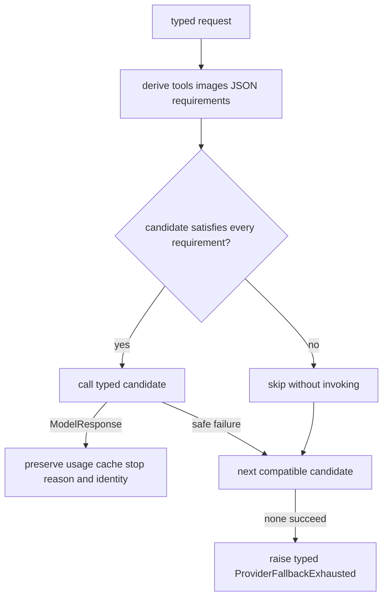
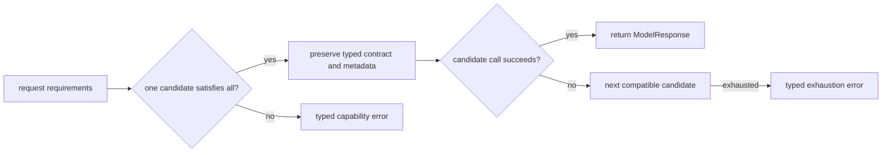

# Fallback

**Status:** partially implemented through two different mechanisms

## Definition

Fallback substitutes a secondary implementation or a degraded response when the preferred path fails.
It is not automatically safe merely because it returns something.
Correct fallback requires an explicit contract for capabilities, safety, freshness, and user-visible degradation.
A fallback may preserve availability while reducing quality.
It may also convert a clear failure into a plausible but unsafe success.
The key design question is not “did another endpoint answer?” but “which guarantees remain true?”

## Two fallback forms in Archon

`backend/app/agents/fallback_chain.py::FallbackLLMChain` now supports the typed `ModelProvider.complete` boundary and the legacy text-only `chat` API.
`backend/app/agents/resilient_coordinator.py::ResilientCoordinator` separately supplies fixed stage-specific degraded text.
The typed chain computes the request requirements, skips incompatible candidates, and selects the first compatible provider that succeeds.
The coordinator stops retrying a failed specialist and synthesizes or forwards a predetermined fallback response.
Neither mechanism should be confused with `CircuitBreakingProvider`, which blocks calls to a known-unhealthy delegate rather than selecting another provider.

## Exact `FallbackLLMChain` behavior

The constructor requires at least one adapter and accepts a covariant sequence of typed or legacy clients.
`complete` accepts typed messages, tool definitions, `max_tokens`, and an optional response contract or legacy JSON format.
It derives the complete requirement set before attempting providers; one candidate must satisfy all requirements.
Incompatible candidates are skipped without invocation.
The first compatible successful `ModelResponse` is returned with content, tool calls, images contract, usage, cache usage, stop reason, structured value, and provider/model identity preserved.
A successful later adapter logs `llm_fallback_success` with adapter class name, list position, and the actual number of failed invocations—not incompatible skips.
Every ordinary adapter exception increments an in-memory counter keyed by list position.
Failure logging uses `safe_exception_metadata` rather than directly attaching the raw exception.
`chat` remains a compatibility API. It forwards temperature only to clients whose declared signature supports it and omits the argument for Ollama-like clients.
`get_stats` returns adapter class names and per-position cumulative failure counts.
There is no sticky routing; each request starts from the configured priority order.
An end-to-end runtime deadline still owns total latency; the chain itself does not create a separate deadline.

## All-provider failure semantics

When no single candidate satisfies the complete requirement set, the chain raises `NoCompatibleProviderError` before invoking a provider.
When every compatible candidate raises, it raises `ProviderFallbackExhausted`.
These errors expose stable capability/provider class metadata and attempt counts, not raw provider exception text.
The chain therefore cannot turn a total outage into plausible assistant content.
Operational logs receive sanitized exception metadata; prompts and credentials are not attached.

## Capability retained and capability lost

The typed path preserves `Message` objects, tool definitions, images, response contracts, `ModelResponse`, token/cache usage, provider stop reason, and actual provider/model identity.
The legacy `chat` path intentionally returns text only, while preserving `max_tokens` and supported temperature semantics.
The chain advertises the union of candidate capabilities so a capable primary is not rejected because a weaker fallback exists.
At execution time it checks every requirement against each candidate; capabilities cannot be assembled across different providers.
A text-only fallback is never eligible for a request requiring tools, images, or JSON mode.
The chain does not guarantee equivalent model quality, safety policy, context length, tokenizer, cost, geography, or data residency.
Those differences remain explicit acceptance and deployment concerns.

## Factory wiring

`backend/app/agents/llm_factory.py::create_llm_client` creates the configured primary first.
An empty `llm_fallback_providers` string returns that client directly.
A comma-separated fallback string is stripped and empty entries are removed.
Each known fallback provider is appended in order.
Unknown fallback names are logged and skipped.
If no valid secondary remains, the factory returns the primary directly.
With at least one valid secondary, it returns `FallbackLLMChain([primary, ...fallbacks])`.
The same general model/base URL/API-key settings are reused by provider constructors as implemented by the factory.
Configuration presence does not establish feature parity between providers.

## Coordinator degradation

`ResilientCoordinator._execute_with_fallback` attempts a specialist from attempt 1 through `max_retries` inclusive.
Despite the setting name, `max_retries=2` yields two total attempts, not one initial attempt plus two retries.
Each attempt uses `asyncio.wait_for` with `timeout_seconds`.
After all attempts fail or time out, it returns a dictionary with `fallback: True`.
Planning degrades to `Proceeding with direct answer (planning skipped)`.
Retrieval degrades to `No additional context found (retrieval skipped)`.
Validation degrades to `{"approved": true, "reason": "validation skipped"}`.
Synthesis degrades to the raw retrieval response.
Those substitutions retain pipeline shape and a text response.
They do not retain the missing specialist's actual capability.
In particular, validation fallback explicitly skips validation and must never be treated as policy or security approval.
Raw retrieval fallback loses synthesis and may expose low-quality or unreviewed context as the answer.

## Designing a capability-aware fallback

Define required capabilities before choosing providers.
Reject fallback when any mandatory capability is absent.
Negotiate model context length, tool support, image support, and structured-output mode.
Normalize typed responses only where semantics are genuinely equivalent.
Validate structured output after fallback exactly as after primary success.
Carry a `degraded`, `provider`, and `reason_code` field in the result.
Apply one end-to-end deadline so sequential providers cannot multiply latency without bound.
Use breakers to skip known-unhealthy providers while preserving a recovery probe.
Use idempotency keys before retrying or switching a side-effecting operation.
Separate safety policy from model availability; no model fallback should bypass authorization.
Choose whether cost, geography, and data residency permit each route.

## Security and failure modes

A weaker fallback can silently bypass content filtering or data-location requirements.
Sending the same prompt to multiple vendors expands data exposure.
Sequential attempts can increase latency and spend.
A typed fallback may still duplicate a provider request, but tool side effects execute only after the runtime selects and validates one response.
Typed exhaustion prevents provider failure text from being rendered as trustworthy assistant content.
Sanitized errors avoid returning raw exception text, but provider class names remain operational metadata and must stay non-secret.
Fallback success can hide a sustained primary outage unless explicitly measured.
Permanent caller errors should not fan out to every provider.
A fallback model may not understand the same system prompt or output schema.
Fixed degraded text may be factually inappropriate for a particular request.
Always make degradation visible to downstream code and, where useful, the user.

## Observability

Count attempts by primary/fallback position and stable provider identifier.
Measure primary success, fallback success, all-failed, and degraded coordinator stages.
Track latency and cost added by each extra attempt.
Expose capability mismatch and schema-validation failure as distinct reasons.
Alert when fallback share rises even if overall success remains high.
Track failure counters per process while recognizing that `get_stats` is not durable or shared.
Do not place prompts or raw exception messages in labels.
Preserve a correlation ID across provider attempts.
Record which guarantee was lost, not merely that “fallback happened.”

## Lab versus production

In a lab, fake clients clearly demonstrate order and first-success behavior.
The deterministic portfolio benchmark demonstrates injected secondary selection.
Neither proves real-provider parity, outage recovery, or equivalent answers.
In production, use typed capability declarations and contract tests against every provider/version.
Add global deadlines, provider-specific timeouts, breakers, safe typed errors, and cost controls.
Review data-processing terms and regional routing before enabling a vendor fallback.
Canary each fallback independently and test malformed as well as successful responses.
Practice all-provider outage behavior before an incident.

## Alternatives

Fail closed when a required safety or transactional guarantee cannot be preserved.
Queue work for later when freshness is flexible and durable completion matters.
Serve a cached response when staleness is acceptable and clearly labeled.
Use a deterministic rules engine for narrow tasks with explicit semantics.
Reduce features, such as answering without tools, only when the request permits that mode.
Ask the user to retry rather than fabricate continuity.
Route by capability from the start instead of treating every secondary as an emergency fallback.
Use hedging only for safe idempotent requests because parallel providers increase load and exposure.

## Exercise

1. Create a failing typed primary and a successful typed fallback.
2. Verify that each compatible candidate is called once and the secondary `ModelResponse` retains usage and stop reason.
3. Make both fail and confirm `ProviderFallbackExhausted` contains no raw exception text.
4. Add a text-only candidate before a provider supporting tools; verify the text candidate is skipped without invocation.
5. Define a request requiring JSON mode and tools; prove that one provider—not the union—must satisfy both.
6. Call the legacy `chat` API with a temperature-aware client and an Ollama-like client; verify each receives only supported arguments.
7. Trace all four coordinator stage fallbacks and mark exactly which capability each loses.
8. Add an end-to-end deadline and state where it must be checked before each new provider.

## Exact source and test evidence

- `backend/app/agents/fallback_chain.py::FallbackLLMChain.complete` defines typed capability-aware selection.
- `backend/app/agents/fallback_chain.py::FallbackLLMChain.chat` preserves compatible legacy sampling arguments.
- `backend/app/agents/fallback_chain.py::FallbackLLMChain.get_stats` exposes process-local failure counts.
- `backend/app/agents/llm_factory.py::create_llm_client` defines configuration order and unknown-provider skipping.
- `backend/app/agents/resilient_coordinator.py::ResilientCoordinator._execute_with_fallback` defines bounded specialist attempts and degraded dictionaries.
- `backend/tests/unit/test_fallback_wire.py::test_typed_failure_then_compatible_fallback` proves typed secondary selection.
- `backend/tests/unit/test_fallback_wire.py::test_combined_requirements_need_one_candidate_not_union_only_match` proves capabilities cannot be assembled across providers.
- `backend/tests/unit/test_fallback_wire.py::test_all_compatible_failures_raise_without_raw_errors` proves safe typed exhaustion.
- `backend/tests/unit/test_fallback_wire.py::test_legacy_chat_forwards_temperature_when_supported` proves legacy temperature preservation.
- `docs/evidence/local-portfolio-benchmark.json` uses injected clients and is not evidence of live-provider equivalence.

## 30-second interview answer

“Fallback is a semantic substitution, not just another endpoint. Archon's typed `FallbackLLMChain` derives tools, image, and JSON requirements, skips incompatible candidates, and preserves the winning `ModelResponse`, usage, cache counters, stop reason, and provider identity. No single provider means a typed capability error; total outage means typed exhaustion, never an exception-bearing assistant string. The remaining production questions are end-to-end deadlines, live parity, cost, geography, and safety-policy equivalence.”

## Self-checks

1. **What happens when no provider satisfies every required capability?** `NoCompatibleProviderError` is raised before any incompatible provider call.
2. **Can tools from one provider and images from another satisfy one request?** No. One candidate must satisfy the complete requirement set.
3. **What happens when all compatible providers fail?** The chain raises `ProviderFallbackExhausted` without raw exception text.
4. **Does legacy chat still preserve temperature?** Yes for clients whose signature supports it; the argument is omitted for Ollama-like clients that do not.
5. **Is the coordinator's validation fallback an approval?** No. It says validation was skipped and cannot substitute for policy or security enforcement.
6. **Why can fallback increase risk during outage?** It expands data exposure and may route to providers with different controls, cost, geography, or quality.
7. **What metadata survives typed fallback?** Tool calls, usage/cache counters, stop reason, structured value, and actual provider/model identity.
8. **What does deterministic fake-client evidence prove?** Contract wiring and selection behavior, not live-provider parity or outage recovery.
