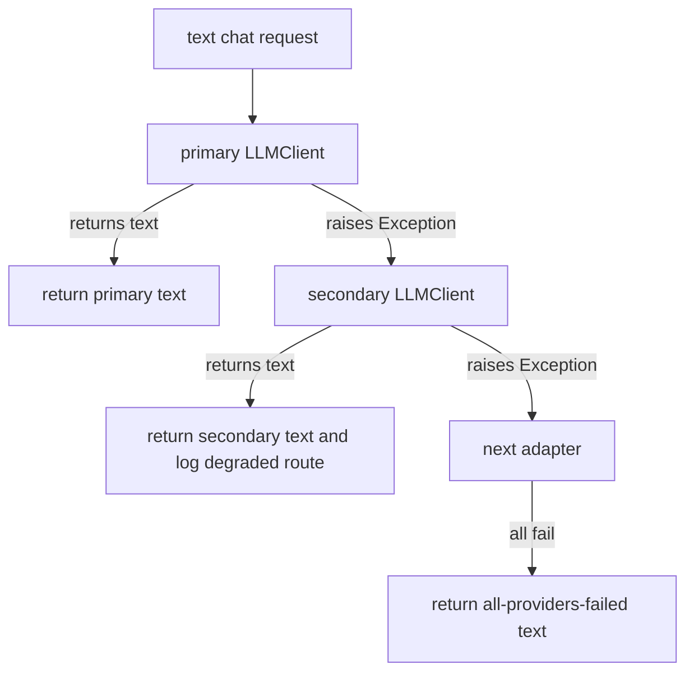
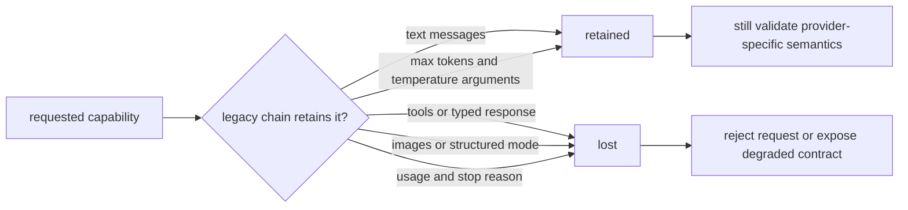

# Fallback

**Status:** partially implemented through two different mechanisms

## Definition

Fallback substitutes a secondary implementation or a degraded response when the preferred path fails.
It is not automatically safe merely because it returns something.
Correct fallback requires an explicit contract for capabilities, safety, freshness, and user-visible degradation.
A fallback may preserve availability while reducing quality.
It may also convert a clear failure into a plausible but unsafe success.
The key design question is not “did another endpoint answer?” but “which guarantees remain true?”

## Two fallback forms in Archon

`backend/app/agents/fallback_chain.py::FallbackLLMChain` tries legacy `LLMClient` adapters in order.
`backend/app/agents/resilient_coordinator.py::ResilientCoordinator` supplies fixed stage-specific degraded text.
These are separate mechanisms with different contracts.
The chain seeks the first provider text response.
The coordinator stops retrying a failed specialist and synthesizes or forwards a predetermined fallback response.
Neither mechanism should be confused with `CircuitBreakingProvider`, which returns a typed unavailable error rather than selecting a fallback.

## Exact `FallbackLLMChain` behavior

The constructor requires at least one adapter and otherwise raises `ValueError`.
`chat` accepts `messages: list[dict[str, str]]`, `max_tokens`, and `temperature`.
Adapters are attempted sequentially in configured list order.
Each receives the same messages, token maximum, and temperature.
The first returned string is returned unchanged.
A successful primary produces no fallback-success log.
A successful later adapter logs `llm_fallback_success` with adapter class name, zero-based position, and failures skipped.
Every ordinary adapter exception increments an in-memory counter keyed by list position.
Failure logging uses `safe_exception_metadata` rather than directly attaching the raw exception.
`get_stats` returns adapter class names and the per-position cumulative failure counts.
There is no timeout, backoff, per-adapter breaker, health scoring, or request deadline inside this chain.
There is no sticky routing; every new request starts with adapter zero.

## All-provider failure semantics

When every adapter raises, the method does **not** raise a typed unavailable exception.
It creates strings such as `AdapterName: exception text` for each failure.
It joins them and returns `[All LLM providers failed: ...]` as an ordinary text result.
That means a caller can mistake total failure for a valid model answer.
The returned text includes exception text even though structured failure logs are sanitized.
This is an important legacy limitation and a possible information-disclosure path.
Production code should prefer a typed failure with safe public text and protected internal diagnostics.

## Capability retained and capability lost

The chain retains plain text chat, message ordering, `max_tokens`, and `temperature` at its declared interface.
It retains deterministic configured priority: primary first, then fallback entries.
It retains only the response string from the successful adapter.
It does not expose the selected provider in the return type.
It does not retain typed `ModelResponse` metadata.
It does not retain tool definitions or tool calls.
It does not retain images or multimodal inputs.
It does not retain structured-output or JSON-mode guarantees.
It does not retain token usage, cost, stop reason, finish reason, or provider request IDs.
It does not guarantee safety-policy, context-window, tokenizer, or model-quality parity.
It therefore cannot transparently replace the typed runtime `ModelProvider` contract.

## Factory wiring

`backend/app/agents/llm_factory.py::create_llm_client` creates the configured primary first.
An empty `llm_fallback_providers` string returns that client directly.
A comma-separated fallback string is stripped and empty entries are removed.
Each known fallback provider is appended in order.
Unknown fallback names are logged and skipped.
If no valid secondary remains, the factory returns the primary directly.
With at least one valid secondary, it returns `FallbackLLMChain([primary, ...fallbacks])`.
The same general model/base URL/API-key settings are reused by provider constructors as implemented by the factory.
Configuration presence does not establish feature parity between providers.

## Coordinator degradation

`ResilientCoordinator._execute_with_fallback` attempts a specialist from attempt 1 through `max_retries` inclusive.
Despite the setting name, `max_retries=2` yields two total attempts, not one initial attempt plus two retries.
Each attempt uses `asyncio.wait_for` with `timeout_seconds`.
After all attempts fail or time out, it returns a dictionary with `fallback: True`.
Planning degrades to `Proceeding with direct answer (planning skipped)`.
Retrieval degrades to `No additional context found (retrieval skipped)`.
Validation degrades to `{"approved": true, "reason": "validation skipped"}`.
Synthesis degrades to the raw retrieval response.
Those substitutions retain pipeline shape and a text response.
They do not retain the missing specialist's actual capability.
In particular, validation fallback explicitly skips validation and must never be treated as policy or security approval.
Raw retrieval fallback loses synthesis and may expose low-quality or unreviewed context as the answer.

## Designing a capability-aware fallback

Define required capabilities before choosing providers.
Reject fallback when any mandatory capability is absent.
Negotiate model context length, tool support, image support, and structured-output mode.
Normalize typed responses only where semantics are genuinely equivalent.
Validate structured output after fallback exactly as after primary success.
Carry a `degraded`, `provider`, and `reason_code` field in the result.
Apply one end-to-end deadline so sequential providers cannot multiply latency without bound.
Use breakers to skip known-unhealthy providers while preserving a recovery probe.
Use idempotency keys before retrying or switching a side-effecting operation.
Separate safety policy from model availability; no model fallback should bypass authorization.
Choose whether cost, geography, and data residency permit each route.

## Security and failure modes

A weaker fallback can silently bypass content filtering or data-location requirements.
Sending the same prompt to multiple vendors expands data exposure.
Sequential attempts can increase latency and spend.
An ambiguous provider error can cause duplicate side effects if the request included tool execution.
A returned all-failed string can be rendered as trustworthy assistant content.
Raw exception text in that string can disclose endpoints, configuration, or provider details.
Fallback success can hide a sustained primary outage unless explicitly measured.
Permanent caller errors should not fan out to every provider.
A fallback model may not understand the same system prompt or output schema.
Fixed degraded text may be factually inappropriate for a particular request.
Always make degradation visible to downstream code and, where useful, the user.

## Observability

Count attempts by primary/fallback position and stable provider identifier.
Measure primary success, fallback success, all-failed, and degraded coordinator stages.
Track latency and cost added by each extra attempt.
Expose capability mismatch and schema-validation failure as distinct reasons.
Alert when fallback share rises even if overall success remains high.
Track failure counters per process while recognizing that `get_stats` is not durable or shared.
Do not place prompts or raw exception messages in labels.
Preserve a correlation ID across provider attempts.
Record which guarantee was lost, not merely that “fallback happened.”

## Lab versus production

In a lab, fake clients clearly demonstrate order and first-success behavior.
The deterministic portfolio benchmark demonstrates injected secondary selection.
Neither proves real-provider parity, outage recovery, or equivalent answers.
In production, use typed capability declarations and contract tests against every provider/version.
Add global deadlines, provider-specific timeouts, breakers, safe typed errors, and cost controls.
Review data-processing terms and regional routing before enabling a vendor fallback.
Canary each fallback independently and test malformed as well as successful responses.
Practice all-provider outage behavior before an incident.

## Alternatives

Fail closed when a required safety or transactional guarantee cannot be preserved.
Queue work for later when freshness is flexible and durable completion matters.
Serve a cached response when staleness is acceptable and clearly labeled.
Use a deterministic rules engine for narrow tasks with explicit semantics.
Reduce features, such as answering without tools, only when the request permits that mode.
Ask the user to retry rather than fabricate continuity.
Route by capability from the start instead of treating every secondary as an emergency fallback.
Use hedging only for safe idempotent requests because parallel providers increase load and exposure.

## Exercise

1. Create a failing fake primary and a successful text fallback.
2. Verify that each is called once and the secondary text is returned.
3. Make both fail and inspect the returned value's type and contents.
4. List the information disclosure and caller-confusion risks of that ordinary string.
5. Define a request requiring JSON mode and tools; explain why `FallbackLLMChain` cannot preserve it.
6. Trace all four coordinator stage fallbacks and mark exactly which capability each loses.
7. Redesign the result as a typed union of success, degraded success, and unavailable.
8. Add an end-to-end deadline and state where it must be checked before each new provider.

## Exact source and test evidence

- `backend/app/agents/fallback_chain.py::FallbackLLMChain.chat` defines sequential first-text-success behavior.
- `backend/app/agents/fallback_chain.py::FallbackLLMChain.get_stats` exposes process-local failure counts.
- `backend/app/agents/llm_factory.py::create_llm_client` defines configuration order and unknown-provider skipping.
- `backend/app/agents/resilient_coordinator.py::ResilientCoordinator._execute_with_fallback` defines bounded attempts and degraded dictionaries.
- `backend/tests/unit/test_fallback_wire.py::test_fallback_chain_uses_primary_when_healthy` proves primary preference.
- `backend/tests/unit/test_fallback_wire.py::test_fallback_chain_falls_through_on_failure` proves secondary selection.
- `backend/tests/unit/test_fallback_wire.py::test_fallback_chain_all_fail_returns_error_message` locks the current ordinary-string failure behavior.
- `backend/tests/unit/test_fallback_wire.py::test_factory_returns_fallback_chain_with_fallbacks` proves primary plus configured fallback wiring.
- `docs/evidence/local-portfolio-benchmark.json` uses injected clients and is not evidence of live-provider equivalence.

## 30-second interview answer

“Fallback is a semantic substitution, not just another endpoint. Archon's legacy `FallbackLLMChain` tries text adapters in order and retains plain text plus token/temperature arguments, but it loses typed tools, images, structured output, usage, and stop-reason semantics. If all fail, it currently returns an exception-bearing text string rather than a typed error. The coordinator also uses stage-specific degraded text, including a validation-skipped value that must never count as security approval. Production needs capability negotiation, typed degradation, safe errors, deadlines, and explicit observability.”

## Self-checks

1. **What does the chain return when all adapters fail?** An ordinary string containing an all-providers-failed summary and adapter exception text.
2. **Does a secondary text response preserve typed tool capability?** No. The legacy interface returns only `str`.
3. **How are unknown configured fallback providers handled?** The factory logs and skips them; if none remain, it returns the primary.
4. **Is the coordinator's validation fallback an approval?** No. It says validation was skipped and cannot substitute for policy or security enforcement.
5. **Why can fallback increase risk during outage?** It expands data exposure and may route to providers with weaker capabilities or controls under pressure.
6. **What should be visible in a fallback result?** At least degraded status, selected provider/path, reason code, and capability changes.
7. **Does the current chain impose a total deadline?** No. Sequential adapter latency can accumulate.
8. **What does injected fake-client evidence prove?** Wiring and deterministic selection behavior, not real-provider parity or recovery.
