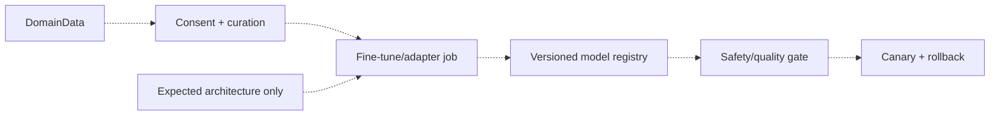

# Fine-tuning and vertical adaptation

> **Implementation status:** `deferred`
> **Status boundary:** No training, fine-tuning, adapter-weight, model-registry, or promotion pipeline exists; current skills, RAG, and prompts are runtime adaptation and must not be called fine-tuning.
> **Reviewed revision:** `6e3e13f`
> **Used by module:** [Module 09-evaluation-harness](../modules/09-evaluation-harness/README.md)
> **Catalog ID:** `fine-tuning-vertical-adaptation`

## Beginner explanation

Fine-tuning changes model weights using a curated dataset. Vertical adaptation specializes a system for a domain and may instead use retrieval, tools, rules, or prompts. RAG changes context, not weights. A safe pipeline needs data lineage, privacy review, evaluation, and rollback.

## Problem and mental model

Treat the boundary as a contract with explicit inputs, outputs, state, failure behavior, and evidence. The important question is not whether a similarly named class or file exists, but whether the behavior is wired into a real path and whether a test or observation proves it.

## Architecture and components



## Startup and request sequence

```mermaid
sequenceDiagram
    Owner->>Curate: approved versioned dataset
    Curate->>Train: train candidate
    Train->>Eval: immutable model version
    Eval-->>Owner: quality/safety/cost report
    Owner->>Deploy: explicit promotion
    Note over Owner,Deploy: Deferred; no current code
```

## Archon implementation and source walkthrough

This is an expected architecture, not a source walkthrough. No dataset consent pipeline, trainer, checkpoints, registry, offline/online gate, or deployment rollback. The diagram and sequence define the boundary a future design would need; they do not imply scheduled work.

### Source symbols

| Source symbol | Role and boundary |
|---|---|
| None | No Archon implementation is claimed for this concept. |

### Tests

| Test | Contract proved and limit |
|---|---|
| None | No implementation test is claimed; adjacent tests do not establish this concept. |

### Evidence boundary

There is no runtime evidence for this concept. Use the repository and current [implementation evidence](../../IMPLEMENTATION-EVIDENCE.md) to confirm the negative boundary; do not infer implementation from adjacent features.

## Try it: bounded study exercise

Code-reading exercise: search the repository for the missing components named in the gap. Confirm that adjacent features do not satisfy them. No service should be started and no data should be changed.

**Done criteria:** identify the trust boundary, one proved behavior, and one unproved behavior without changing repository state.

## Risks, failures, and trade-offs

| Topic | Assessment |
|---|---|
| Principal risk | Training data can leak PII/copyrighted content and specialization can regress general safety. |
| Current gap/failure | No dataset consent pipeline, trainer, checkpoints, registry, offline/online gate, or deployment rollback. |
| Trade-off | RAG is easier to update and cite; fine-tuning can improve behavior/format but is harder to govern. |
| Evidence hygiene | Do not log secrets or hidden chain-of-thought; record revision, environment, command, and only redacted outcomes. |

## Lab vs production

The status remains **deferred** at `6e3e13f`. No training, fine-tuning, adapter-weight, model-registry, or promotion pipeline exists; current skills, RAG, and prompts are runtime adaptation and must not be called fine-tuning. Unit tests, manifests, or local observations do not prove external-provider parity, sustained load, public deployment, legal compliance, or a production SLO.

## Interview answer

> Fine-tuning changes model weights using a curated dataset. Vertical adaptation specializes a system for a domain and may instead use retrieval, tools, rules, or prompts. RAG changes context, not weights. A safe pipeline needs data lineage, privacy review, evaluation, and rollback. In Archon the honest status is **deferred**: No training, fine-tuning, adapter-weight, model-registry, or promotion pipeline exists; current skills, RAG, and prompts are runtime adaptation and must not be called fine-tuning.

## Self-check

1. What problem does this concept solve, and what nearby concept is it not?
2. Trace the diagram’s trust boundary and failure path.
3. Which mapped symbol/test proves current behavior, or why are the lists empty?
4. What exact gap prevents a stronger status?
5. Which risk would you test first before production use?

<details>
<summary>Answer guide</summary>

A good answer names the contract in the beginner explanation, follows the sequence, cites the exact table entry (or the explicit absence), repeats the status boundary, and chooses a risk from the table rather than claiming unrecorded behavior.

</details>

## Related concepts and modules

- **Module:** [Module 09-evaluation-harness](../modules/09-evaluation-harness/README.md)
- **Course-day map:** [AIAMastery Days 1–30 coverage](../course-concept-coverage.md)
- **Evidence:** [Implementation Evidence](../../IMPLEMENTATION-EVIDENCE.md)
- **Historical context only:** [Feature and Course Audit v2](../../FEATURE-AND-COURSE-AUDIT-V2.md)
