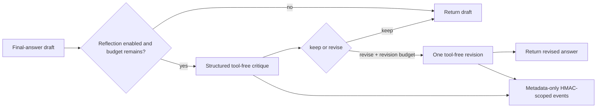
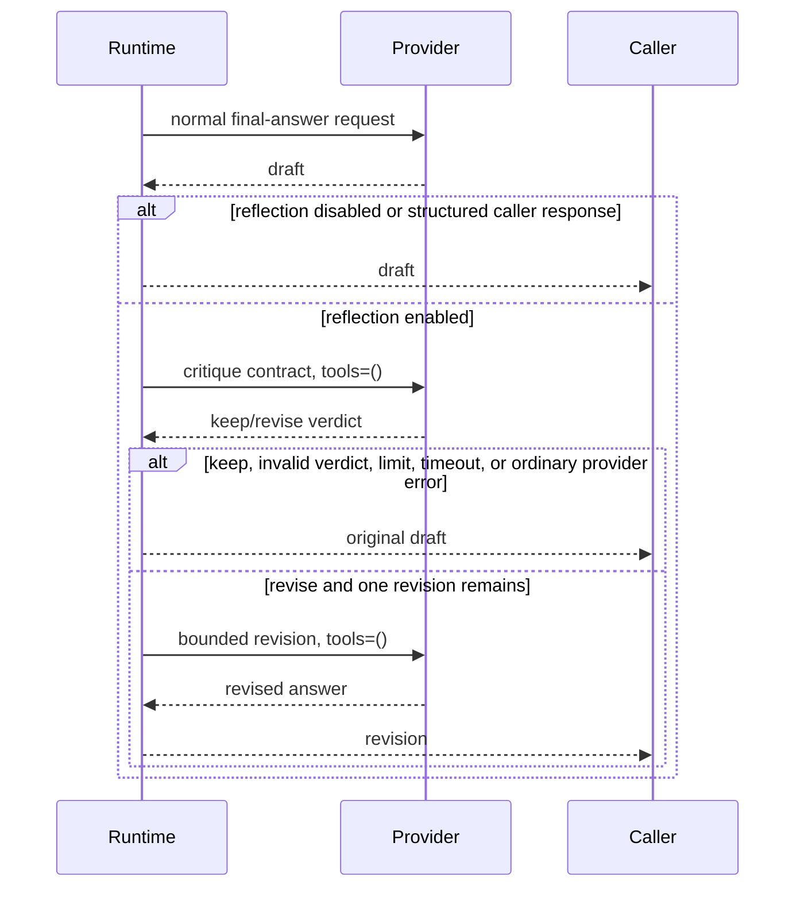

# Generic self-reflection

> **Implementation status:** `implemented`
> **Status boundary:** Archon can optionally critique a tool-free final-answer draft and perform at most one bounded revision. It does not expose chain-of-thought, create recursive agents, or maintain learned reflection memory.
> **Reviewed revision:** `eb5a448`
> **Used by module:** [Module 03-react-loop](../modules/03-react-loop/README.md)
> **Catalog ID:** `generic-self-reflection`

## Beginner explanation

Self-reflection is a second, deliberately bounded look at a proposed final answer. Archon first produces the normal draft. If reflection is enabled, a tool-free critic returns a small structured verdict: keep or revise, issue codes, validated `request:L#` / `draft:L#` evidence locations, and confidence. A revise verdict permits at most one tool-free revision.

This is different from ReAct tool-error feedback, verifier delegation, and post-run scoring.

## Architecture



The critic and revision use `tools=()`. Reflection inherits the run deadline/token budget and adds its own input, output, time, revision, and priced cost limits. Provider calls are still wrapped by durable monetary accounting when that feature is enabled.

## Runtime sequence



A hard deadline detaches cancellation-delaying providers and returns immediately. Unknown or zero usage is raised to deterministic conservative token estimates. A provider response that ignores `max_tokens` is rejected and its estimated usage remains accounted. Durable monetary failures preserve the draft while using the existing `BUDGET_BLOCKED` and monetary stop reasons.

## Code walkthrough

| Source symbol | Role and boundary |
|---|---|
| [`ReflectionPolicy`](../../../backend/app/reflection/models.py) | Opt-in policy, one-revision maximum, token/time/priced-cost limits and rubric version. |
| [`ReflectionVerdict`](../../../backend/app/reflection/models.py) | Closed structured verdict; evidence references are locations, not model text. |
| [`BoundedReflectionService`](../../../backend/app/reflection/service.py) | Tool-free critique/revision, hard timeout, conservative usage, fail-safe draft retention and metadata-only events. |
| [`AgentRuntime.run`](../../../backend/app/runtime/engine.py) | Invokes reflection only at the unstructured final-answer boundary and preserves normal run/budget semantics. |
| [`measure_reflection_benefit`](../../../backend/app/reflection/measurement.py) | Scores a versioned recorded synthetic fixture; does not execute a provider or prove generalization. |

Persisted reflection events include rubric/version, outcome, counts, bounded issue codes, validated location references, usage/cost, and owner/project/run-scoped HMAC fingerprints. Draft, critique, revision, prompts, and hidden reasoning are not persisted by the reflection event allowlist.

## Tests and evidence

| Test | Contract proved and limit |
|---|---|
| [`test_bounded_reflection.py`](../../../backend/tests/unit/test_bounded_reflection.py) | Disabled zero-call path, keep/revise, tool blocking, invalid verdict, hard deadline, conservative usage, HMAC privacy, budget propagation and monetary stop semantics against fakes/adversarial providers. |
| [`test_reflection_benefit.py`](../../../backend/tests/integration/test_reflection_benefit.py) | Version/hash validation and deterministic scorer delta for a recorded synthetic fixture only. |
| [`test_tool_error_feedback.py`](../../../backend/tests/unit/test_tool_error_feedback.py) | Narrow ReAct error feedback; explicitly not generic self-reflection. |

The current recorded fixture reports a positive exact-match delta because its answers are hand-authored scorer examples. Its report explicitly states `recorded_synthetic_fixture`, `runtime_executed=false`, and `generalizes=false`. It is parser/scorer evidence—not model-quality evidence.

## Try it

```bash
cd backend
pytest -q \
  tests/unit/test_bounded_reflection.py \
  tests/integration/test_reflection_benefit.py \
  tests/unit/test_tool_error_feedback.py
```

**Done criteria:** explain why disabled reflection makes zero extra calls; identify both tool-free calls; reproduce one hard limit; and distinguish synthetic scorer delta from live-provider benefit.

## Risks and trade-offs

| Risk | Control and remaining limit |
|---|---|
| Cost/latency amplification | Opt-in, one critique, at most one revision, hard deadline, token limits and priced local cost cap. Live provider latency is not yet measured. |
| Confident self-reinforcement | Closed verdict and evidence locations reduce persistence risk but do not make the same model independent. |
| Prompt/draft disclosure | Only scoped HMAC fingerprints and closed metadata persist. Provider processing still sees the draft by design. |
| Provider ignores limits/usage | Conservative estimates and oversized-output rejection fail safe, but consumed upstream capacity cannot be undone. |
| Recursive reflection | No recursive loop or reflection memory exists. |

## Lab versus production

Implemented and locally tested means the runtime wiring and hard boundaries exist. It does not prove that reflection improves answers for real providers, domains, or production traffic. No live-provider reflection benchmark, public deployment, production SLO, or learned reflection memory is claimed.

## Interview answer

> Archon implements optional final-answer reflection as a bounded runtime phase, not another autonomous agent. The critic and optional single revision have no tools, use a strict structured verdict, inherit the run budget, add hard time/token/priced-cost limits, and persist only HMAC-scoped metadata. Failures retain the draft; monetary failures preserve established stop semantics. We have deterministic adversarial tests and a clearly labeled synthetic scorer fixture, but no claim that reflection improves live-provider quality yet.

## Self-check

1. Why is tool-error feedback not generic reflection?
2. Which paths retain the original draft?
3. How does the timeout remain hard when provider cancellation cleanup stalls?
4. Why are `request:L#` and `draft:L#` safer than free-form evidence text?
5. What does the synthetic fixture prove, and what does it not prove?

## Related concepts

- [ReAct loop](react.md)
- [Evaluation harness](evaluation-harness.md)
- [Provider capability parity](provider-adapters-capability-parity.md)
- [Implementation Evidence](../../IMPLEMENTATION-EVIDENCE.md)
