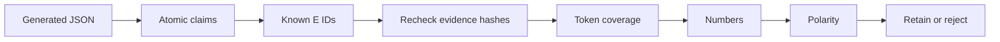
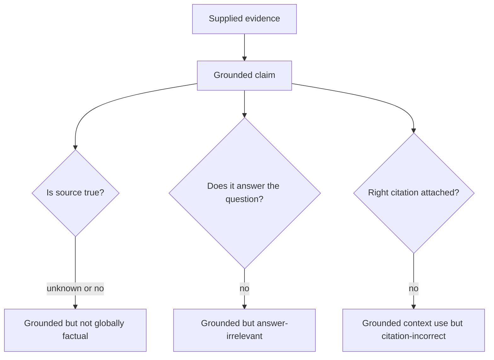

# Groundedness

**Status:** implemented with conservative deterministic checks

## Beginner definition

Groundedness asks whether factual claims in an answer are supported by the evidence supplied for that run.
It is relative to a context, not a declaration that the claims are universally true.
If a source falsely says a bridge opened in 2020, repeating that statement can be grounded in the source and still factually wrong.
Groundedness therefore needs explicit evidence scope and claim-level inspection.

## Vocabulary

- **Claim:** a factual assertion that can be checked independently.
- **Atomic claim:** a claim split small enough to evaluate without unrelated assertions.
- **Evidence:** retrieved source text available to the answering workflow.
- **Support:** the relationship in which evidence justifies a claim.
- **Unsupported claim:** a claim not justified by its cited evidence.
- **Polarity:** whether a statement is affirmative or negated.
- **Numeric containment:** requiring claim numbers to appear in cited evidence.
- **Entailment:** the stronger semantic relation that evidence logically supports a claim.
- **Abstention:** returning no factual answer when no claim passes verification.

## Mental model

Groundedness is an open-book auditor asking, “Show me where this line comes from in the supplied pages.”
The auditor checks each line, not the confidence of the writer.
The audit concerns those pages only.
It does not certify that the pages are authoritative, current, or useful for the original question.

## Archon implementation

`backend/app/services/grounded_rag.py::GroundedDocumentWorkflow` owns the grounded answer path.
`_prompt` requests one factual claim per item and one or more listed evidence IDs.
`_parse_claims` bounds output to 65,536 characters, twenty claims, and eight citations per claim.
`_verify_document_claims` immediately rechecks each evidence content hash.
Evidence with a changed verification text is removed before support evaluation.
`_supports_claim` rejects missing citations and unknown IDs.
It normalizes case and common English negative contractions.
`_substantive_tokens` removes stop words and negation words from token coverage.
The minimum substantive-token overlap is `_MIN_SUBSTANTIVE_OVERLAP = 0.9`.
Tokens from all cited evidence for a claim are combined for coverage.
Every numeric literal in the claim must occur in cited evidence.
Relevant evidence excerpts must have exactly the same polarity set as the claim.
An excerpt contributes polarity only when it overlaps at least half of claim tokens.
A claim with no substantive tokens is rejected.
Only supported claims enter the final answer.
If no claim survives, `_NO_EVIDENCE_ANSWER` is returned.
`GroundedResult.grounded` is `bool(claims)`, meaning at least one retained claim.
This boolean does not mean every possible interpretation is semantically proven.

## Why the rule is conservative

The 90% set-overlap rule strongly favors near-extractive claims.
Numeric containment catches a common overclaim such as changing 20 to 200.
Polarity matching catches some “supports” versus “does not support” reversals.
The rule can reject valid paraphrases because synonyms do not share tokens.
It can accept incoherent or semantically altered text that preserves enough words.
It does not reason about temporal qualifiers, attribution, causality, units, or multi-hop logic reliably.
It is explicitly not natural-language inference.
Deterministic verification is repeatable regression evidence, not semantic truth.

## Five separate quality questions

**Retrieval relevance:** are the selected chunks useful for the question?
**Groundedness:** are answer claims supported by supplied evidence?
**Faithfulness:** does the answer remain within the meaning of its context?
**Citation correctness:** does each explicit marker identify evidence that supports its claim?
**Answer relevance:** does the answer address the user's request?
Groundedness is close to faithfulness but should still be reported with its evaluator definition.
The workflow operationalizes groundedness through cited claim filtering.
The legacy evaluator named faithfulness uses a different and weaker threshold.
Neither is a source-truth checker.

## Security and failure modes

Retrieved content is untrusted and can contain instructions aimed at the model.
The prompt must frame it as evidence, never as authority to call tools or alter policy.
Owner/project/document scope must be applied before evidence receives an ID.
Hash checks detect changed evidence snapshots before verification.
Unknown, missing, malformed, or excessive citations fail closed.
Bounded output parsing limits model-generated memory and processing abuse.
A lexical attacker may copy many source words while changing the relationship between them.
A poisoned authoritative-looking document can yield grounded but harmful misinformation.
The optional child verifier fails closed: on verifier errors, no delegated claim passes.

## Observability

Record evidence, supported, unsupported, and retained citation counts.
Track abstention rate and break it down by retrieval-no-result versus verification rejection.
Track numeric, polarity, unknown-ID, and hash-integrity failures if safe reason codes are added.
The ledger records claim and answer hashes rather than raw text.
`claim_verified` includes claim hashes, unsupported hashes, cited IDs, and counts.
`grounded_answer` includes answer hash, citation IDs, and counts.
`run_stopped` records terminal reason and error state.
Monitor false acceptance and false rejection against human-labeled claims.
Never infer semantic quality from a stable deterministic pass rate alone.

## Alternatives and trade-offs

Exact quotation is highly auditable but too restrictive for useful synthesis.
Natural-language inference models can assess paraphrases but add calibration and model risk.
LLM judges handle nuanced support but are nondeterministic and prompt-sensitive.
Human review is strongest for high-risk samples but expensive and slow.
Structured fact extraction can compare entities, relations, units, and dates more explicitly.
Multiple independent checks can improve coverage but do not automatically produce truth.
Source authority and freshness scoring address different risks than groundedness.

## Lab versus production

The deterministic verifier is valuable in a lab because failures are reproducible and explainable.
The unit tests cover numbers, negation, partial support, tampering, abstention, and scope.
The final benchmark uses mock embeddings/provider and does not prove live semantic support quality.
Production requires representative claim/evidence labels and calibrated acceptance thresholds.
Review false positives and false negatives across languages and domains.
Use real provider output, adversarial paraphrases, conflicting sources, and stale sources.
Keep deterministic checks as defense-in-depth even if a semantic verifier is added.

## Evidence in this repository

- `backend/app/services/grounded_rag.py::GroundedDocumentWorkflow.run`
- `backend/app/services/grounded_rag.py::_verify_document_claims`
- `backend/app/services/grounded_rag.py::_supports_claim`
- `backend/app/services/grounded_rag.py::_normalize_support_text`
- `backend/app/services/grounded_rag.py::_substantive_tokens`
- `backend/app/services/grounded_rag.py::_numeric_literals`
- `backend/app/services/grounded_rag.py::_negated`
- `backend/tests/unit/test_grounded_rag.py::test_supported_claim_is_answered_with_verified_citation`
- `backend/tests/unit/test_grounded_rag.py::test_claim_support_is_conservative_about_negation_numbers_and_partial_claims`
- `backend/tests/unit/test_grounded_rag.py::test_tampered_persisted_evidence_is_skipped_before_provider_call`
- `backend/tests/unit/test_grounded_rag.py::test_empty_model_output_is_safe_and_bounded`
- `backend/tests/unit/test_grounded_rag.py::test_enabled_verifier_filters_and_records_child_lineage`
- `docs/evidence/local-portfolio-benchmark.json` is deterministic mock evidence only.

## Exercise

Use evidence saying, “The service supports 20 concurrent jobs and does not retain payload text.”
Write claims that preserve it, change 20 to 200, remove the negation, paraphrase “concurrent,” and add an unsupported location.
Predict `_supports_claim` outcomes before running tests.
Compare those outcomes with a human semantic judgment.
Classify each disagreement as a false acceptance or false rejection.
Finally ask an unrelated question and show that a supported claim can still fail answer relevance.

## 30-second interview answer

“Groundedness is claim support relative to supplied evidence, not global truth. Archon's grounded workflow parses atomic claims, requires known citations, rechecks content hashes, and conservatively checks 90% substantive-token coverage, numbers, and polarity before reconstructing an answer. It abstains if nothing survives. Those deterministic checks are auditable regression controls, not semantic entailment, so production needs labeled semantic evaluation too.”

## Self-checks

1. **Can a grounded answer be false in the world?** Yes; its supplied source may be false.
2. **What overlap threshold does `_supports_claim` use?** At least 90% of substantive claim tokens.
3. **How are numbers handled?** Every numeric literal in the claim must occur in cited evidence.
4. **What happens when all claims fail?** The workflow returns the standard abstention.
5. **Does `grounded=True` prove every nuance?** No; it means at least one claim survived the implemented checks.
6. **Why recheck hashes?** To ensure verification uses the same unmodified evidence snapshot.
7. **Is deterministic verification semantic truth?** No; it can both reject valid paraphrases and accept lexical impostors.
8. **How does answer relevance differ?** It asks whether the response addresses the question, not whether evidence supports it.
