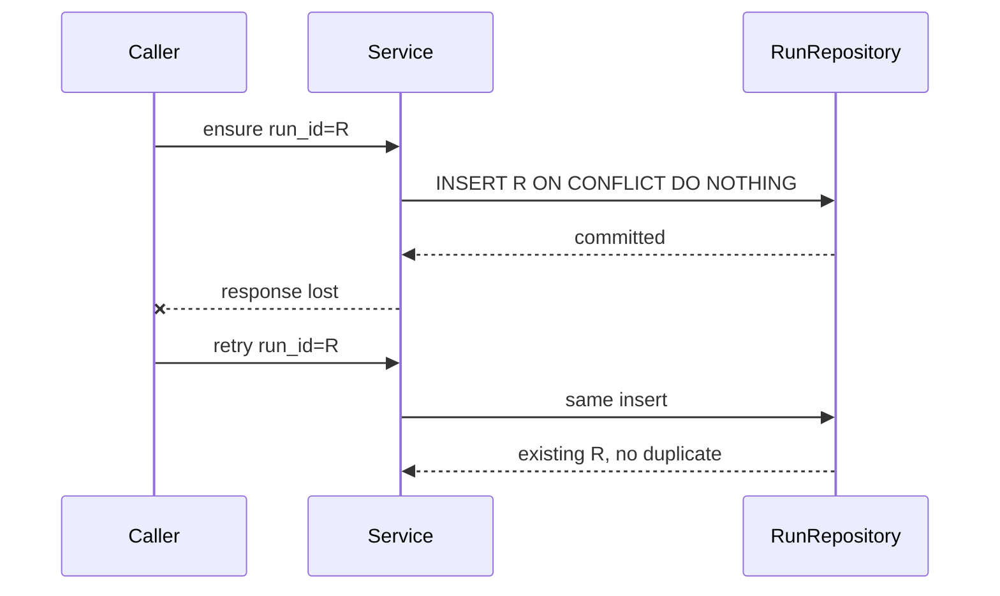
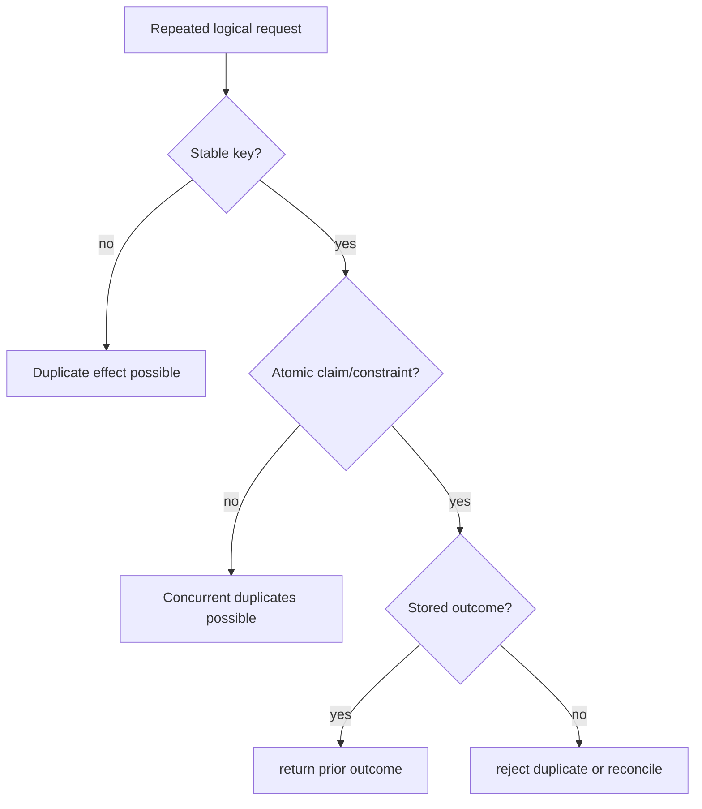

# Idempotency

**Status:** partial, implemented at selected persistence and runtime boundaries—not a universal request guarantee.

## Beginner explanation

An operation is idempotent when repeating the same logical request does not create extra effects after the first successful application.
“Set status to approved” can be idempotent; “send another email” usually is not unless the receiver recognizes a stable operation key.
Retries are safe only when every effect they may repeat has a duplicate-detection or reconciliation rule.

## Prerequisites and vocabulary

- **Logical operation:** user intent that may be attempted more than once.
- **Idempotency key:** stable identity shared by retries of that operation.
- **Atomic uniqueness:** database constraint or conditional write that chooses one winner.
- **At-most-once:** duplicates are prevented, possibly losing work.
- **At-least-once:** retries avoid loss, possibly duplicating work.
- **Exactly-once effect:** externally observable effect occurs once; difficult across system boundaries.
- **Linearizable transition:** concurrent observers can explain the outcome as one ordered change.

## Problem and mental model

A client can time out after the server committed but before receiving the response. The retry is ambiguous: did the first attempt fail, or did only its acknowledgement fail?
Place stable identity and atomic deduplication *at the effect*, not merely at the HTTP endpoint.





## Archon: what is actually implemented

- [`RunRepository.ensure_run`](../../../backend/app/services/run_ledger.py) uses `run_id` and dialect-specific `ON CONFLICT DO NOTHING` for PostgreSQL/SQLite.
- [`RunRepository.ensure_child_run`](../../../backend/app/services/run_ledger.py) accepts a repeated matching child identity but rejects changed owner/project/parent lineage.
- [`RunRepository.append`](../../../backend/app/services/run_ledger.py) atomically allocates event sequence only while the run is active; terminal finalization is guarded by running status and null completion.
- [`RunRepository.fork`](../../../backend/app/services/run_ledger.py) derives checkpoint identity with UUID5 from owner, source run, and sequence and uses a uniqueness conflict guard.
- [`ApprovalRepository.decide_exact_for_owner`](../../../backend/app/security/approval_repository.py) allows only one live pending-to-terminal transition; later decisions return false.
- [`AgentRuntime.run`](../../../backend/app/runtime/engine.py) tracks `seen_calls` and blocks duplicate semantic tool calls within one run.

That last runtime guard is only in-memory and run-local. Archon has no universal HTTP idempotency-key ledger and cannot claim arbitrary tools are idempotent.
A repeated terminal append is rejected with `ValueError("run is not running")`; state is protected, but the API does not silently replay the first success response.

## Behavior-focused tests—and their limits

- [`test_finalize_is_idempotent_and_cannot_overwrite_terminal_run`](../../../backend/tests/unit/test_run_ledger.py) proves repeated finalization cannot change terminal metadata. It does not prove the retry receives the original response.
- [`test_concurrent_child_ensures_are_idempotent_and_parent_delete_is_restricted`](../../../backend/tests/unit/test_run_lineage.py) proves matching concurrent child creation converges. It does not cover cross-region replication.
- [`test_duplicate_tool_calls_execute_only_once`](../../../backend/tests/unit/test_runtime_budget_regressions.py) proves one runtime blocks repeated name/argument calls. It does not survive restart or cover two runs.
- [`test_concurrent_decisions_have_exactly_one_winner`](../../../backend/tests/unit/test_approval_repository.py) proves an approval transition has one winner. It does not make the later external tool call exactly once.

## Bounded executable exercise

Timebox: 12 minutes. Run:

```bash
cd backend
pytest -q \
  tests/unit/test_run_ledger.py::test_finalize_is_idempotent_and_cannot_overwrite_terminal_run \
  tests/unit/test_runtime_budget_regressions.py::test_duplicate_tool_calls_execute_only_once
```

For each test, name the stable identity, atomic guard, duplicate behavior, and boundary beyond which the guarantee stops.

## Security and failure modes

- User-chosen keys need owner scoping; otherwise one tenant may suppress or retrieve another's operation.
- A key without an immutable request digest can be reused for different payloads; reject key/payload mismatch.
- Check-then-insert without a uniqueness constraint races under concurrency.
- Expiring keys too early allows delayed retries to duplicate effects; retaining forever creates storage pressure.
- A database commit followed by an unkeyed network call still permits duplicates.
- Runtime call deduplication can also suppress a deliberately repeated read; semantic identity must match product intent.

## Observability and evidence

Record operation key, owner, request digest, first-seen time, result status, duplicate count, and downstream idempotency key—without sensitive payloads.
Metrics should separate first attempts, accepted retries, payload conflicts, and unknown outcomes.
A database uniqueness violation is useful evidence of deduplication pressure; it is not itself evidence that no downstream effect duplicated.
Reconciliation compares the local ledger with the external system's operation records after ambiguous failures.

## Alternatives and tradeoffs

An inbox table deduplicates received commands; an outbox table atomically records effects to publish later.
Provider-supplied idempotency keys are strongest when the external service enforces them.
Distributed locks serialize contenders but can expire or partition; durable uniqueness is usually easier to audit.
Returning a stored prior result improves retry ergonomics but requires result retention and authorization.

## Lab versus production

A lab can demonstrate conflict-safe inserts with SQLite and concurrent coroutines.
Production needs documented key scope, payload binding, retention windows, durable constraints, downstream support, crash recovery, and reconciliation playbooks.
Archon's partial guarantees must not be advertised as end-to-end exactly once.

## 30-second interview answer

“Idempotency starts with stable logical identity and an atomic guard at each effect. Archon partially implements it: conflict-safe run creation, immutable child lineage, guarded terminal updates, deterministic fork checkpoints, one-shot approvals, and run-local duplicate tool-call blocking. It does not have a universal request-key ledger and cannot make arbitrary external tools exactly once. Safe retries require owner-scoped keys, payload binding, downstream idempotency, and reconciliation.”

## Self-check questions

1. **Why are timeouts ambiguous?** The effect may commit even when its response is lost.
2. **What makes `ensure_run` converge?** Stable `run_id` plus atomic conflict handling.
3. **Is duplicate-call blocking durable?** No; `seen_calls` exists only in one runtime invocation.
4. **Why bind key to payload?** To prevent one key authorizing or suppressing different operations.
5. **Does one approval winner imply one tool effect?** No; execution can still crash or retry separately.
6. **What is Archon's honest status?** Partial idempotency at selected boundaries.

## Related modules and concepts

- Modules: [Run ledger](../modules/07-run-ledger/README.md) and [Resilience](../modules/10-resilience/README.md).
- Concepts: [retries, timeouts, and cancellation](retries-timeouts-cancellation.md), [durable approvals](durable-approvals.md), [run ledger](run-ledger.md), and [checkpoints](checkpoints.md).
