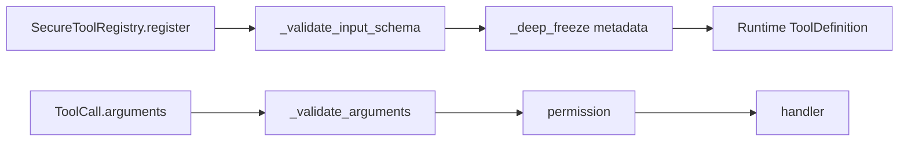
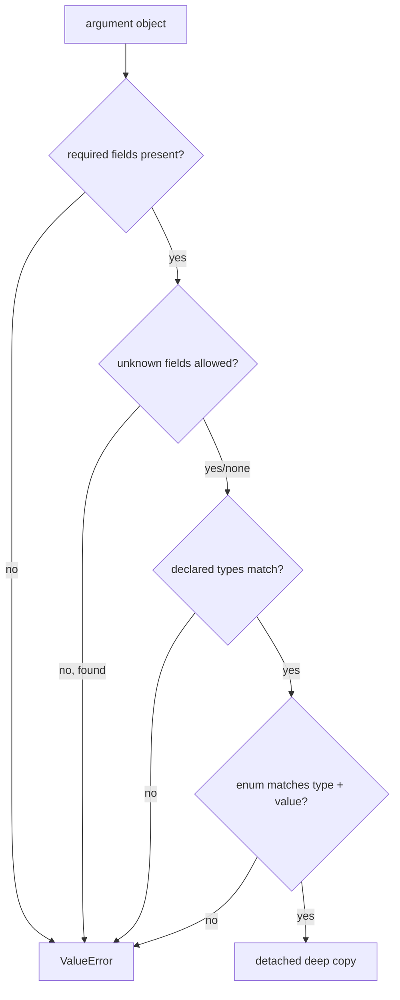

# JSON Schema for Archon tools

> **Implementation status:** `implemented` for the documented tool-input subset

## Beginner explanation

JSON Schema is a vocabulary for describing the shape of JSON data.
Archon uses a deliberately small, custom-validated subset to reject malformed tool arguments before permissions or handler code run.
It is an intentionally bounded contract—not a claim of compliance with the full JSON Schema specification.

## Prerequisites and vocabulary

- **JSON object:** string-keyed mapping used for tool arguments.
- **Property:** named field declaration.
- **Required:** field that must be present; it says nothing about semantic usefulness.
- **Type:** basic expected value category.
- **Enum:** finite set of accepted values.
- **Additional properties:** fields not named by the contract.
- **Registration-time validation:** checking trusted tool metadata once.
- **Call-time validation:** checking provider-supplied arguments on every execution.

## Problem and mental model

A schema is a syntactic gate between probabilistic output and deterministic code.
Think of it as an airport document check: it rejects the wrong shape, but it does not establish permission, benign intent, or safe destination.





## Supported Archon subset

A typical contract is:

```json
{
  "type": "object",
  "properties": {"city": {"type": "string"}},
  "required": ["city"],
  "additionalProperties": false
}
```

[`_validate_input_schema`](../../../backend/app/tools/registry.py) accepts a mapping with root `type` omitted or equal to `object`.
`required` must be a list/tuple of unique strings; when `properties` is non-empty, required names must be declared.
`properties` must map string names to declarations with one of `string`, `integer`, `number`, `boolean`, `object`, or `array`.
`enum` must be non-empty and each option must match its declared type.
[`_value_matches_type`](../../../backend/app/tools/registry.py) deliberately rejects booleans as integers; numbers must be finite, and arrays may arrive as list or tuple.
[`SecureToolRegistry._validate_arguments`](../../../backend/app/tools/registry.py) checks required, unknown fields, top-level property type, and enum using type-sensitive equality.
Unknown fields fail unless `additionalProperties` is exactly `true`.
[`_deep_freeze`](../../../backend/app/tools/registry.py) recursively snapshots trusted metadata; validated call arguments are returned as a detached deep copy.

## Explicit non-support

Archon does not claim recursive validation of nested object properties or array items.
It does not implement `$ref`, `$defs`, `oneOf`, `allOf`, `anyOf`, `not`, formats, regex patterns, lengths, numeric ranges, or the complete standard's meta-schema behavior.
A declaration containing an ignored keyword should not be treated as an enforced security rule.

## Behavior-focused tests—and their limits

- [`test_tools.py`](../../../backend/tests/unit/test_tools.py) covers registration rejection, required/unknown fields, supported types, enum matching, and metadata snapshots. It does not certify full JSON Schema conformance.
- [`test_policy_rejects_non_json_arguments_before_execution`](../../../backend/tests/unit/test_runtime_policy.py) proves policy mode rejects selected non-JSON provider values. It does not recursively validate business meaning.
- [`test_metadata_error_fails_closed_without_leaking_exception`](../../../backend/tests/unit/test_runtime_policy.py) proves malformed policy metadata blocks execution with sanitized evidence. It does not prove every handler is injection-safe.

## Bounded executable/read exercise

Timebox: 15 minutes. Read `_validate_input_schema`, `_value_matches_type`, and `_validate_arguments`, then run:

```bash
cd backend
pytest -q tests/unit/test_tools.py
```

Bound the task to that file. Build a two-column list: “enforced here” versus “must be enforced by handler/policy.”

## Security and failure modes

- Schema-valid strings can still contain shell fragments, traversal attempts, or unsafe URLs.
- Permitting `additionalProperties` broadens the model-controlled surface and may expose future handler parameters.
- Nested objects receive only a top-level `Mapping` check; handlers must validate nested semantics.
- `number` excludes NaN and infinity, avoiding non-portable JSON and hash behavior.
- Error messages avoid echoing caller-controlled unknown names/values, reducing accidental secret leakage.
- Mutable registration metadata could change authorization assumptions; recursive freezing prevents ordinary mutation.

## Observability and evidence

Track validation failure category and tool name, not raw argument values.
Useful evidence is schema version/hash, registration success, rejected stage, and whether handler invocation count stayed zero.
A provider accepting the advertised schema is not proof that it will always follow it; call-time validation remains mandatory.
Schema failures should be distinguishable from permission, policy, timeout, and handler failures.

## Alternatives and tradeoffs

A standards-compliant JSON Schema library offers more keywords and interoperability but adds dependency/version complexity.
Pydantic models provide rich Python validation and typed outputs but need translation to provider tool schemas.
Handwritten validators fit domain semantics but can drift from advertised definitions.
Archon's compact subset is auditable and sufficient for simple tools, but nested contracts should not pretend to be enforced.

## Lab versus production

A lab schema with one required string demonstrates the boundary.
Production contracts need versioning, compatibility policy, size/depth limits, domain validation, fuzz/adversarial tests, and provider-specific schema translation checks.
Treat unsupported keywords as design errors rather than documentation decoration.

## 30-second interview answer

“Archon advertises and enforces a compact JSON Schema subset for tool arguments: object roots, required fields, properties, a Boolean additional-properties policy, six basic property types, and type-sensitive enums. Registration validates and freezes metadata; each call is validated and deep-copied before permissions or execution. Nested schemas, `$ref`, composition, formats, and ranges are not claimed. Schema checks shape—not authorization, sanitization, containment, or business semantics.”

## Self-check questions

1. **Is Archon a full JSON Schema validator?** No; it implements and tests an intentionally bounded fail-closed subset for tool arguments.
2. **Are booleans valid integers?** No, despite Python's `bool` subclassing `int`.
3. **What is the default unknown-field behavior?** Fail closed unless `additionalProperties` is true.
4. **Are nested object properties recursively checked?** No.
5. **When are schemas checked?** Metadata at registration and arguments on every call.
6. **Does a valid schema authorize execution?** No; policy, permissions, and containment are separate.

## Related modules and concepts

- Module: [Tools and schemas](../modules/04-tools-and-schemas/README.md).
- Concepts: [tool contracts](tool-contracts.md), [typed runtime](typed-runtime.md), [policy engine](policy-engine.md), and [MCP](mcp.md).
