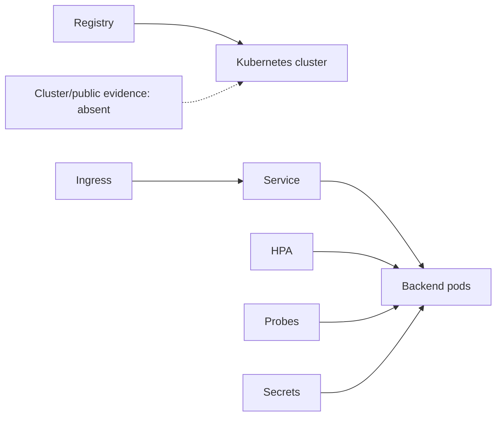

# Kubernetes and public deployment

> **Implementation status:** `deferred` for public/cloud/Kubernetes operation
> **Status boundary:** Historical Kubernetes and Helm artifacts describe possible resources, but no cluster validation or public deployment evidence exists; operation on that target is deliberately outside this capstone.
> **Reviewed boundary:** S8.10 documentation candidate based at `440f08e`; no final gate claimed
> **Used by module:** [Module 14-local-operations](../modules/14-local-operations/README.md)
> **Catalog ID:** `kubernetes-public-deployment`

## Beginner explanation

Kubernetes declares how containers run, scale, receive traffic, and recover. A public deployment also needs real image provenance, TLS/DNS, secret management, migrations, monitoring, and observed rollout behavior. A YAML manifest in Git is an artifact, not evidence that a cluster works.

## Problem and mental model

Treat the boundary as a contract with explicit inputs, outputs, state, failure behavior, and evidence. The important question is not whether a similarly named class or file exists, but whether the behavior is wired into a real path and whether a test or observation proves it.

## Architecture and components



## Startup and request sequence

```mermaid
sequenceDiagram
    CI->>Registry: publish immutable image
    CD->>Cluster: apply/upgrade manifests
    Cluster->>Pods: rollout + readiness probes
    Ingress->>Pods: public TLS traffic
    Cluster-->>CD: health/rollback evidence
    Note over CI,CD: Expected; not observed in this repository
```

## Archon implementation and source walkthrough

The mapped files are historical design artifacts, not an implemented deployment target. No schema/render test, cluster smoke, TLS/DNS, external secret manager, immutable production image, migration job, or public URL evidence exists.

### Source symbols

| Source symbol | Role and boundary |
|---|---|
| [`deploy/k8s/archon.yaml:Kubernetes resources`](../../../deploy/k8s/archon.yaml) | Contains a deployment, service, ingress, HPA, PDB, config, and placeholder secret. |
| [`deploy/helm/archon/Chart.yaml:Helm chart`](../../../deploy/helm/archon/Chart.yaml) | Packages a deployment/service configuration. |

### Tests

| Test | Contract proved and limit |
|---|---|
| None | No implementation test is claimed; adjacent tests do not establish this concept. |

### Evidence boundary

Current implementation dimensions are centralized in [Implementation Evidence](../../IMPLEMENTATION-EVIDENCE.md). Source/tests below are repository evidence; they are not public-deployment or production-certification evidence.

## Try it: bounded study exercise

From the repository root, inspect the mapped source and test, then run the named focused test with the project test environment if available. Confirm both the passing contract and this gap: No schema/render test, cluster smoke, TLS/DNS, external secret manager, immutable production image, migration job, or public URL evidence.

**Done criteria:** identify the trust boundary, one proved behavior, and one unproved behavior without changing repository state.

## Risks, failures, and trade-offs

| Topic | Assessment |
|---|---|
| Principal risk | Placeholder secrets and mutable images are unsafe; replicas can race migrations or rely on non-shared local state. |
| Current gap/failure | No schema/render test, cluster smoke, TLS/DNS, external secret manager, immutable production image, migration job, or public URL evidence. |
| Trade-off | Kubernetes supports scaling and rollout controls but is unnecessary complexity for the verified local portfolio target. |
| Evidence hygiene | Do not log secrets or hidden chain-of-thought; record revision, environment, command, and only redacted outcomes. |

## Lab vs production

Public/cloud/Kubernetes operation remains **deferred**. The manifests do not prove that a cluster rendered, rolled out, served TLS traffic, protected secrets, migrated data, met an SLO, or rolled back. Unit tests, manifests, or local observations do not prove public deployment, legal compliance, or production operation.

## Interview answer

> Kubernetes declares how containers run, scale, receive traffic, and recover. A public deployment also needs real image provenance, TLS/DNS, secret management, migrations, monitoring, and observed rollout behavior. A YAML manifest in Git is an artifact, not evidence that a cluster works. In Archon public/cloud/Kubernetes operation is deliberately deferred; the sole observed deployment target remains local Compose.

## Self-check

1. What problem does this concept solve, and what nearby concept is it not?
2. Trace the diagram’s trust boundary and failure path.
3. Which mapped symbol/test proves current behavior, or why are the lists empty?
4. What exact gap prevents a stronger status?
5. Which risk would you test first before production use?

<details>
<summary>Answer guide</summary>

A good answer names the contract in the beginner explanation, follows the sequence, cites the exact table entry (or the explicit absence), repeats the status boundary, and chooses a risk from the table rather than claiming unrecorded behavior.

</details>

## Related concepts and modules

- **Module:** [Module 14-local-operations](../modules/14-local-operations/README.md)
- **Course-day map:** [AIAMastery Days 1–30 coverage](../course-concept-coverage.md)
- **Evidence:** [Implementation Evidence](../../IMPLEMENTATION-EVIDENCE.md)
- **Deferred decision:** [Required architecture, evidence threshold, and capstone rationale](../../REMAINING-DEFERRED-GAPS.md#4-public-cloud-or-kubernetes-deployment)
- **Historical context only:** [Feature and Course Audit v2](../../FEATURE-AND-COURSE-AUDIT-V2.md)
