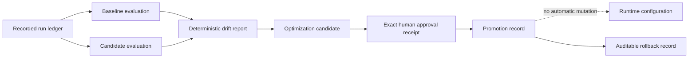
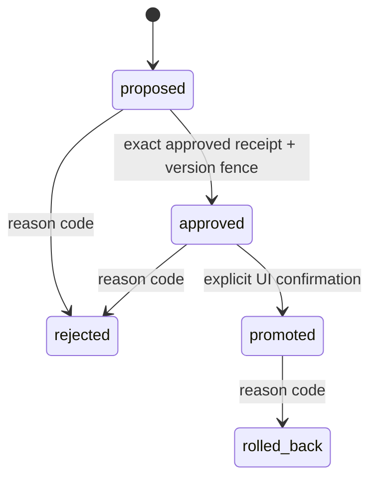
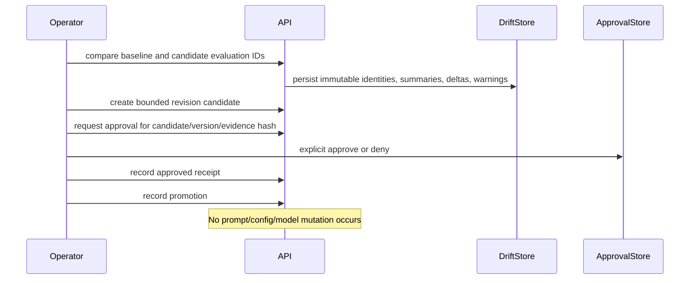

# Learning recommendations and drift governance

> **Implementation status:** `implemented` for the verified local target
> **Status boundary:** Archon compares immutable evaluation cohorts and records human-reviewed revision recommendations. It does not retrain models, rewrite prompts, or mutate runtime/production configuration automatically.
> **Used by module:** [Module 09-evaluation-harness](../modules/09-evaluation-harness/README.md)
> **Catalog ID:** `learning-optimization-drift`
> **Deferred boundary:** [Autonomous unapproved production optimization](../../REMAINING-DEFERRED-GAPS.md#6-autonomous-unapproved-production-optimization) is a separate, intentionally omitted capability.

## Beginner explanation

A trustworthy learning loop separates three things:

1. **Measurement:** compare two versioned evaluation cohorts.
2. **Recommendation:** describe a bounded prompt, policy, retrieval, or configuration revision.
3. **Decision:** require a human-bound approval before recording promotion.

Archon implements those records and gates. “Promoted” means the recommendation was approved and recorded; it does **not** mean runtime configuration changed.

## Architecture

## Request and state sequence

## Implemented contracts

### Versioned cohort identity

Each new evaluation stores:

- dataset ID, version, and content hash;
- model and provider derived from the completed source-run ledger;
- an internal evaluator configuration revision.

The public API cannot override model/provider/config revision. Migration 14 deterministically backfills historical evaluations with hashed legacy source-run identity and an explicit legacy config marker.

### Deterministic drift

`app.eval.drift` records descriptive summaries for:

- pass rate and score distribution;
- latency, tokens, and cost;
- abstention and citation coverage;
- unsupported claims and safety failures.

Warnings use fixed thresholds and a minimum sample gate. They are operational warning rules—not p-values and not statistical-significance claims. Repeating an identical comparison returns the same durable report.

### Reviewed candidate lifecycle

Candidates are limited to `prompt`, `policy`, `retrieval`, or `config`. Metadata uses a closed per-type allowlist and bounded scalar/list values. Summaries, rollback plans, targets, and metadata reject detected PII or credentials.

Approval binds:

- owner and project;
- candidate ID and exact candidate version;
- target revision;
- baseline and candidate evaluation IDs;
- the `optimization_candidate_promotion` purpose.

Optimistic updates and database constraints prevent replay and stale transitions. Composite foreign keys prevent cross-owner/project evidence links. Database triggers preserve cohort/report/event append-only semantics and candidate evidence immutability.

## Source walkthrough

| Source | Responsibility |
|---|---|
| `backend/app/eval/drift.py` | Deterministic summaries, thresholds, report persistence |
| `backend/app/eval/candidates.py` | Candidate schemas, approval binding, fenced state machine |
| `backend/app/eval/persistence.py` | Immutable evaluation and runtime revision identity |
| `backend/alembic/versions/20260828_14_drift_and_candidates.py` | Backfill, scoped FKs, constraints, append-only guards |
| `backend/app/routes/evaluations.py` | Authenticated, rate-limited, project-scoped APIs |
| `frontend/src/lib/components/DriftOptimizationPanel.svelte` | Trends, reports, explicit review/promotion/rollback UI |

## Tests and evidence

| Test | Contract |
|---|---|
| `tests/unit/test_drift_detection.py` | Stable metric summaries, minimum sample, deterministic warnings |
| `tests/integration/test_optimization_candidates.py` | Scope, metadata rejection, approval binding, replay, promotion, rollback |
| `tests/integration/test_drift_candidate_migration.py` | Backfill, migration roundtrip, composite FKs, append-only/state triggers |
| `frontend/src/lib/evaluations.test.ts` | Project-scoped API payloads and exact version snapshots |
| `frontend/src/lib/components/DriftOptimizationPanel.test.ts` | Human decision precedes approval state transition |

## Failure boundaries

- Small cohorts produce `insufficient_sample`; deltas remain descriptive.
- Unknown/unversioned cohort identity is rejected.
- Stale candidate versions return conflict rather than overwriting a newer decision.
- A pending receipt is not approval; the human decision endpoint must approve it first.
- Promotion records intent and evidence only. Deployment remains a separate operational act.

This omission strengthens the implemented governance story: measurements may propose bounded revisions, but they never confer production authority. Autonomous status could change only after representative shadow/canary evidence, hard action and budget limits, metric-gaming tests, automatic rollback and kill-switch drills, complete audit lineage, and explicit authorization for unattended changes.

## Interview answer

> Archon implements a governed learning loop, not autonomous self-modification. It compares immutable, versioned evaluation cohorts with deterministic thresholds, creates bounded metadata-only recommendations, and requires an exact owner/project/version-bound human approval. A promoted candidate records the intended revision and before/after evidence, but deliberately does not change production or train a model.

## Self-check

1. Why is `insufficient_sample` different from “no drift”?
2. Which fields bind an approval to one candidate version?
3. Why does promotion not update runtime configuration?
4. How do composite foreign keys prevent evidence-scope forgery?
5. Which records are append-only, and why?
