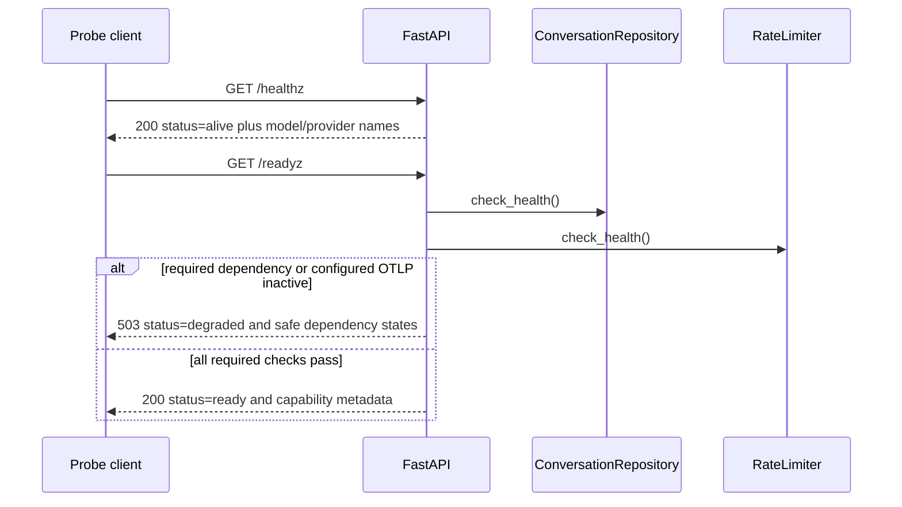

# Liveness and readiness

> **Documentation status:** Draft
> **Concept status:** `implemented`
> **Status boundary:** `/healthz` reports process liveness; `/readyz` checks required local dependencies and configured telemetry, but neither proves an availability SLA or every provider workflow.
> **Used by:** [Module 14](../modules/14-local-operations/README.md)

## Beginner explanation

A running process is not always able to serve useful traffic.
Liveness asks a narrow question: “is this process alive enough that restarting it is not immediately justified?”
Readiness asks a different question: “should this instance receive traffic right now?”
A database outage should normally make an instance unready, not dead.
If liveness also depended on the database, an orchestrator might restart every healthy application process while the shared database remains down.
That restart loop adds load and hides the real cause.
Archon therefore keeps `/healthz` shallow and makes `/readyz` dependency-aware.
Neither endpoint is an authenticated agent job, a historical uptime record, or an end-to-end user transaction.

## Vocabulary

| Term | Plain-English meaning |
|---|---|
| liveness probe | current signal used to decide whether a process may need restart |
| readiness probe | current signal used to decide whether traffic should be sent |
| dependency | service or component required by the configured mode |
| degraded | alive but not eligible to receive normal traffic |
| capability metadata | safe description of enabled or disabled behavior |
| synthetic transaction | active end-to-end user-like test; not provided by these probes |

A `200` response is a point-in-time result.
It is not a promise about the next request.
A probe must be cheap, bounded, and free of sensitive values.
Readiness should fail closed when a configured required dependency cannot serve.
Disabled optional capability is different from configured-but-broken capability.

## Architecture

```mermaid
flowchart LR
    O[orchestrator or operator] --> H[/healthz]
    O --> R[/readyz]
    H --> P[FastAPI process state]
    R --> DB[conversation repository check_health]
    R --> RL[rate limiter check_health]
    R --> OT[OTLP exporter active state]
    R --> CAP[safe capability metadata]
    DB --> D{all required checks up?}
    RL --> D
    OT --> D
    D -->|yes| OK[200 ready]
    D -->|no| BAD[503 degraded]
```

[`create_app`](../../../backend/app/main.py) registers both routes.
[`lifespan`](../../../backend/app/main.py) validates configuration and constructs application-scoped dependencies before serving.
The route boundary is operational HTTP, outside authenticated Core API run semantics.
The response intentionally exposes safe state names rather than credentials, connection strings, raw exceptions, or provider payloads.

## Startup sequence

```mermaid
sequenceDiagram
    participant C as Configuration
    participant L as lifespan
    participant DB as Repositories
    participant RL as Rate limiter
    participant OT as OTLP exporter
    participant A as FastAPI
    C->>L: validated Settings
    L->>L: validate embedding and memory-key configuration
    L->>DB: initialize stores
    L->>RL: construct; Redis ping when configured
    opt OTEL endpoint configured
        L->>OT: construct OTLPExporter
    end
    L-->>A: yield only after startup succeeds
    A-->>C: routes can answer probes
```

Invalid encrypted-memory configuration fails before database resources are opened.
A configured Redis rate limiter is pinged during startup; failure raises rather than silently switching to memory.
An OTLP exporter exists only when an endpoint is configured.
Startup construction and readiness are complementary: startup rejects unusable configuration, while readiness detects later dependency loss.

## Probe sequence and exact responses



`/healthz` returns `status: alive`, `llm_model`, and `llm_provider` without querying downstream services.
`/readyz` begins with repository and rate-limiter states set to up, then executes each health method.
A caught failure marks that dependency down and logs `readiness_check_failed` with safe exception metadata.
Telemetry is `disabled` when no exporter is configured.
Telemetry is `up` only when the configured exporter reports `is_active`; configured but inactive is `down` and makes readiness return `503`.
Additional metadata reports circuit state, vector backend, verifier enabled/disabled, and embedding capability.
Those metadata fields describe configuration; they do not actively call every model, vector, verifier, or embedding workflow.

## Source, tests, and evidence

| Source or test | Exact contract | Not proved |
|---|---|---|
| [`main.py:create_app`](../../../backend/app/main.py) | registers `/healthz`, `/readyz`, and response logic | production routing availability |
| [`main.py:lifespan`](../../../backend/app/main.py) | dependency construction and startup failure behavior | all later requests succeed |
| [`TestHealthEndpoints.test_liveness_probe`](../../../backend/tests/unit/test_health.py) | `200`, `alive`, model metadata | dependency health |
| [`TestHealthEndpoints.test_readiness_probe`](../../../backend/tests/unit/test_health.py) | exact ready response in mock/memory mode | PostgreSQL/Redis deployment |
| [`test_readiness_probe_reports_repository_failure`](../../../backend/tests/unit/test_health.py) | repository failure produces `503` and down state | real outage duration |
| [`test_readiness_probe_reports_rate_limiter_failure`](../../../backend/tests/unit/test_health.py) | limiter failure produces `503` | Redis failover |
| [`test_readiness_reports_configured_but_inactive_otel_as_down`](../../../backend/tests/unit/test_health.py) | configured inactive OTEL blocks readiness | collector delivery |
| [`test_enabled_verifier_is_app_scoped_and_readiness_is_safe`](../../../backend/tests/unit/test_health.py) | app scope and safe capability string | verifier quality |

See [Implementation Evidence](../../IMPLEMENTATION-EVIDENCE.md) for the revision-scoped local observation.
[`test_real_otel_dependencies_and_span_assertion_are_part_of_the_target`](../../../backend/tests/unit/test_local_deployment.py) checks the local deployment contract, not production uptime.

## Try it: bounded exercise

### Goal

Observe the difference between liveness and readiness failure behavior in deterministic tests.

### Setup and steps

Run from the repository root with backend dev dependencies.
The tests use application fixtures and do not need real provider credentials.
Do not point test settings at a production database or Redis.

```bash
cd backend
uv run pytest -q \
  tests/unit/test_health.py::TestHealthEndpoints::test_liveness_probe \
  tests/unit/test_health.py::TestHealthEndpoints::test_readiness_probe_reports_repository_failure \
  tests/unit/test_health.py::TestHealthEndpoints::test_readiness_reports_configured_but_inactive_otel_as_down
```

### Done criteria

- [ ] All three tests pass or the blocker is recorded.
- [ ] You can explain why repository failure changes readiness rather than liveness.
- [ ] You can distinguish disabled OTEL from configured-but-inactive OTEL.
- [ ] You identify metadata that is descriptive rather than actively probed.
- [ ] No external service or credential was used.

## Security and failure modes

| Threat or failure | Control and response | Residual risk |
|---|---|---|
| database outage | readiness logs safe reason and returns `503` | check can pass just before a real request fails |
| Redis outage | configured limiter reports down | no automatic fallback in Redis mode |
| OTLP SDK inactive | configured telemetry reports down | active SDK does not prove collector retention |
| model provider outage | circuit state is metadata | readiness does not make a provider request |
| probe overload | checks are intentionally small | no dedicated probe rate limit described here |
| leaked connection detail | safe dependency names and exception metadata | model/provider names are intentionally visible |
| restart storm | liveness avoids deep dependencies | true process deadlocks may still need detection |
| slow dependency | health method latency affects readiness | explicit endpoint-wide timeout needs operational review |
| partial startup | lifespan must complete before service | abrupt process termination can leave external resources |
| stale cached state | checks execute at request time | observations remain instantaneous |

## Observability and evidence path

```text
probe request → dependency check → safe status or redacted warning → HTTP status → Compose/smoke observation
```

A readiness failure emits `readiness_check_failed` with dependency, exception type, and safe reason code.
It does not log the raw exception message.
HTTP status lets a gateway or operator remove the instance from traffic.
Probe results are not persisted as Run Ledger events and do not increment agent-run metrics.
Historical availability requires an external scraper or monitor, retention, alerting, and agreed calculations.
A production monitor should record revision, instance, region, probe latency, and failure class without exposing secrets.

## Alternatives and trade-offs

| Alternative | Benefit | Cost or risk |
|---|---|---|
| one `/health` endpoint | simple | confuses restart and traffic decisions |
| deep liveness | detects dependencies | causes restart storms during shared outages |
| shallow readiness | cheap | routes traffic to instances lacking dependencies |
| synthetic user flow | stronger end-to-end signal | expensive, stateful, and requires test identities |
| startup probe | protects slow initialization | additional orchestration configuration |

Archon chooses shallow liveness and dependency-aware readiness for the local target.
Synthetic transactions and historical availability remain separate operational work.

## Lab vs production

| Dimension | Demonstrated | Missing or unverified |
|---|---|---|
| liveness | deterministic `200 alive` route | process-level restart policy under incidents |
| readiness | repository, limiter, configured OTLP checks | every provider/user workflow |
| privacy | safe states and exception metadata | independent disclosure review |
| integration | Compose health ordering and local smoke | multi-replica load-balancer behavior |
| operations | point-in-time responses | SLA, SLO, alert routing, historical uptime |

The concept is `implemented` within the local configured-dependency boundary.

## Interview answer

### 30-second answer

> Liveness asks whether the process should be restarted; readiness asks whether it should receive traffic. Archon keeps `/healthz` shallow and makes `/readyz` check the conversation repository, rate limiter, and configured OTLP exporter, while reporting safe capability metadata. Dependency failure returns `503 degraded` without raw exceptions. Tests prove those contracts, not historical uptime, an SLA, or every external-provider workflow.

## Self-check

1. Why should database failure not normally fail liveness?
2. Which methods does `/readyz` call directly?
3. How are disabled and inactive OTEL different?
4. What response follows a required dependency failure?
5. Which test proves repository failure behavior?
6. Why is a `200 ready` response not an availability claim?
7. Are probes authenticated Core API runs?

<details>
<summary>Answer guide</summary>

1. Restarting the application cannot repair the shared database and may create a restart storm.
2. `app.state.conversations.check_health()` and `app.state.rate_limiter.check_health()`.
3. Disabled means no exporter was configured; inactive means one was configured but its real SDK/exporter is not active, which blocks readiness.
4. HTTP `503` with `status: degraded` and safe dependency states.
5. `TestHealthEndpoints.test_readiness_probe_reports_repository_failure`.
6. It is only the outcome of named checks at one instant, not history or a future guarantee.
7. No; they are operational HTTP endpoints outside agent-job and Run Ledger semantics.

</details>

## Related concepts

- [Docker and Compose](docker-compose.md)
- [Metrics](metrics.md)
- [Tracing and OpenTelemetry](tracing-opentelemetry.md)
- [Module 14](../modules/14-local-operations/README.md)
