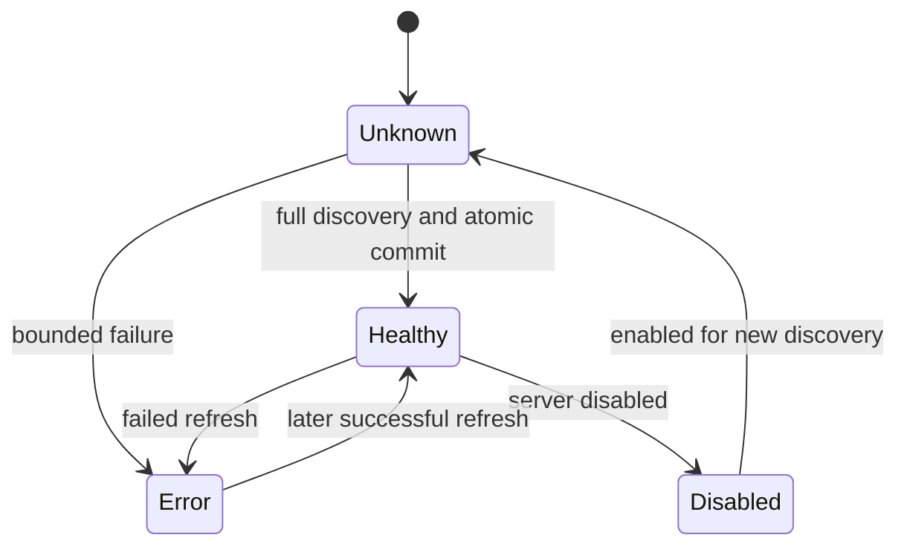
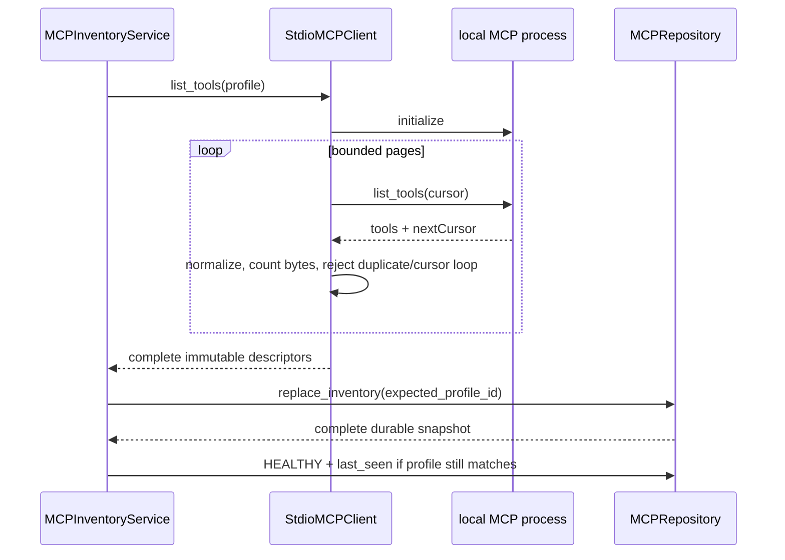

# MCP transports and inventory

> **Documentation status:** Draft
> **Concept status:** `implemented`
> **Status boundary:** Official MCP 2.1.1 stdio was exercised locally. Durable inventory is metadata, not authorization or proof that a server is currently healthy.
> **Used by:** [Module 12](../modules/12-governed-mcp/README.md)

## Transport versus inventory

A **transport** moves live protocol messages.
Archon starts an allowlisted local child process and exchanges MCP messages over stdin and stdout.
An **inventory** is a durable owner/project-scoped snapshot of normalized server and tool metadata discovered through that transport.
The transport ends when its SDK/process context closes; the inventory remains in the database.
Neither concept is the policy decision that authorizes a call.
Read [MCP](mcp.md) first for the complete governance chain.

No HTTP endpoint or OAuth token exchange is implemented by this claim.
The repository contains historical/simple transport types, but the governed runtime evidence described here is `StdioMCPClient` using the official SDK.
Do not infer deployment support from a formatting helper or class name alone.

## Discovery lifecycle

`MCPInventoryService.discover` first reads the server by owner, project, and server ID.
A missing server becomes stable `server_not_found`.
A disabled server is marked `DISABLED` and discovery stops.
The stored profile ID must resolve inside the deployment-owned profile map.
An unknown profile marks an error without persisting its secret configuration.

The client lists and normalizes every page before repository replacement.
`MCPRepository.replace_inventory` swaps the complete snapshot atomically.
A partial page set therefore does not masquerade as a complete healthy inventory.
After replacement, health is updated to `HEALTHY` with `last_seen` under the expected profile ID.
If a profile changes during discovery, the expected-profile guard prevents stale results from winning.

## Pagination and normalization view

This view shows why one successfully parsed page is not enough.
A repeated cursor, duplicate tool name, invalid schema, excessive bytes, or page/tool cap aborts discovery.
The stored inventory changes only through the complete replacement boundary.

## Transport details

`StdioMCPClient._with_session` constructs `StdioServerParameters` from one strict `ServerProfile`.
It starts an official SDK `stdio_client`, opens `ClientSession`, and runs `initialize`.
Connection and operation each have bounded time.
Context-manager exit cleans up the session and child process on success or failure.
The child environment inherits only `PATH`, `HOME`, `LANG`, and `TMPDIR` when present, plus profile-owned values.
Callers cannot inject environment variables through inventory routes.

`list_tools` caps discovery at 100 pages and 10,000 tools.
It tracks cumulative serialized result bytes against `profile.max_result_bytes`.
A cursor must be a new non-empty string.
Tool names must match the allowed pattern and fit within 128 UTF-8 bytes.
Schemas must be JSON objects and fit within 64,000 serialized bytes each.
Titles, descriptions, and versions have explicit length limits.

## Inventory contents and limits

A server record stores identity, owner, project, selected profile ID, enabled state, health, timestamps, and a stable error code.
A tool record stores normalized identity, name, descriptions, input schema, risk hints, version, and enabled selection.
The inventory does not store the deployment profile's command or environment.
The profiles API must not expose process configuration.
A healthy timestamp means the last complete discovery succeeded.
It does not continuously prove that the process is available now.

Changing a server's profile invalidates prior inventory.
Keeping the same profile does not needlessly invalidate it.
Deleting a server cascades its tool inventory under tested database behavior.
All CRUD and selection operations must include owner/project scope.

## Runtime remains separate

`MCPRuntimeToolProvider.for_scope` reads inventory but exposes only enabled, healthy, selected entries.
It normalizes schemas again for an enforceable runtime subset.
`MCPRuntimeToolProvider._call` re-reads state before invocation.
Thus inventory health is necessary but insufficient.
Policy and approval are also necessary and separate.
This separation prevents a discovery endpoint from becoming an execution endpoint.

## Exact implementation landmarks

- [`StdioMCPClient._with_session`](../../../backend/app/mcp/client.py) owns SDK session, timeout, and cleanup.
- [`StdioMCPClient.list_tools`](../../../backend/app/mcp/client.py) owns protocol pagination and limits.
- [`StdioMCPClient._normalize_tool`](../../../backend/app/mcp/client.py) normalizes untrusted metadata.
- [`MCPInventoryService.discover`](../../../backend/app/mcp/inventory.py) owns profile resolution and health transitions.
- [`MCPInventoryService._fail`](../../../backend/app/mcp/inventory.py) records stable failure state.
- [`MCPRepository.replace_inventory`](../../../backend/app/mcp/repository.py) owns atomic persistence.
- [`MCPRepository.update_health`](../../../backend/app/mcp/repository.py) guards health updates.
- [`MCPRuntimeToolProvider.for_scope`](../../../backend/app/mcp/runtime.py) consumes inventory under runtime gates.

## Tests and evidence

- [`test_list_tools_follows_sdk_cursors_and_aggregates_pages`](../../../backend/tests/unit/test_mcp_client.py) checks complete pagination.
- [`test_list_tools_rejects_cross_page_duplicates_and_cursor_loops`](../../../backend/tests/unit/test_mcp_client.py) checks adversarial page state.
- [`test_scope_restart_refresh_selection_and_cascade`](../../../backend/tests/integration/test_mcp_inventory.py) checks persistence, scope, refresh, selection, and deletion.
- [`test_profile_change_atomically_invalidates_inventory_and_same_profile_does_not`](../../../backend/tests/integration/test_mcp_inventory.py) checks profile transitions.
- [`test_profile_update_wins_against_in_flight_discovery`](../../../backend/tests/integration/test_mcp_inventory.py) checks the refresh race.
- [`test_unknown_profile_and_failure_do_not_persist_raw_secret`](../../../backend/tests/integration/test_mcp_inventory.py) checks safe failure persistence.
- [`test_official_stdio_initialize_list_call_env_and_cleanup`](../../../backend/tests/integration/test_mcp_stdio.py) checks a real local official-SDK exchange.
- [`test_mcp_migration_round_trip_and_postgresql_safe`](../../../backend/tests/integration/test_mcp_inventory_migration.py) checks schema migration behavior.
- Evidence dimensions are summarized in [implementation evidence](../../IMPLEMENTATION-EVIDENCE.md).

## Security and failure analysis

A child can emit enormous, malformed, duplicated, or endlessly paginated metadata; bounds stop those cases.
A timeout can occur during connection, initialization, discovery, or call.
Errors are reduced to stable codes because raw exceptions may contain commands, paths, environment, or tool content.
Atomic replacement avoids serving a half-discovered snapshot.
Expected-profile checks avoid committing a stale process's metadata after reconfiguration.
Health can go stale immediately after success, so call-time revalidation and transport errors still matter.
Inventory records must never become a place to persist raw profile secrets.
Local stdio still grants the process operating-system capabilities; inventory controls are not a sandbox.

## Observability

Track discovery start/end, stable error code, duration, page count, tool count, total metadata bytes, profile ID, and server health.
Use owner/project IDs only under access and retention controls.
Track profile-change invalidations and in-flight refresh conflicts.
Alert on cursor-loop, duplicate-name, oversized-result, and timeout trends.
Record `last_seen` as a historical observation, not a live readiness promise.
Do not place command lines, environment values, stderr, or full schemas in ordinary logs.

## Lab versus production

The lab starts a local fixture process and proves MCP 2.1.1 stdio behavior.
Production should pin and verify process artifacts, isolate OS permissions, constrain egress, cap concurrent children, and monitor orphan cleanup.
Large inventories may need stricter operator-selected caps and database indexing.
Remote HTTP would need separate transport code and evidence for TLS, origin validation, SSRF controls, authentication, and OAuth lifecycle.
None of those remote controls are implied by local stdio success.

## Alternatives and trade-offs

Ephemeral discovery on every call avoids stale storage but adds latency and makes selection/audit harder.
A durable snapshot is fast and inspectable but must be refreshed and revalidated.
A manually configured static catalog avoids untrusted discovery but increases operator work and drift risk.
A long-lived MCP session may reduce startup cost but introduces session health, multiplexing, and cleanup complexity.
Archon chooses short bounded stdio sessions plus durable scoped metadata.

## Exercise: reason about an in-flight profile change

1. Read [`MCPInventoryService.discover`](../../../backend/app/mcp/inventory.py).
2. Pause a fake client's `list_tools` after it reads profile A.
3. Update the server to profile B while discovery is paused.
4. Resume profile A's response and confirm expected-profile persistence rejects stale success.
5. Run `pytest backend/tests/integration/test_mcp_inventory.py backend/tests/unit/test_mcp_client.py -q`.
6. Explain why an old inventory snapshot still would not authorize a runtime call.

Expected conclusion: atomic inventory and expected-profile checks preserve metadata coherence, while runtime policy and revalidation remain separate gates.

## 30-second answer

“Transport is the live local stdio protocol session; inventory is a durable owner/project snapshot produced only after complete bounded discovery. Pagination, names, schemas, counts, bytes, time, profile races, and cleanup are controlled. Healthy means the last refresh succeeded, not that execution is authorized or the process is live now. Runtime selection, revalidation, policy, and approval remain separate; HTTP/OAuth is not claimed.”

## Self-check

1. **What survives after the stdio process exits?** The durable normalized inventory snapshot.
2. **Does `HEALTHY` authorize a call?** No.
3. **What prevents partial discovery from looking complete?** Full collection followed by atomic `replace_inventory`.
4. **How are cursor loops handled?** Repeated or invalid cursors fail discovery.
5. **Why pass `expected_profile_id` when persisting?** To stop stale in-flight discovery from overwriting a newer profile.
6. **Are process commands stored in inventory?** No; deployment profiles own them outside the user-facing records.
7. **What transport has real evidence?** Local official-SDK stdio.
8. **Why revalidate at runtime?** Health, enablement, schema, hints, and profile state may change after discovery.

## Related concepts

- [MCP](mcp.md)
- [Authorization and ownership](authorization-ownership.md)
- [Tool contracts](tool-contracts.md)
- [Retries, timeouts, and cancellation](retries-timeouts-cancellation.md)
- [Migrations](migrations.md)
