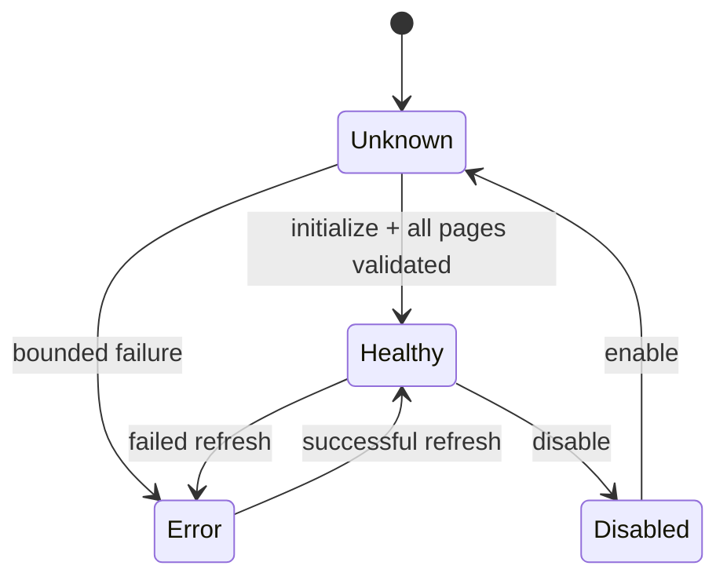

# MCP transports and inventory

> **Documentation status:** Draft
> **Concept status:** `implemented`
> **Status boundary:** Official MCP 2.1.1 stdio was exercised locally. Durable inventory is metadata, not authorization or proof that a server is currently healthy.
> **Used by:** [Module 12](../modules/12-governed-mcp/README.md)

## Transport versus inventory

A **transport** moves protocol messages. Archon starts an allowlisted child process and exchanges MCP messages over stdin/stdout. An **inventory** is a durable, owner/project-scoped snapshot of normalized server and tool metadata discovered through that transport. Learn [MCP](mcp.md) first.

## Discovery lifecycle

`list_tools` follows SDK cursors while rejecting cursor loops, duplicates, excessive pages/tools/bytes, invalid names, and unsupported schemas. `replace_inventory` commits a complete normalized replacement; partial discovery does not masquerade as healthy state. Runtime still checks enabled/healthy/selected and policy independently.

## Source and tests

- [`StdioMCPClient.list_tools`](../../../backend/app/mcp/client.py) owns protocol pagination and limits.
- [`MCPInventoryService.discover`](../../../backend/app/mcp/inventory.py) owns profile resolution and health transitions.
- [`MCPRepository.replace_inventory`](../../../backend/app/mcp/repository.py) owns atomic persistence.
- [`test_list_tools_follows_sdk_cursors_and_aggregates_pages`](../../../backend/tests/unit/test_mcp_client.py) checks pagination.
- [`test_scope_restart_refresh_selection_and_cascade`](../../../backend/tests/integration/test_mcp_inventory.py) checks durable scope.
- [`test_official_stdio_initialize_list_call_env_and_cleanup`](../../../backend/tests/integration/test_mcp_stdio.py) checks a real local SDK exchange.
- Evidence dimensions: [implementation evidence](../../IMPLEMENTATION-EVIDENCE.md).

## Interview answer

“Transport is the live stdio conversation; inventory is its durable bounded snapshot. Discovery success marks metadata healthy but grants no execution authority. Enablement, request scoping, binding revalidation, policy, and approval remain separate gates.”
