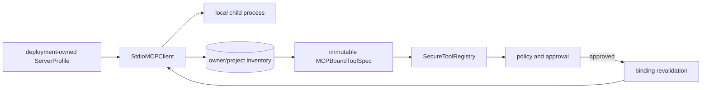
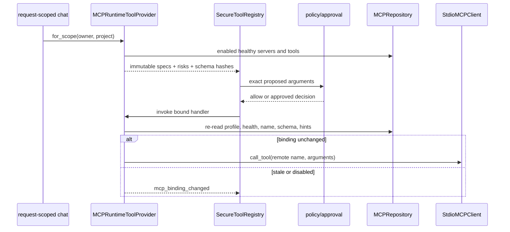

# Model Context Protocol (MCP)

> **Documentation status:** Draft
> **Concept status:** `implemented`
> **Status boundary:** Archon supports governed, deployment-allowlisted MCP over local stdio. HTTP/OAuth and arbitrary user-supplied commands are outside the implemented claim.
> **Used by:** [Module 12](../modules/12-governed-mcp/README.md)

## Definition and trust boundary

MCP standardizes how a client discovers and invokes tools.
Compatibility says that two components can exchange protocol messages.
It does not say the tool is safe, truthful, authorized, or suitable for a tenant.
Archon therefore treats MCP as an untrusted tool-supply boundary.
MCP tools join the same [tool contract](tool-contracts.md), [policy engine](policy-engine.md), approval, timeout, and evidence paths as native tools.

The implemented transport is local **stdio** only.
Archon starts a deployment-allowlisted child process and exchanges messages over its standard input and output.
The request API accepts a `profile_id`; it does not accept a command, argument vector, working directory, or environment map.
No remote HTTP transport or OAuth flow is claimed here.

## From profile to governed call

`MCPInventoryService` holds an immutable copy of deployment-owned profiles.
An authenticated owner creates a server record by selecting one known profile ID.
Discovery resolves that ID to `ServerProfile` inside the application.
`StdioMCPClient` starts only the command and arguments in that profile.
Its child environment begins with a small base set and adds only profile-owned entries.
SDK and process exceptions become stable error codes so paths, commands, and response details are not returned.

Discovery normalizes tool name, schema, title, description, annotations, and version.
Missing read-only hints are interpreted conservatively.
Missing `destructiveHint: false` means the tool is considered destructive.
Inventory records are metadata snapshots, not executable authority.
A server and tool must still be enabled, healthy, selected for the owner/project, and policy-approved.

## Call-time gates

`MCPRuntimeToolProvider.for_scope` exposes only owner/project records.
It skips disabled servers, unhealthy servers, unknown profiles, and disabled tools.
It normalizes the persisted input schema before registration.
A schema that cannot be enforced causes that tool to be disabled rather than exposed.
Each `MCPBoundToolSpec` freezes metadata and captures a private `_Binding`.

Risk always includes `NETWORK` because the child tool is an external capability from the runtime's perspective.
Read-only tools add `READ`.
Non-read-only or destructive tools add `WRITE` and `EXTERNAL_SIDE_EFFECT`.
MCP bound tools require approval by default.
The secure registry evaluates the exact proposed call before invocation.

Immediately before transport use, `_call` reloads server and tool state.
It compares owner/project, enabled state, health, server name, profile ID, tool ID/name, schema hash, read-only hint, and destructive hint.
Any drift raises the stable `mcp_binding_changed` error.
This closes a time-of-check/time-of-use gap between request binding and execution.

## Protocol and resource bounds

`StdioMCPClient._with_session` wraps initialize and operation timeouts.
Every operation opens and closes an SDK session and child-process context.
`list_tools` permits at most 100 pages and 10,000 tools.
It rejects duplicate names and repeated or invalid cursors.
Tool names are syntax-checked and limited to 128 UTF-8 bytes.
Each input schema must be an object and at most 64,000 serialized bytes.
The whole discovery/result payload is capped by the selected profile's `max_result_bytes`.
`call_tool` validates JSON arguments and caps response bytes.
These are containment measures; they do not make a malicious process benign.

## Exact implementation landmarks

- [`ServerProfile`](../../../backend/app/mcp/models.py) is the strict deployment-owned process configuration.
- [`StdioMCPClient`](../../../backend/app/mcp/client.py) wraps the official SDK's local stdio session.
- [`StdioMCPClient.list_tools`](../../../backend/app/mcp/client.py) enforces pagination and metadata limits.
- [`StdioMCPClient.call_tool`](../../../backend/app/mcp/client.py) enforces call and result bounds.
- [`MCPInventoryService.discover`](../../../backend/app/mcp/inventory.py) resolves profiles and refreshes metadata.
- [`MCPRepository.replace_inventory`](../../../backend/app/mcp/repository.py) atomically stores a discovered snapshot.
- [`MCPRuntimeToolProvider.for_scope`](../../../backend/app/mcp/runtime.py) creates scoped immutable bindings.
- [`MCPRuntimeToolProvider._call`](../../../backend/app/mcp/runtime.py) revalidates before transport use.
- [`get_tool_registry`](../../../backend/app/routes/chat.py) joins MCP tools to ordinary governance.

## Tests and evidence

- [`test_server_profile_is_frozen_strict_and_filters_environment_configuration`](../../../backend/tests/unit/test_mcp_client.py) checks the process profile boundary.
- [`test_list_tools_follows_sdk_cursors_and_aggregates_pages`](../../../backend/tests/unit/test_mcp_client.py) checks pagination.
- [`test_list_tools_rejects_cross_page_duplicates_and_cursor_loops`](../../../backend/tests/unit/test_mcp_client.py) checks hostile pagination.
- [`test_official_stdio_initialize_list_call_env_and_cleanup`](../../../backend/tests/integration/test_mcp_stdio.py) exercises the official SDK against a local stdio server.
- [`test_stdio_timeout_result_cap_and_cleanup`](../../../backend/tests/integration/test_mcp_stdio.py) checks resource failure and cleanup.
- [`test_real_enabled_tool_is_governed_and_executes_only_after_approval`](../../../backend/tests/integration/test_mcp_runtime.py) checks policy and approval wiring.
- [`test_scope_filter_risks_disable_toctou_and_schema_rejection`](../../../backend/tests/integration/test_mcp_runtime.py) checks scope, risk, invalid schema, and stale binding behavior.
- Current revision claims are indexed in [implementation evidence](../../IMPLEMENTATION-EVIDENCE.md).

## Security and failure analysis

An allowlisted child process can still read or change anything permitted by its operating-system identity.
Application policy is not an OS sandbox.
Use least-privilege users, filesystem permissions, network controls, and container/process isolation in production.
Tool annotations come from the server and are hints, so absent hints are treated conservatively.
Discovery success is not a permanent health guarantee.
A stale schema or enablement state is rejected at call time.
Unknown profiles, malformed metadata, cursor loops, oversized results, timeouts, and transport failures become bounded errors.
Do not expose raw child stderr, commands, environment, or protocol payloads to callers.

## Observability

Record safe server/tool IDs, owner/project scope, profile ID, inventory health, stable error code, policy decision, approval identity, latency, and result size.
Do not record profile secrets, environment values, raw arguments, or unrestricted tool output.
Track discovery failures separately from invocation failures.
Track `mcp_binding_changed` because it reveals expected safety revalidation, configuration churn, or races.
Measure approval and denial rates by risk class.
A successful call proves transport completion, not truth of the tool result.

## Lab versus production

The lab proves official-SDK local stdio exchange and governed runtime wiring.
It does not prove remote HTTP, OAuth, distributed discovery, or arbitrary MCP server compatibility.
Production should isolate child processes, pin executable artifacts, control egress, manage profile secrets, cap concurrency, and monitor process cleanup.
Operators should review every profile because profile ownership is the command-execution boundary.
Remote transport support would require a separate design for endpoint trust, TLS, authentication, authorization, token storage, retries, and SSRF defense.
Do not infer those controls from stdio tests.

## Alternatives and trade-offs

Native tools avoid a child protocol boundary and can have tighter application types.
MCP improves interoperability and discovery but introduces metadata, process, and stale-binding risks.
A fixed sidecar can strengthen process isolation but adds deployment complexity.
Remote MCP may reduce local process exposure but adds network identity and availability problems.
Archon's current choice is intentionally narrow: deployment-owned local stdio plus ordinary tool governance.

## Exercise: follow one approved MCP call

1. Start at [`MCPRuntimeToolProvider.for_scope`](../../../backend/app/mcp/runtime.py) and identify each selection gate.
2. Find where risk classes and `requires_approval` are assigned.
3. Follow the closure to `_call` and list all fields revalidated.
4. Run `pytest backend/tests/integration/test_mcp_runtime.py backend/tests/integration/test_mcp_stdio.py -q`.
5. Disable the selected tool between binding and invocation in the existing test pattern.
6. Confirm execution fails with `mcp_binding_changed` rather than calling the child.

Expected conclusion: protocol compatibility supplies a candidate tool; scoped inventory, policy, approval, and revalidation supply execution authority.

## 30-second answer

“Archon treats MCP as untrusted tool supply. Operators own strict process profiles, and the only verified transport is local stdio through the official SDK. Discovery creates bounded owner/project metadata. Request-scoped bindings add conservative risks and approval, then revalidate profile, health, enablement, schema, and hints immediately before calling. No HTTP or OAuth support is claimed.”

## Self-check

1. **What transport is implemented?** Local child-process stdio.
2. **Can an API caller supply a command?** No; callers select a deployment-owned profile ID.
3. **Does inventory grant execution authority?** No; it is scoped metadata.
4. **How are missing risk hints treated?** Conservatively, including destructive unless explicitly false.
5. **Why hash and recheck schema?** To reject binding drift before execution.
6. **Are MCP tools policy-exempt?** No; they use the secure registry and approval path.
7. **Does stdio policy sandbox the child OS process?** No; process isolation is a separate deployment control.
8. **Is HTTP/OAuth supported by this claim?** No.

## Related concepts

- [MCP transports and inventory](mcp-transports-inventory.md)
- [Tool contracts](tool-contracts.md)
- [Policy engine](policy-engine.md)
- [Durable approvals](durable-approvals.md)
- [Authorization and ownership](authorization-ownership.md)
