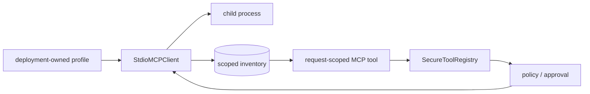

# Model Context Protocol (MCP)

> **Documentation status:** Draft
> **Concept status:** `implemented`
> **Status boundary:** Archon supports governed, deployment-allowlisted MCP over stdio. HTTP/OAuth and arbitrary user-supplied commands are outside the implemented claim.
> **Used by:** [Module 12](../modules/12-governed-mcp/README.md)

## Definition

MCP standardizes discovery and invocation of tools. A protocol-compatible tool is not automatically safe or authorized. Archon places MCP behind the same [tool contract](tool-contracts.md), [policy engine](policy-engine.md), approval, timeout, and evidence boundaries as native tools.

The API accepts a profile ID, never an executable or environment map. Discovery normalizes bounded metadata. Runtime selection includes only enabled, healthy tools and revalidates server/profile/schema/risk state just before invocation to reject stale bindings.

## Source and proof

- [`StdioMCPClient`](../../../backend/app/mcp/client.py) wraps the official SDK session with page, size, timeout, and cleanup limits.
- [`MCPInventoryService.discover`](../../../backend/app/mcp/inventory.py) resolves profiles and atomically refreshes inventory.
- [`MCPRuntimeToolProvider.for_scope`](../../../backend/app/mcp/runtime.py) creates immutable scoped bindings.
- [`get_tool_registry`](../../../backend/app/routes/chat.py) joins MCP tools to ordinary governance.
- [`test_official_stdio_initialize_list_call_env_and_cleanup`](../../../backend/tests/integration/test_mcp_stdio.py) proves local protocol exchange.
- [`test_real_enabled_tool_is_governed_and_executes_only_after_approval`](../../../backend/tests/integration/test_mcp_runtime.py) proves policy/approval wiring.
- Current evidence: [implementation evidence](../../IMPLEMENTATION-EVIDENCE.md).

## Failure and interview answer

Unknown profiles, malformed schemas, cursor loops, excessive results, stale bindings, timeouts, and policy denials produce bounded failures. A child process remains a trust boundary; an allowlist is not proof of benign semantics.

“Archon treats MCP as untrusted tool supply: operators own process profiles, discovery creates scoped inventory, and each call is rebound and governed. The verified transport is local stdio, not remote HTTP/OAuth.”
