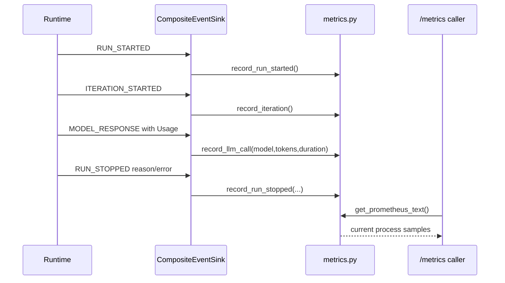
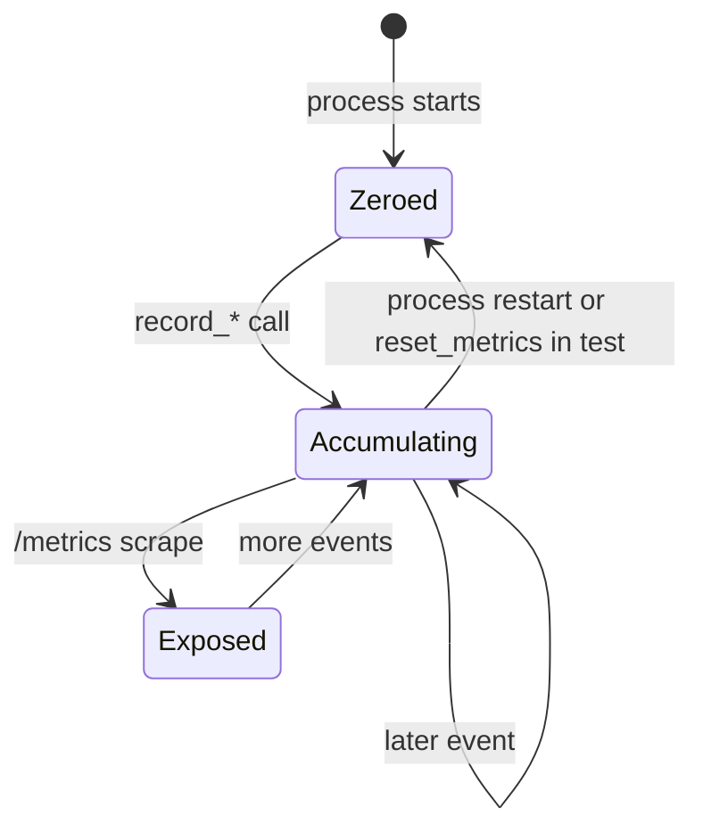

# Metrics

> **Documentation status:** Draft
> **Concept status:** `implemented`
> **Status boundary:** Prometheus samples are generated from a process-local registry; durable multi-replica aggregation, alerting, and SLO evidence are not implemented.
> **Used by:** [Module 13](../modules/13-auth-ui-observability/README.md)

## Beginner explanation

A metric is a number tracked over time.
Counters answer questions such as “how many runs started?”
Current values answer questions such as “how many conversations are active?”
Latency observations help summarize how long work takes.
Metrics are compact because they discard most event detail.
That makes them useful for trends and alerts but poor for explaining one specific request.
Use [Structured logging](structured-logging.md) for event records and [Tracing](tracing-opentelemetry.md) for a timed request path.
Archon’s current registry lives in one Python process and resets when that process restarts.

## Vocabulary and safe dimensions

| Term | Plain-English meaning |
|---|---|
| counter | value intended to increase as events occur |
| label | bounded key/value dimension attached to a metric sample |
| cardinality | number of distinct label combinations |
| registry | in-memory structure holding current samples |
| scrape | monitoring system fetches Prometheus text from `/metrics` |
| SLO | agreed reliability target calculated from defined signals; not supplied here |

Labels must come from small, controlled sets.
User IDs, run IDs, prompts, arbitrary URLs, tool arguments, and raw error strings are unsafe labels.
They can leak data and create an unbounded number of time series.
Correlation IDs belong in logs and traces, not metric labels.
A counter reset after process restart is expected in this implementation.

## Signal architecture

```mermaid
flowchart LR
    E[typed AgentEvent] --> S[CompositeEventSink.emit]
    S --> M[metrics record_* functions]
    M --> R[process-local _metrics registry]
    R --> T[get_prometheus_text]
    T --> X[/metrics text/plain]
    X --> Q[optional external scraper]
```

[`backend/app/observability/metrics.py`](../../../backend/app/observability/metrics.py) owns `_metrics` and recording functions.
[`CompositeEventSink.emit`](../../../backend/app/observability/runtime_events.py) translates typed runtime events into updates.
[`create_app`](../../../backend/app/main.py) exposes `get_prometheus_text()` at `/metrics`.
The endpoint exports application instrumentation; it does not turn CI, backup scripts, or disaster-recovery timings into authenticated agent metrics.
Those operational workflows retain separate evidence paths.

## Event-to-metric sequence



`RUN_STARTED` increments `agent_runs_total`.
`ITERATION_STARTED` increments `agent_iterations_total`.
`MODEL_RESPONSE` updates model call, token, and latency values using typed `Usage`.
Completed tool calls update total, per-tool calls, error state, and latency in the internal registry.
`RUN_STOPPED` updates stop reason, total tokens, duration sum, and error count.
Open tool spans remaining when a run stops are recorded as errors.
The mapping occurs from typed events, not by parsing log text.

## Exact exported shape

`get_prometheus_text` emits HELP and TYPE lines plus samples for selected totals.
Examples include `archon_agent_runs_total`, `archon_agent_errors_total`, `archon_agent_iterations_total`, and `archon_agent_tokens_total`.
It also emits `archon_agent_run_duration_milliseconds_sum`, model/tool/chat totals, guardrail blocks, and PII detections where defined.
Per-model samples use the `model` label.
Stop counts use the `reason` label.
The current implementation does not use the Prometheus client library’s durable multiprocess mode.
The internal registry includes more dashboard data than the text endpoint exports, including bounded recent chat latencies and per-tool details.
`get_metrics_snapshot` computes process-local dashboard summaries, including simple p50 and p95 values from at most 1,000 recent chat latency samples.
Those calculations are not production histogram quantiles.

## Source, tests, and evidence

| Source or test | Exact contract | Not proved |
|---|---|---|
| [`metrics.py:_metrics`](../../../backend/app/observability/metrics.py) | process-local storage and bounded chat sample list | durability or replicas |
| [`metrics.py:record_run_stopped`](../../../backend/app/observability/metrics.py) | reason, token, duration, and error updates | SLO correctness |
| [`metrics.py:get_prometheus_text`](../../../backend/app/observability/metrics.py) | Prometheus-compatible selected text output | scrape configuration |
| [`runtime_events.py:CompositeEventSink.emit`](../../../backend/app/observability/runtime_events.py) | typed event-to-metric mapping | every route is instrumented |
| [`test_exact_event_to_metric_span_and_correlation_mapping`](../../../backend/tests/unit/test_runtime_observability.py) | exact runtime signal mapping | fleet aggregation |
| [`test_error_timeout_event_marks_metrics_and_spans`](../../../backend/tests/unit/test_runtime_observability.py) | timeout/error accounting | production timeout rate |

The revision-scoped status is in [Implementation Evidence](../../IMPLEMENTATION-EVIDENCE.md).
The local deployment smoke observes that metrics are exposed, but no durable Prometheus server, alert manager, or hosted dashboard is claimed.

## State and lifecycle



`reset_metrics()` exists primarily for deterministic tests.
Production code should not treat it as durable history management.
Concurrent process replicas each have independent dictionaries.
Adding their text naively may double-count or miss restarts unless an external monitoring system handles series identity and counter resets.

## Try it: bounded exercise

### Goal

Prove the typed event mapping and inspect the exported names without external services.

### Setup and steps

Run from the repository root with backend dev dependencies.
Tests reset process-local state and use deterministic clocks.
No provider credentials or Prometheus server are needed.

```bash
cd backend
uv run pytest -q \
  tests/unit/test_runtime_observability.py::test_exact_event_to_metric_span_and_correlation_mapping \
  tests/unit/test_runtime_observability.py::test_error_timeout_event_marks_metrics_and_spans
uv run python -c "from app.observability.metrics import reset_metrics,record_run_started,get_prometheus_text; reset_metrics(); record_run_started(); print(get_prometheus_text())"
```

### Done criteria

- [ ] Both tests pass or the blocker is recorded.
- [ ] Output contains `archon_agent_runs_total 1`.
- [ ] You can identify one bounded label and one forbidden high-cardinality label.
- [ ] You explain why a restart loses current registry values.
- [ ] No external telemetry service or real user data was used.

## Security and failure modes

| Threat or failure | Control or behavior | Residual risk |
|---|---|---|
| PII in labels | mapping uses selected safe fields | future model/tool names still need review |
| cardinality explosion | no user/run/prompt/error labels | controlled values can still grow over time |
| process restart | counters reset visibly | history is lost without scraper storage |
| multiple workers | independent registries | no built-in aggregation |
| missing terminal event | run totals may not receive stop/duration update | event lifecycle must remain correct |
| malformed reason | current mapping converts safe data to string | bounded reason vocabulary should be enforced upstream |
| scrape exposure | local gateway routes `/metrics` | endpoint access policy needs production design |
| slow consumer | scrape reads current text only | no backpressure or durable queue |
| alert silence | no alert rules exist | operators can miss failures |
| false SLO | raw counters lack approved query/window | no SLO claim is supported |

## Observability and evidence path

```text
typed event → selected bounded update → process registry → Prometheus text → optional scraper/query/alert
```

Archon implements the path only through Prometheus text.
Logs retain per-event context and traces retain request timing; metrics should not duplicate sensitive detail.
A useful investigation starts with a metric trend, narrows by safe log fields, and follows a correlation ID into a trace or durable run evidence.
The metric itself is not durable evidence of semantic correctness.
For an observation, record revision, process count, uptime/restarts, command, and scrape time.

## Alternatives and trade-offs

| Alternative | Benefit | Cost or risk |
|---|---|---|
| Prometheus client library | mature collectors and histogram support | migration and multiprocess configuration |
| StatsD | simple fire-and-forget updates | aggregation semantics move to another service |
| OpenTelemetry metrics | shared telemetry ecosystem | collector/backend and semantic design work |
| derive metrics from logs | fewer instrumentation calls | delayed, expensive, and parser-dependent |
| database aggregates | durable business counts | query load and poor high-frequency behavior |

The small registry keeps the local implementation understandable and testable.
It should be replaced or extended before multi-worker production claims.

## Lab vs production

| Dimension | Demonstrated | Missing or unverified |
|---|---|---|
| mapping | typed runtime events to selected counters/sums | complete route coverage |
| storage | one process dictionary | durable multi-replica backend |
| exposure | Prometheus text endpoint | secure scrape discovery and retention |
| privacy | selected bounded fields | formal cardinality/privacy governance |
| operations | tests and local endpoint observation | alerts, dashboards, SLO rules, on-call |

The concept is `implemented` for process-local instrumentation only.

## Interview answer

### 30-second answer

> Archon maps typed runtime events through `CompositeEventSink.emit` into low-cardinality counters and duration sums, then exposes selected samples with `get_prometheus_text` at `/metrics`. Tests verify start, stop, token, error, span, and correlation mappings. The registry is process-local and resets, so it proves instrumentation shape—not durable fleet aggregation, alerting, production histograms, or an SLO.

## Self-check

1. Why are metrics less detailed than logs?
2. Which typed event increments run starts?
3. Why must run IDs not be metric labels?
4. What happens to counters on process restart?
5. Which symbol renders Prometheus text?
6. Which test covers error and timeout mapping?
7. Does `/metrics` prove alerting or an SLO?

<details>
<summary>Answer guide</summary>

1. Metrics intentionally aggregate events into compact numbers and discard per-request detail.
2. `AgentEventKind.RUN_STARTED` through `record_run_started()`.
3. They create unbounded cardinality and can expose identifying information.
4. The process-local `_metrics` registry starts over.
5. `app.observability.metrics.get_prometheus_text`.
6. `test_error_timeout_event_marks_metrics_and_spans`.
7. No; scraper storage, queries, alert rules, ownership, and agreed objectives are absent.

</details>

## Related concepts

- [Structured logging](structured-logging.md)
- [Tracing and OpenTelemetry](tracing-opentelemetry.md)
- [Liveness and readiness](liveness-readiness.md)
- [Module 13](../modules/13-auth-ui-observability/README.md)
