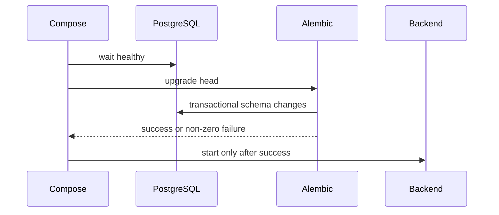

# Database migrations

> **Documentation status:** Draft
> **Concept status:** `implemented`
> **Status boundary:** Alembic upgrades are wired and revision `20260826_08` was observed locally. Rollback safety and zero-downtime mixed-version operation are unverified.
> **Used by:** [Module 14](../modules/14-local-operations/README.md)

## Purpose

A migration is a versioned transition of durable schema, separate from application startup logic. Learn [Docker and Compose](docker-compose.md) first: the local migration service reaches database head before the backend is eligible to become ready.

Migration tests cover fresh and representative prior schemas, constraints, foreign keys, and round trips where a downgrade is defined. A passing migration test does not prove compatibility while old and new application versions run concurrently.

## Source and tests

- [`backend/alembic/env.py`](../../../backend/alembic/env.py) configures online migration execution.
- [`20260826_08_mcp_inventory.py`](../../../backend/alembic/versions/20260826_08_mcp_inventory.py) is the referenced observed revision.
- [`test_mcp_migration_round_trip_and_postgresql_safe`](../../../backend/tests/integration/test_mcp_inventory_migration.py) checks the MCP schema path.
- [`test_run_parent_fk_migrates_valid_rows_and_roundtrips`](../../../backend/tests/integration/test_run_parent_migration.py) checks lineage schema.
- Evidence: [implementation evidence](../../IMPLEMENTATION-EVIDENCE.md).

## Failure and interview answer

Migration failure must block startup rather than permit code/schema drift. Back up before destructive transitions, and test rollback with realistic data before claiming it.

“Archon runs explicit Alembic migration before backend readiness and tests important schema transitions. The evidence supports local upgrade behavior, not online zero-downtime compatibility or guaranteed rollback.”
