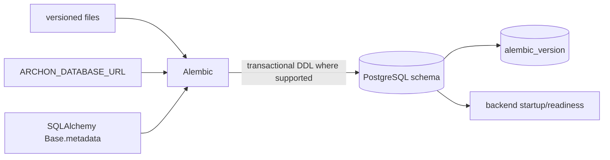
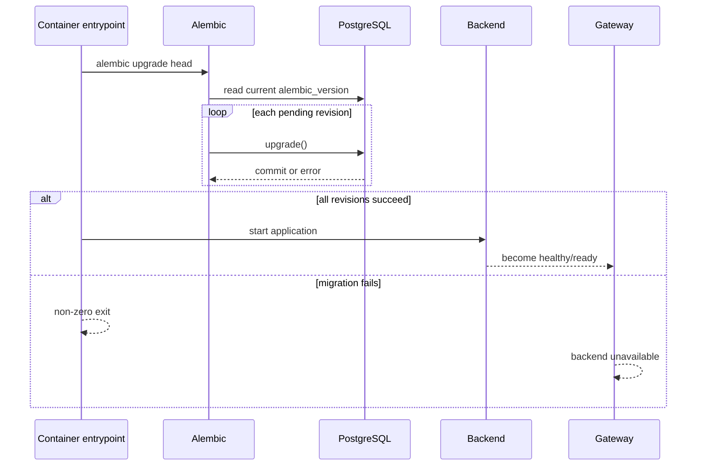
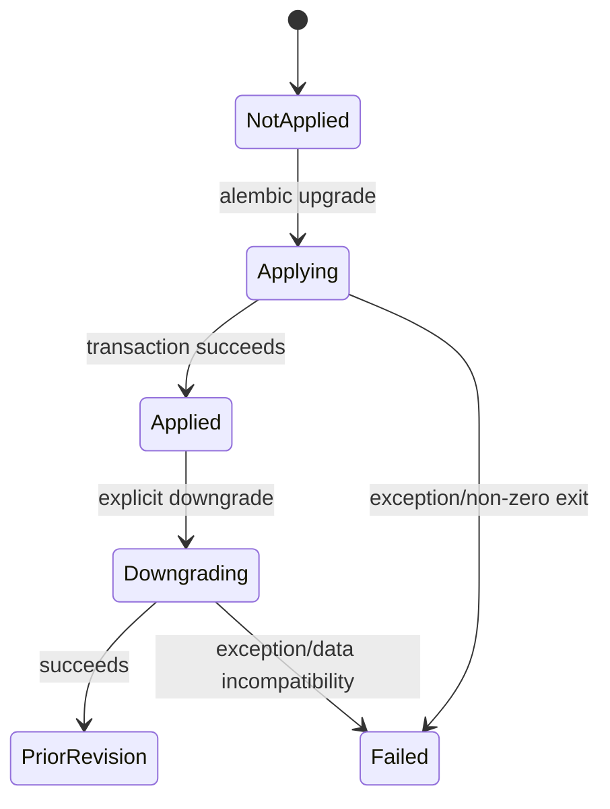

# Database migrations

> **Documentation status:** Draft
> **Concept status:** `implemented`
> **Status boundary:** Alembic upgrades are wired and revision `20260826_08` was observed locally; rollback safety and zero-downtime mixed-version operation are unverified.
> **Used by:** [Module 14](../modules/14-local-operations/README.md)

## Beginner explanation

Application code changes over time, and durable database structure must sometimes change with it.
A migration is a named, ordered program that moves the schema from one revision to another.
Examples include creating a table, adding a foreign key, or changing a constraint.
A migration is not ordinary application startup code and not a model-generated action.
It runs with database-definition authority and must fail visibly.
Archon uses Alembic to keep the revision chain and execute transitions.
The local container path upgrades to `head` before the application begins serving.
A successful fresh upgrade does not automatically prove safe rollback or compatibility between old and new application versions.

## Vocabulary and invariants

| Term | Plain-English meaning |
|---|---|
| revision | stable identifier for one migration step |
| `down_revision` | predecessor that orders the chain |
| head | newest revision in the selected chain |
| upgrade | move schema forward |
| downgrade | move schema backward when defined |
| mixed-version operation | old and new application versions using one schema during rollout |
| data migration | transformation of stored rows, not only table shape |

Every applied revision must be recorded in `alembic_version`.
The migration chain must have an unambiguous order.
A failed migration must block startup rather than permit unknown code/schema drift.
Constraints and foreign keys must preserve intended data rules.
Destructive changes need backup, compatibility design, and realistic rehearsal.
Migration scripts are operational database code, not authenticated Core API objects or Run Ledger events.

## Architecture



[`backend/alembic/env.py`](../../../backend/alembic/env.py) loads `ARCHON_DATABASE_URL` when present and uses `Base.metadata` as target metadata.
`run_migrations_offline` configures literal SQL generation.
`run_async_migrations` creates an async engine with `NullPool`, runs synchronous migration logic through the connection, then disposes it.
Both paths set `compare_type=True`.
The version files under [`backend/alembic/versions`](../../../backend/alembic/versions/) form the current chain.

## Local startup sequence



[`backend/container-entrypoint.sh`](../../../backend/container-entrypoint.sh) provides this ordering.
Compose dependency health ensures PostgreSQL is reachable before the backend entrypoint executes.
The application is not allowed to paper over a failed schema transition.
This is appropriate for a single-host local target.
It does not prove two application versions can safely overlap during a rolling production deployment.

## Current head example

[`20260826_08_mcp_inventory.py`](../../../backend/alembic/versions/20260826_08_mcp_inventory.py) declares `revision = "20260826_08"` and `down_revision = "20260826_07"`.
Its `upgrade()` creates `mcp_servers` and `mcp_tools`.
The server table scopes names by owner and project and constrains transport to `stdio`.
It constrains health to `unknown`, `healthy`, `error`, or `disabled`.
The tools table references `mcp_servers.id` with `ondelete="CASCADE"`.
Indexes support server scope and tool lookup.
Its `downgrade()` drops the tool index/table before the referenced server index/table.
That ordering avoids trying to remove a referenced parent first.
The presence of a downgrade function does not guarantee rollback is safe with production data.

## Migration lifecycle



PostgreSQL supports transactional behavior for many schema operations, but not every database or operation has identical guarantees.
A migration can also succeed structurally while taking locks too long or making old code incompatible.
For additive production rollout, a common pattern is expand, deploy compatible code, backfill, switch reads, and contract later.
That sequence is not established by the local one-shot path.

## Source, tests, and evidence

| Source or test | Exact contract | Not proved |
|---|---|---|
| [`alembic/env.py:run_async_migrations`](../../../backend/alembic/env.py) | async engine wiring and transaction invocation | production lock behavior |
| [`20260826_08_mcp_inventory.py:upgrade`](../../../backend/alembic/versions/20260826_08_mcp_inventory.py) | MCP tables, constraints, indexes, foreign key | online rollout compatibility |
| [`20260826_08_mcp_inventory.py:downgrade`](../../../backend/alembic/versions/20260826_08_mcp_inventory.py) | inverse schema removal order | preservation of rows after downgrade |
| [`test_mcp_migration_round_trip_and_postgresql_safe`](../../../backend/tests/integration/test_mcp_inventory_migration.py) | MCP migration round trip and PostgreSQL-safe operations | load-sized lock duration |
| [`test_run_parent_fk_migrates_valid_rows_and_roundtrips`](../../../backend/tests/integration/test_run_parent_migration.py) | valid lineage rows migrate and round-trip | malformed real-world datasets |
| [`test_images_run_nonroot_and_backend_migrates`](../../../backend/tests/unit/test_local_deployment.py) | container includes Alembic and runs upgrade | successful live upgrade |

[Implementation Evidence](../../IMPLEMENTATION-EVIDENCE.md) records the current local observed schema boundary.
[`local-dr-report.json`](../../evidence/local-dr-report.json) records the restored `schema_revision` for one recovery drill.
That artifact is an observation, not proof that every possible starting revision migrates.

## Try it: bounded exercise

### Goal

Run focused migration round-trip tests and inspect the revision chain without touching a real database.

### Setup and steps

Run from the repository root with backend dev dependencies.
The tests manage temporary databases and fixtures.
Remove any production-like `ARCHON_DATABASE_URL` from the shell before running so the tests cannot target it accidentally.

```bash
cd backend
unset ARCHON_DATABASE_URL
uv run pytest -q \
  tests/integration/test_mcp_inventory_migration.py::test_mcp_migration_round_trip_and_postgresql_safe \
  tests/integration/test_run_parent_migration.py::test_run_parent_fk_migrates_valid_rows_and_roundtrips
uv run alembic heads
```

### Done criteria

- [ ] Both tests pass or a real dependency blocker is recorded.
- [ ] Alembic reports one expected head.
- [ ] You can trace `20260826_08` to `20260826_07`.
- [ ] You identify one foreign key and one check constraint.
- [ ] No shared or production database was contacted.

## Security and failure modes

| Threat or failure | Control and response | Residual risk |
|---|---|---|
| wrong database URL | explicit environment/config review | migration identity has powerful authority |
| broken revision chain | Alembic head/history and tests | branch merges still need review |
| invalid existing rows | constraints or data step fail | cleanup plan must be designed beforehand |
| partial migration | transaction/error blocks startup where supported | some DDL may have engine-specific behavior |
| lock contention | not measured here | can cause production outage |
| incompatible old code | not exercised by one-shot local start | rolling deploy needs expand/contract design |
| destructive downgrade | backup and rehearsal required | restored rows may not fit old schema |
| concurrent migrators | deployment must elect one migration owner | local Compose does not prove distributed locking |
| secret leakage | URL comes from environment | Alembic/log configuration must avoid printing credentials |
| disk exhaustion | database returns failure | no automatic capacity remediation |

## Observability and evidence path

```text
revision file → Alembic command → database transaction/exit → alembic_version → readiness/smoke → canonical evidence
```

The first evidence is Alembic’s exit status and bounded logs.
The durable schema records its current revision in `alembic_version`.
Backend failure prevents a misleading ready state in the local container path.
Migration observations should include source revision, destination revision, database engine/version, data volume, command, duration, and lock impact.
They are not agent metrics or authenticated product runs.
Avoid logging database URLs, row payloads, or migration-time secrets.

## Alternatives and trade-offs

| Alternative | Benefit | Cost or risk |
|---|---|---|
| ORM `create_all` | simple fresh setup | no ordered evolution or reviewable history |
| manual SQL | direct control | drift and weak repeatability |
| application self-migration | easy startup | every replica may race with schema work |
| dedicated migration job | explicit authority and lifecycle | deployment orchestration required |
| expand/contract rollout | supports mixed versions | more revisions and temporary complexity |

Archon’s entrypoint upgrade is suitable for the local single-backend target.
A production orchestrator should normally make migration ownership explicit and design mixed-version compatibility.

## Lab vs production

| Dimension | Demonstrated | Missing or unverified |
|---|---|---|
| revisioning | ordered Alembic chain through observed head | future branch/merge policy |
| testing | focused fresh/round-trip integration tests | representative production data volume |
| startup | migration blocks local backend start | multi-replica migration election |
| rollback | selected downgrade tests | business-safe rollback for every revision |
| availability | local one-shot ordering | lock budgets and zero-downtime mixed versions |
| recovery | schema revision restored in local drill | PITR and failed-migration incident playbook |

The concept is `implemented` for explicit local upgrade and tested selected transitions, not for zero-downtime production migration.

## Interview answer

### 30-second answer

> Archon uses an ordered Alembic revision chain. The container entrypoint runs `alembic upgrade head` against PostgreSQL before the backend can serve, so migration failure blocks readiness. The current observed head is `20260826_08`, and focused integration tests cover MCP and run-parent round trips. That proves selected local transitions, not distributed migration ownership, lock safety, mixed-version rollout, or guaranteed rollback.

## Self-check

1. Why is `create_all` not a replacement for migrations?
2. What orders `20260826_08` after its predecessor?
3. What happens when local startup migration fails?
4. Which function runs online async migrations?
5. Which test checks the MCP round trip?
6. Why does a written downgrade not guarantee safe rollback?
7. What design supports old and new code during production rollout?

<details>
<summary>Answer guide</summary>

1. It creates current structure but does not encode ordered transitions for existing durable data.
2. `down_revision = "20260826_07"`.
3. The entrypoint exits non-zero, so the backend cannot become healthy or ready.
4. `run_async_migrations()` in `backend/alembic/env.py`, invoked through `run_migrations_online()`.
5. `test_mcp_migration_round_trip_and_postgresql_safe`.
6. Removing schema can lose data or produce rows incompatible with old code; realistic data must be rehearsed.
7. An additive expand/backfill/switch/contract sequence with explicit compatibility testing.

</details>

## Related concepts

- [Docker and Compose](docker-compose.md)
- [Backup and restore](backup-restore.md)
- [Liveness and readiness](liveness-readiness.md)
- [Module 14](../modules/14-local-operations/README.md)
