# Multimodal input and artifacts

> **Implementation status:** `implemented` for deterministic local request flow
> **Status boundary:** Authenticated sync and SSE chat validate and sanitize image inputs before persistence or provider execution. Provider builders are tested; no external vision-provider call, malware scanner, durable attachment backend, or public deployment is claimed.
> **Reviewed revision:** S8.7 candidate
> **Used by module:** [Module 13-auth-ui-observability](../modules/13-auth-ui-observability/README.md)
> **Catalog ID:** `multimodal-and-artifacts`

## Beginner explanation

An image string is not trusted merely because it starts with `data:image`. Archon caps the encoded request, decodes strict base64, inspects actual image bytes, compares the declared MIME type, rejects oversized dimensions before pixel decoding, strips metadata by re-encoding pixels, and caps the sanitized output. Only then may the image enter a model request.

Artifacts are a separate output concern. This note focuses on provider-bound image inputs; existing artifact ownership and inert-rendering controls remain independently tested.

## Request flow

```mermaid
flowchart LR
    UI[Authenticated UI] --> Route[Sync or SSE chat]
    Route --> Encoded[Encoded-length + Data URI shape]
    Encoded --> Bytes[Strict base64 + decoded-size cap]
    Bytes --> Header[MIME + dimensions + pixel budget]
    Header --> Decode[Verify/load pixels]
    Decode --> Sanitize[Re-encode and strip metadata]
    Sanitize --> OutputCap[Sanitized-size cap]
    OutputCap --> Message[Typed Message.images]
    Message --> Adapter[OpenAI / Anthropic / Ollama builder]
```

Validation runs before new-conversation creation, message persistence, context hashing, or provider execution in both sync and SSE routes.

## Implemented boundaries

| Boundary | Implementation |
|---|---|
| Data URI contract | closed `data:image/<allowed>;base64,` format |
| Encoded/decoded size | pre-decode encoded cap and decoded byte cap |
| Type validation | declared MIME must match bytes detected by Pillow |
| Decompression control | width, height and pixel budget checked before `verify()`/`load()` |
| Metadata removal | decoded pixels are re-encoded without EXIF/comments/ICC/filename metadata |
| Provider payload cap | sanitized output is capped again after re-encoding |
| Retention | immediate chat validation is transient; accepted Data URIs are not retained globally |
| Ownership | persistent attachment lookup remains owner/project scoped |
| Provider path | sanitized data is tested through OpenAI, Anthropic and Ollama request builders |
| Route parity | sync and SSE reject invalid bytes before calling the provider |

## Verification

`backend/tests/integration/test_multimodal_contract.py` proves:

- MIME, bytes, dimensions, pixel count, attachment count and ownership;
- metadata stripping and filename sanitization;
- dimensions fail before pixel load;
- sanitized output remains under policy;
- no transient attachment accumulation;
- invalid sync/SSE input never reaches the provider;
- valid sanitized input reaches capturing provider messages and all supported request builders.

The frontend already supplies image Data URIs through the authenticated workbench path. Model capability negotiation rejects images when the selected provider/model does not advertise image support.

## Risks and limits

- No live external vision-provider request is recorded in S8.7; that belongs to provider-live acceptance.
- There is no malware scanner, OCR policy service, durable object store or signed attachment URL.
- Base64 remains bandwidth-expensive and unsuitable for large production media.
- Re-encoding reduces metadata risk but does not prove that image semantic content is safe.
- Artifact persistence remains distinct from transient image input validation.

## Interview answer

> Archon treats images as hostile input. Sync and SSE routes validate strict Data URIs, decoded bytes, actual MIME, dimensions and pixel budgets before persistence. The service then re-encodes pixels to strip metadata, caps the sanitized result and passes only that value to a capability-aware provider adapter. Deterministic tests cover OpenAI, Anthropic and Ollama builders; live provider behavior and durable media storage remain explicit gaps.

## Self-check

1. Why must dimensions be checked before `load()`?
2. Why cap the sanitized output as well as the input?
3. At what point can the provider first see image bytes?
4. Why is a capturing mock not real-provider evidence?
5. Which attachment/storage capabilities remain deferred?
