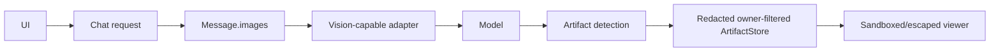
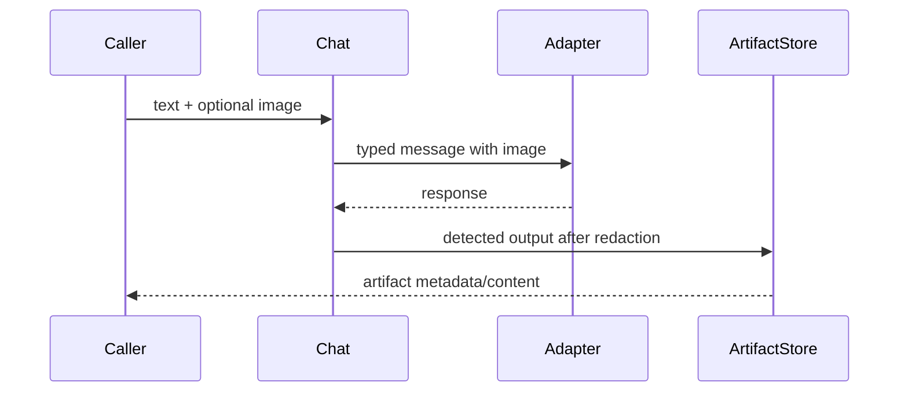

# Multimodal input and artifacts

> **Implementation status:** `partial`
> **Status boundary:** Image data flows through chat into typed messages and Anthropic/Ollama request builders, while owner-filtered redacted artifacts and private generated images exist; real-provider multimodal E2E and durable artifact storage are not established.
> **Reviewed revision:** `c115d62`
> **Used by module:** [Module 13-auth-ui-observability](../modules/13-auth-ui-observability/README.md)
> **Catalog ID:** `multimodal-and-artifacts`

## Beginner explanation

Multimodal agents accept more than text, such as images. Artifacts are inspectable outputs such as code, HTML, diagrams, or tables. Passing a base64 string through data structures does not prove the selected model understood it, and rendering output safely is a separate concern.

## Problem and mental model

Treat the boundary as a contract with explicit inputs, outputs, state, failure behavior, and evidence. The important question is not whether a similarly named class or file exists, but whether the behavior is wired into a real path and whether a test or observation proves it.

## Architecture and components

## Startup and request sequence

## Archon implementation and source walkthrough

At revision `c115d62`, the mapped symbols implement the bounded behavior below. No committed real-provider vision observation, input media validation pipeline, malware scanning, or durable ArtifactStore backend.

### Source symbols

| Source symbol | Role and boundary |
|---|---|
| [`backend/app/runtime/models.py:Message`](../../../backend/app/runtime/models.py) | Carries an immutable image tuple. |
| [`backend/app/runtime/anthropic.py:anthropic_request`](../../../backend/app/runtime/anthropic.py) | Builds Anthropic image content blocks. |
| [`backend/app/services/artifacts.py:ArtifactStore.save`](../../../backend/app/services/artifacts.py) | Redacts and stores owner-associated artifacts in process memory. |

### Tests

| Test | Contract proved and limit |
|---|---|
| [`backend/tests/unit/test_wiring_gaps.py::test_images_flow_through_build_messages`](../../../backend/tests/unit/test_wiring_gaps.py) | Proves image plumbing into runtime messages. |
| [`backend/tests/security/test_resource_security.py::test_artifacts_are_owner_scoped_and_render_inert`](../../../backend/tests/security/test_resource_security.py) | Exercises artifact ownership and inert rendering boundaries. |
| [`backend/tests/security/test_static_security.py::test_generated_images_use_private_contained_temp_storage`](../../../backend/tests/security/test_static_security.py) | Checks generated-image path containment. |

### Evidence boundary

Current implementation dimensions are centralized in [Implementation Evidence](../../IMPLEMENTATION-EVIDENCE.md). Source/tests below are repository evidence; they are not public-deployment or production-certification evidence.

## Try it: bounded study exercise

From the repository root, inspect the mapped source and test, then run the named focused test with the project test environment if available. Confirm both the passing contract and this gap: No committed real-provider vision observation, input media validation pipeline, malware scanning, or durable ArtifactStore backend.

**Done criteria:** identify the trust boundary, one proved behavior, and one unproved behavior without changing repository state.

## Risks, failures, and trade-offs

| Topic | Assessment |
|---|---|
| Principal risk | Large/malformed media can exhaust resources; active HTML/SVG can create browser attacks; model support varies. |
| Current gap/failure | No committed real-provider vision observation, input media validation pipeline, malware scanning, or durable ArtifactStore backend. |
| Trade-off | Base64 is simple but expensive; object storage and signed references scale better but expand the trust surface. |
| Evidence hygiene | Do not log secrets or hidden chain-of-thought; record revision, environment, command, and only redacted outcomes. |

## Lab vs production

The status remains **partial** at `c115d62`. Image data flows through chat into typed messages and Anthropic/Ollama request builders, while owner-filtered redacted artifacts and private generated images exist; real-provider multimodal E2E and durable artifact storage are not established. Unit tests, manifests, or local observations do not prove external-provider parity, sustained load, public deployment, legal compliance, or a production SLO.

## Interview answer

> Multimodal agents accept more than text, such as images. Artifacts are inspectable outputs such as code, HTML, diagrams, or tables. Passing a base64 string through data structures does not prove the selected model understood it, and rendering output safely is a separate concern. In Archon the honest status is **partial**: Image data flows through chat into typed messages and Anthropic/Ollama request builders, while owner-filtered redacted artifacts and private generated images exist; real-provider multimodal E2E and durable artifact storage are not established.

## Self-check

1. What problem does this concept solve, and what nearby concept is it not?
2. Trace the diagram’s trust boundary and failure path.
3. Which mapped symbol/test proves current behavior, or why are the lists empty?
4. What exact gap prevents a stronger status?
5. Which risk would you test first before production use?

Answer guide

A good answer names the contract in the beginner explanation, follows the sequence, cites the exact table entry (or the explicit absence), repeats the status boundary, and chooses a risk from the table rather than claiming unrecorded behavior.

## Related concepts and modules

- **Module:** [Module 13-auth-ui-observability](../modules/13-auth-ui-observability/README.md)
- **Course-day map:** [AIAMastery Days 1–30 coverage](../course-concept-coverage.md)
- **Evidence:** [Implementation Evidence](../../IMPLEMENTATION-EVIDENCE.md)
- **Historical context only:** [Feature and Course Audit v2](../../FEATURE-AND-COURSE-AUDIT-V2.md)
